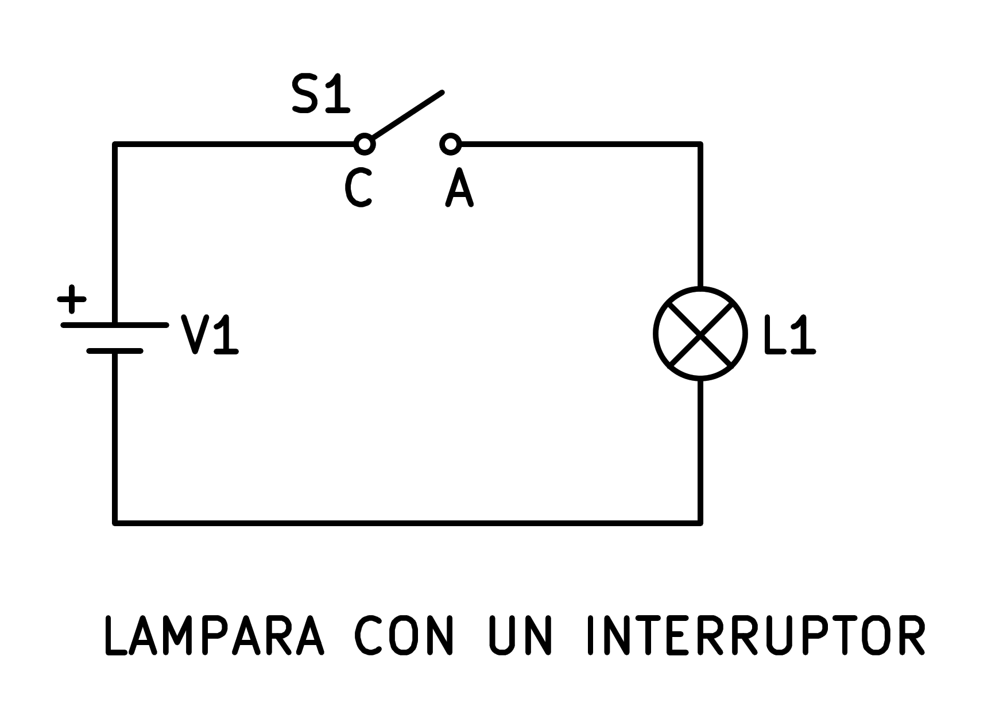


.. _bornas-interruptor:

Interruptor y lámpara
=====================

En esta práctica vamos a montar el circuito práctico más sencillo
que se puede hacer. Una pila conectada mediante un interruptor a
una lámpara.

:download:`Circuito con una lámpara y un interruptor, 
cableado con bornas. Formato PDF.
<electric/electric-bornas-interruptor.pdf>`
   

