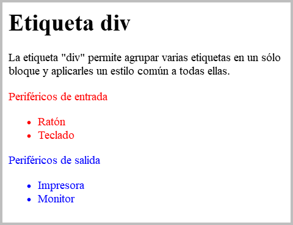

.. css-div:

Etiqueta div
============

``
  
``
   La etiqueta div permite asignar un estilo a una sección, es decir
   un **conjunto grande** de bloques, dentro del documento HTML.
   
   Por ejemplo asigna un color diferente a todo el texto
   que esté en la cabecera de una página web.

Ejercicio
---------

Fichero **css-div.html**

.. literalinclude:: css/css-div.html
   :language: html
   :linenos:
   :name: css-div

..  .. image:: css/_thumbs/css-div-html.png

Fichero **css-div.css**

.. image:: css/_thumbs/css-div-css.png

Resultado
---------

