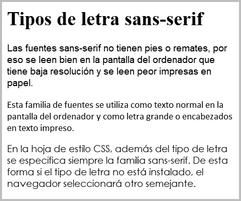

:Date: 22/10/2020
:Author: Carlos Pardo Martín
:Copyright: Creative Commons Attribution-ShareAlike 4.0 International

.. css-sans-serif:

Tipos de letra sans-serif
=========================
En este ejercicio se estudian los tipos de letra sans-serif
y su uso en pantallas como texto normal.

Referencias.

* `Web Safe Fonts <https://www.w3schools.com/cssref/css_websafe_fonts.asp>`__
* `Mejores fuentes seguras para la web
  <https://kinsta.com/es/blog/fuentes-seguras-para-la-web/>`__

Ejercicio
---------

Fichero **css-sans-serif.html**

.. literalinclude:: css/css-sans-serif.html
   :language: html
   :linenos:
   :name: css-sans-serif

..  .. image:: css/_thumbs/css-sans-serif-html.png

Fichero **css-sans-serif.css**

.. image:: css/_thumbs/css-sans-serif-css.png

Resultado
---------

