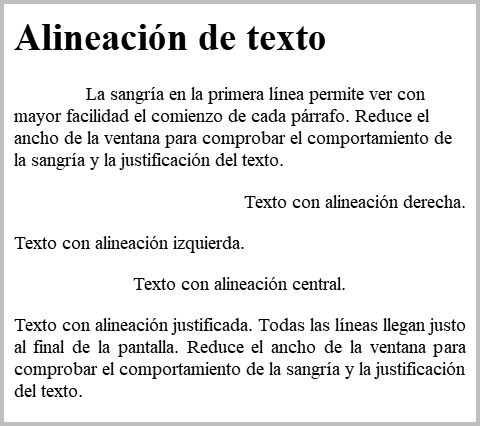

.. css-text-align:

Alineación del texto
====================
En este ejercicio se estudian las diferentes alineaciones
que se pueden dar al texto así como la sangría de primera
línea.

Ejercicio
---------

Fichero **css-text-align.html**

.. literalinclude:: css/css-text-align.html
   :language: html
   :linenos:
   :name: css-text-align

..  .. image:: css/_thumbs/css-text-align-html.png

Fichero **css-text-align.css**

.. image:: css/_thumbs/css-text-align-css.png

Resultado
---------

