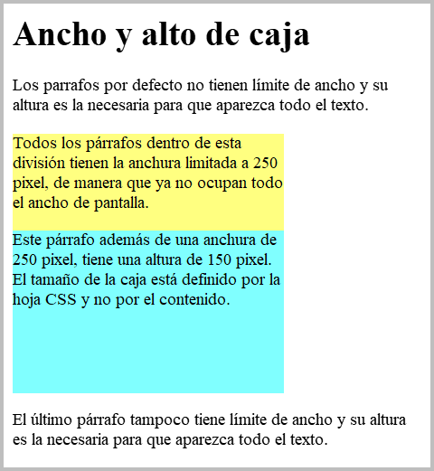

:Date: 08/12/2020
:Author: Carlos Pardo Martín
:Copyright: Creative Commons Attribution-ShareAlike 4.0 International

.. css-width-height:

Ancho y alto de caja
====================
La caja donde se encuentra el contenido (texto o imágenes)
se puede modificar en anchura y altura para que ocupe un
tamaño determinado por la hoja de estilo CSS y no por el 
contenido.

Ejercicio
---------
Fichero **css-width-height.html**

.. literalinclude:: css/css-width-height.html
   :language: html
   :linenos:
   :name: css-width-height

..  .. image:: css/_thumbs/css-width-height-html.png

Fichero **css-width-height.css**

.. image:: css/_thumbs/css-width-height-css.png

Resultado
---------

