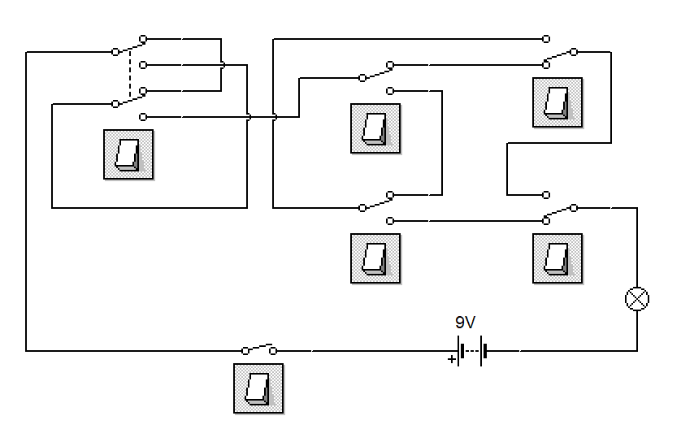

.. include:: electric-crocodile-subs.rst

Circuitos laberinto
===================

1. Copia en el programa Crocodile los siguientes circuitos y pulsa
   los interruptores y conmutadores necesarios para que se enciendan
   las lámparas.

.. image:: crocodile/_images/crocodile-laberinto02.png

.. image:: crocodile/_images/crocodile-laberinto03.png

|br|