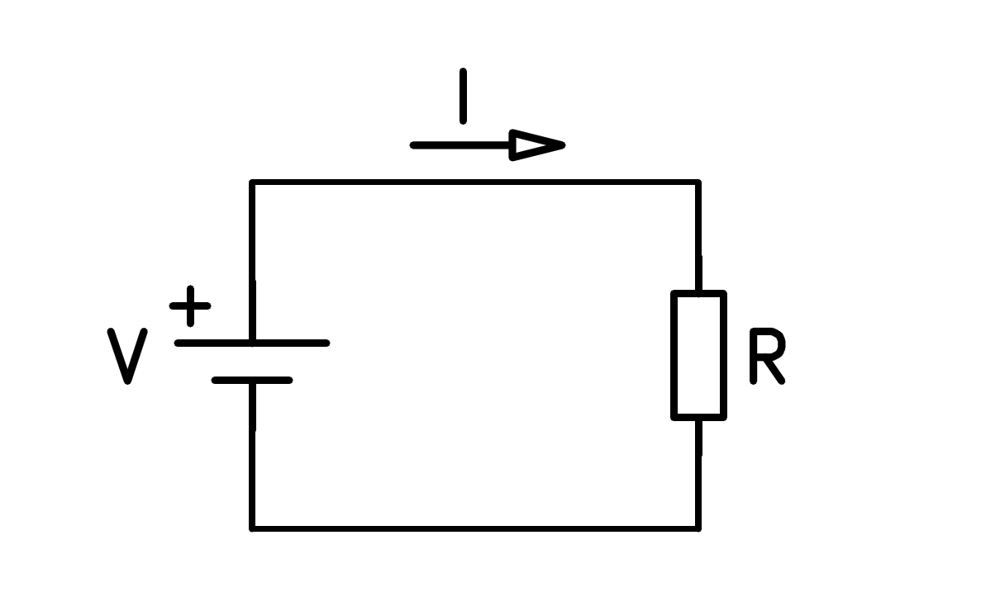
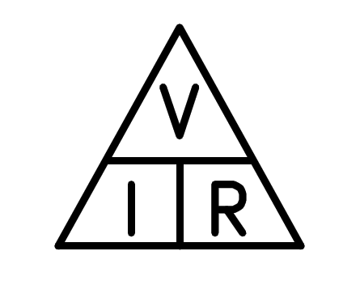
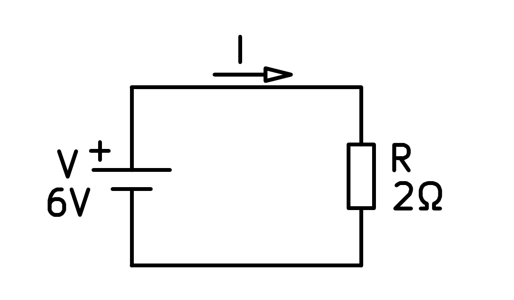


.. _electric-ley-ohm:

La ley de Ohm
=============
La ley de Ohm relaciona el valor de una resistencia con la tensión aplicada
a la resistencia y la intensidad que circula por ella.

Magnitudes y unidades
---------------------
La ley de Ohm por lo tanto relaciona tres magnitudes eléctricas que 
están representadas en la siguiente tabla junto a sus tres unidades.

.. table::
   :widths: 50 50

   +--------------------------------+--------------------------------------+
   | MAGNITUD Y LETRA               | UNIDAD Y LETRA                       |
   +================================+======================================+
   | Tensión o Voltaje  (V)         | Voltio (V)                           |
   +--------------------------------+--------------------------------------+
   | Intensidad de Corriente (I)    | Amperio (A)                          |
   +--------------------------------+--------------------------------------+
   | Resistencia Eléctrica (R)      | Ohmio (Ω)                            |
   +--------------------------------+--------------------------------------+

Fórmula de la ley de Ohm
------------------------

La fórmula de la ley de Ohm que relaciona las tres magnitudes es la siguiente.

.. math::
   
   V = I \cdot R

Despejando la fórmula anterior se consiguen las otras dos formas de la 
ley de Ohm.

.. math::

   I = \cfrac{V}{R}
   
   R = \cfrac{V}{I}

Una regla nemotécnica que se puede utilizar para recordar la ley de Ohm es 
el triángulo de las tres magnitudes:

Tapando con la mano la magnitud que queremos averiguar aparece la fórmula
correspondiente. Por ejemplo si queremos saber cuánto vale la intensidad
de corriente, tapamos la letra I con la mano y se puede ver la letra V 
encima de la letra R. Esto significa que I = V / R.

   
Ejercicios
----------
Ejercicios sencillos para calcular circuitos con la ley de Ohm.

:download:`Ejercicios de la ley de Ohm. Formato PDF 
<electric/electric-ley-ohm-inicio.pdf>`

:download:`Ejercicios de la ley de Ohm. Formato KiCad
<electric/electric-ley-ohm.zip>`

