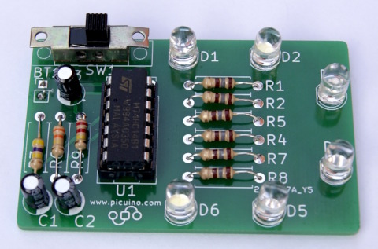
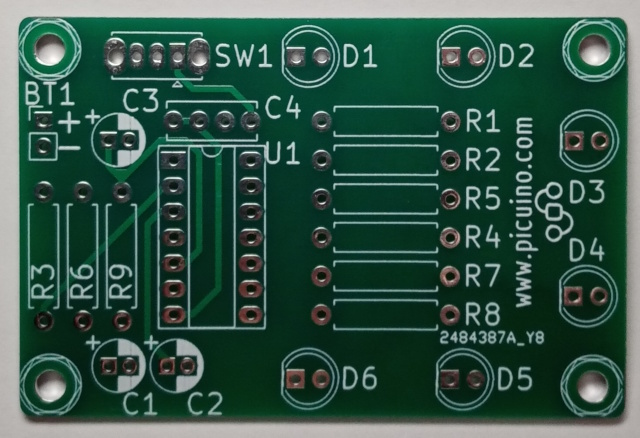
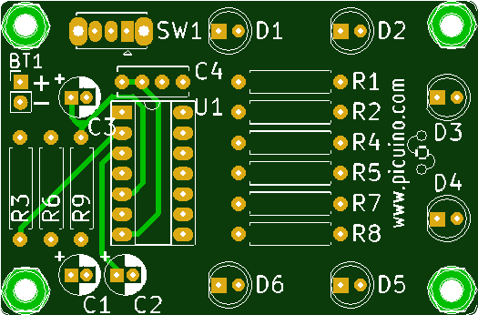
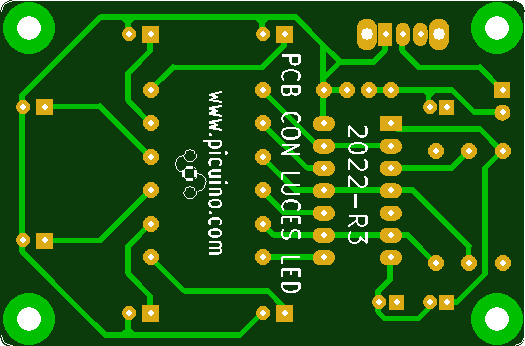


.. _electric-pcb-luces-led:

Circuito impreso con luces led
==============================

Diseño y montaje de un sencillo circuito impreso con 6 luces led parpadeantes.

:download:`Placa de circuito impreso ya montada. Formato JPG.
<electric/_images/electric-pcb-luces-led-03.jpg>`

Circuito eléctrico completo
---------------------------

.. figure:: electric/_images/electric-pcb-luces-led-02.png
   :width: 640px
   :align: center
   :alt: Circuito eléctrico.
   :target: ../_downloads/electric-pcb-luces-led.pdf

:download:`Circuito eléctrico del circuito con luces led. Formato PDF.
<electric/electric-pcb-luces-led.pdf>`

Funcionamiento del circuito oscilador
-------------------------------------

El circuito con luces que parpadean está basado en un oscilador
que cambia su salida cada poco tiempo, encendiendo y apagando el led.

.. figure:: electric/_images/electric-pcb-luces-led-02b.png
   :width: 480px
   :align: center
   :alt: Circuito eléctrico oscilador.

Este circuito oscilador está formado por un inversor con trigger schmitt,
un condensador C1 y una resistencia de realimentación R3.

El circuito inversor con trigger schmitt cambia su salida a diferentes
tensiones de entrada. Este comportamiento se denomina histéresis de entrada
y es el que permite que el circuito funcione como oscilador.
En la siguiente gráfica podemos ver como cambia la tensión de salida del
inversor para diferentes tensiones de entrada. Esta figura rectangular con
dos líneas horizontales es la que tiene el inversor en su interior e
indica que trabaja con histéresis.

Cuando se enciende el circuito por primera vez, el condensador está
descargado y por lo tanto su tensión en el terminal positivo vale
cero voltios.
El inversor schmitt tiene por lo tanto en su entrada cero voltios
(un cero lógico) y en su salida los 5 voltios de alimentación positiva
(un uno lógico).
En esta situación, la resistencia de realimentación R3 va cargando poco
a poco la tensión del condensador hasta que alcanza los 3.33 voltios, 
tensión a partir de la cual el inversor schmitt considera que la entrada
vale un uno lógico y por lo tanto cambia su salida a cero voltios
(cero lógico).

Ahora, la resistencia de realimentación R3 va descargando poco a poco 
la tensión del condensador hasta que alcanza 1.66 voltios, tensión a
partir de la cual el inversor schmitt considera que la entrada vale un cero
lógico y por lo tanto cambia su salida a cinco voltios (uno lógico) volviendo
el ciclo a repetirse una y otra vez.

La velocidad de oscilación dependerá de los valores del condensador y
de la resistencia. Cuanto mayores sean, más tiempo tardará en oscilar el
circuito. La fórmula aproximada del tiempo de oscilación es:

   Tiempo de oscilación = 0.8·R3·C1  = 0.8 · 220000 · 0.000010 = 1.76 segundos

El led D1 conectado a la salida del oscilador mediante una resistencia
limitadora R1, se encenderá y apagará a la misma velocidad que el oscilador.

El led D2 conectado a la salida de otro inversor schmitt mediante una
resistencia limitadora R2, se encenderá cuando D1 esté apagado y se apagará
cuando D1 esté encendido, produciendo un parpadeo alternativo.

Este comportamiento se repite en los tres osciladores que tiene el circuito
completo, a diferentes frecuencias dado que R3, R6 y R9 tienen diferentes
valores y, por lo tanto, diferentes velocidades de parpadeo.

Circuito impreso (PCB)
----------------------

:download:`Diseño del circuito eléctrico y del circuito impreso. Formato KiCad.
<electric/electric-pcb-luces-led.zip>`

:download:`Archivos Gerber para la fabricación del circuito impreso. Formato ZIP.
<electric/electric-pcb-luces-led-gerber.zip>`

Los archivos gerber sirven para solicitar la fabricación de la placa de
circuito impreso a una empresa de fabricación de placas como puede ser 
la empresa china `JLCPCB <https://jlcpcb.com/>`_ u otra cualquiera.

En total hay un conjunto de 7 archivos gerber diferentes, tres
archivos para la parte frontal, 3 archivos para la capa trasera y uno para
los bordes de la placa. 
Además hay un archivo que indica dónde se deben realizar los taladros (drill).

Los archivos gerber y de taladrado se reparten como indica a continuación:

   * Pistas de cobre de la capa frontal (F_Cu)
   * Pistas de cobre de la capa trasera (B_Cu)
   * Máscara de soldadura de la capa frontal (F_Mask)
   * Máscara de soldadura de la capa trasera (B_Mask)
   * Serigrafía de componentes de la parte frontal (F_SilkS)
   * Serigrafía de componentes de la parte trasera (B_SilkS)
   * Bordes para recortar la placa (Edge_Cuts)
   * Archivo de taladros (.drl)

**Pistas de cobre:**
   Son los conductores que conectan entre sí todos los componentes de la
   placa de circuito impreso. Aparecen en el dibujo con color amarillo 
   (sin máscara de soldadura) o de color verde claro (ya cubiertos de máscara
   de soldadura.
   
**Máscara de soldadura:**
   Es una capa de pintura, normalmente de color verde aunque puede tener otros
   colores, que sirve para proteger las pistas de cobre de la corrosión y
   para evitar cortocircuitos a la hora de realizar el proceso de soldadura.
   La máscara de soldadura no se aplica encima de los pads de soldadura.

**Serigrafía de componentes**:
   Es una capa de pintura, generalmente de color blanco, que sirve para 
   indicar el nombre de los componentes del circuito y para escribir 
   indicaciones o dibujos. Esta capa de pintura se aplica con la técnica 
   de la serigrafía y de ahí su nombre.

Listado de componentes (BOM)
----------------------------
El listado de componentes (llamado también BOM o Bill Of Materials) es un 
listado donde aparecen todos los componentes del circuito con su número
y referencia para poder comprarlos antes de realizar el montaje.

La lista de componentes puede tener también la referencia de compra de un
distribuidor de componentes electrónicos. En este caso se han añadido las
referencias del distribuidor `TME <https://www.tme.eu/es/>`_

:download:`Listado de componentes de la placa con luces led. Formato PDF.
<electric/pcb-luces-led/bom/electric-pcb-luces-led-bom.pdf>`

:download:`Listado de componentes de la placa con luces led. Formato ODS.
<electric/pcb-luces-led/bom/electric-pcb-luces-led-bom.ods>`

.. Montaje y soldadura
   -------------------

