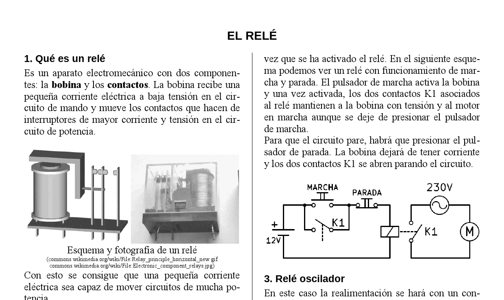

:Date: 25/02/2021
:Author: Carlos Pardo Martín
:Copyright: Creative Commons Attribution-ShareAlike 4.0 International

.. _electric-rele:

Los relés
=========
Los relés son los primeros aparatos eléctricos utilizados 
en la automatización eléctrica.

En esta unidad estudiaremos la historia del relé, su funcionamiento, 
los esquemas eléctricos más usuales y diversos tipos de relés.

:download:`El relé. Formato PDF <electric/componente-rele/electric-reles.pdf>`

:download:`El relé. Formato editable DOC <electric/componente-rele/electric-reles.doc>`
