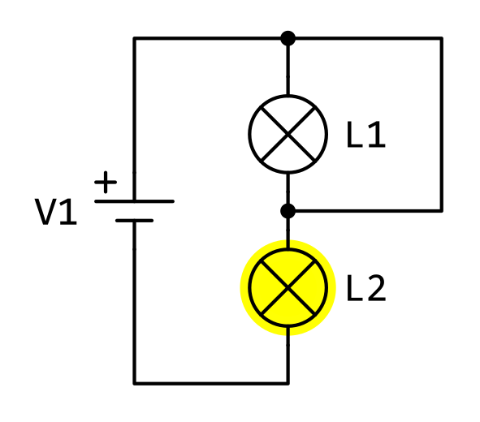
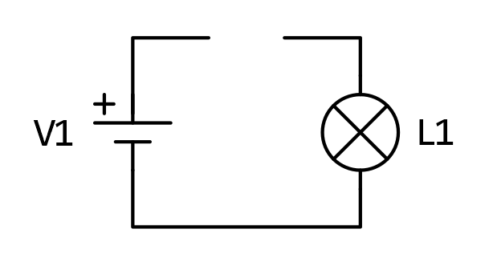
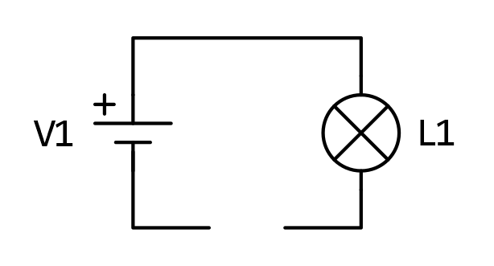


.. _electric-serie-paralelo:

Serie y paralelo
================
Los circuitos eléctricos pueden conectarse de muchas maneras posibles.
Las conexiones más simples son la conexión en serie y la conexión 
en paralelo. Combinando ambas se consigue una conexión mixta.

La conexión en **serie** se utiliza cuando queremos que unos 
componentes afecten el comportamiento de los demás componentes.
Así, el interruptor de la luz se colocará en serie con la lámpara 
para que pueda encenderla o apagarla. 

La conexión en **paralelo** se utiliza cuando queremos que los 
componentes sean independientes. 
De esa manera, las dos bombillas de una lámpara las colocaremos en 
paralelo para que al fundirse una de ellas la otra bombilla siga 
funcionando sin problema.

Por último si las conexiones eléctricas están mal realizadas se puede
producir un **cortocircuito** o un **circuito abierto**. 
Ambas harán que el circuito eléctrico no funcione.

A continuación estudiaremos con más detalle todos estos tipos de 
conexiones.

Circuito en serie
-----------------

En un circuito en serie los componentes están conectados en 
cadena uno detrás de otro:

.. image:: electric/_sources/electric-sch-02a.png
   :width: 236px

**Características de un circuito serie:**
  
  1. La corriente eléctrica que pasa por los componentes es la misma.
      
     Esto significa que si quitamos o abrimos un componente, 
     los demás componentes tampoco tendrán corriente y no funcionarán.
      
  2. La tensión de la pila se divide entre los componentes, 
     que tendrán por lo tanto una tensión menor que la pila.
  
     Esto significa que las lámparas se iluminan menos cuando están 
     en serie
 
**Conexión de un circuito serie:**

La tensión positiva de la pila llega a la primera lámpara:

.. image:: electric/_sources/electric-sch-02b.png
   :width: 236px

Después hay una sola conexión entre la primera lámpara y la segunda:

.. image:: electric/_sources/electric-sch-02c.png
   :width: 236px

Por último hay una conexión entre la segunda lámpara y la pila:

.. image:: electric/_sources/electric-sch-02d.png
   :width: 236px

**Fallo de un componente:**

En un circuito serie, si quitamos una de las lámparas, 
la otra deja de funcionar y se apaga:

.. image:: electric/_sources/electric-sch-02e.png
   :width: 236px

Los sensores de las alarmas y otros sistemas de seguridad
están conectados en serie. Si un componente falla o se rompe,
todo el circuito dejará de funcionar y la máquina peligrosa se 
parará o la alarma dará un aviso.

Circuito en paralelo
--------------------

En un circuito en paralelo los componentes están conectados entre
sí por los dos lados:

.. image:: electric/_sources/electric-sch-01a.png
   :width: 302px
   
   
**Características de un circuito paralelo:**

  1. La tensión eléctrica que llega a los componentes es la misma.
      
     Esto significa que las lámparas tienen toda la tensión
     de la pila y se iluminan al máximo.
      
  2. La corriente de la pila se divide entre los componentes, 
     que tendrán por lo tanto una corriente menor que la pila.

**Conexión de un circuito paralelo:**

Los dos terminales de las lámparas están conectados entre sí.

La tensión positiva de la pila llega por igual a todas las lámparas:

.. image:: electric/_sources/electric-sch-01b.png
   :width: 302px

La tensión negativa de la pila llega por igual a todas las lámparas:

.. image:: electric/_sources/electric-sch-01c.png
   :width: 302px

**Fallo de un componente:**

En caso de que quitemos una lámpara o en caso de que esta falle,
las demás lámparas seguirán funcionando:
 
.. image:: electric/_sources/electric-sch-01d.png
   :width: 302px

Las lámparas y otros componentes comunes de una casa están conectados 
en paralelo. De esta forma el fallo de un componente no hace fallar 
a los demás. Si quitamos una bombilla de casa, las demás bombillas 
seguirán funcionando.

Cortocircuito
-------------
Un cortocircuito es la unión con un cable de dos patillas de un 
mismo componente. Cuando un componente está en cortocircuito, no
puede funcionar. Si una pila o generador está en cortocircuito,
toda la corriente que genera pasará por el cable y uno de los dos
se quemará.

**Cortocircuito en un componente:**

En el siguiente esquema hay un cortocircuito en la primera 
lámpara. El cable llevará toda la corriente de manera 
que la lampara 1 dejará de funcionar y la lámpara 2 se iluminará
mucho más que si estuviera en serie.

.. image:: electric/_sources/electric-sch-02a.png
   :width: 236px
   

En la siguiente imagen se puede ver el camino de la electricidad:

.. image:: electric/_sources/electric-sch-03b.png
   :width: 236px

**Cortocircuito en la pila:**

En este esquema hay un cortocircuito entre los terminales de la
pila. Esto significa que toda la corriente de la pila pasará por
el cable y uno de los dos se quemará. Las lámparas se apagan
porque no les llega corriente.

Esquema del cortocircuito y camino de la corriente:

.. image:: electric/_sources/electric-sch-03c.png
   :width: 236px

.. image:: electric/_sources/electric-sch-03d.png
   :width: 236px

Circuito abierto
----------------
Un circuito abierto es un circuito que no tiene camino para que
circule la corriente eléctrica. Un circuito abierto se puede dar 
si falta algún cable para cerrar el circuito, si hay un interruptor 
abierto o si algún componente en serie está fundido.

Un circuito puede estar abierto si falta camino para que llegue
la tensión positiva de la pila o si falta camino para que llegue la 
tensión negativa de la pila.

Es lo primero que hay que comprobar cuando un aparato eléctrico no 
funciona ¿Está conectado?

Ejercicios
----------
Ejercicios para identificar circuitos en serie, 
en paralelo o con cortocircuito.

.. image:: electric/_images/electric-serie-paralelo-logo.png
   :width: 540px
   :target: ../_downloads/electric-serie-paralelo.pdf

|  :download:`Identificar circuitos en serie, paralelo y
   cortocircuito. Formato PDF.
   <electric/electric-serie-paralelo.pdf>`
|  :download:`Imágenes de los circuitos. Formato PNG.
   <electric/electric-serie-paralelo-images.zip>`
|  :download:`Proyecto editable. Formato KiCad.
   <electric/electric-serie-paralelo.zip>`

Cuestionarios
-------------
Cuestionario de tipo test para identificar circuitos en serie,
en paralelo, con cortocircuito en la pila o con cortocircuito en la bombilla.

  * `Cuestionario. Identificar serie y paralelo 
    <https://www.picuino.com/test/es-electric-series-parallel-identify.html>`__

