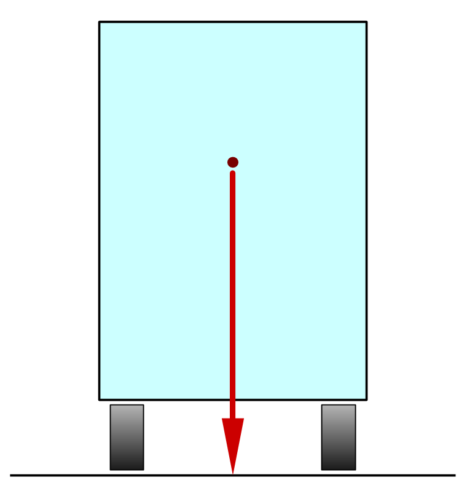
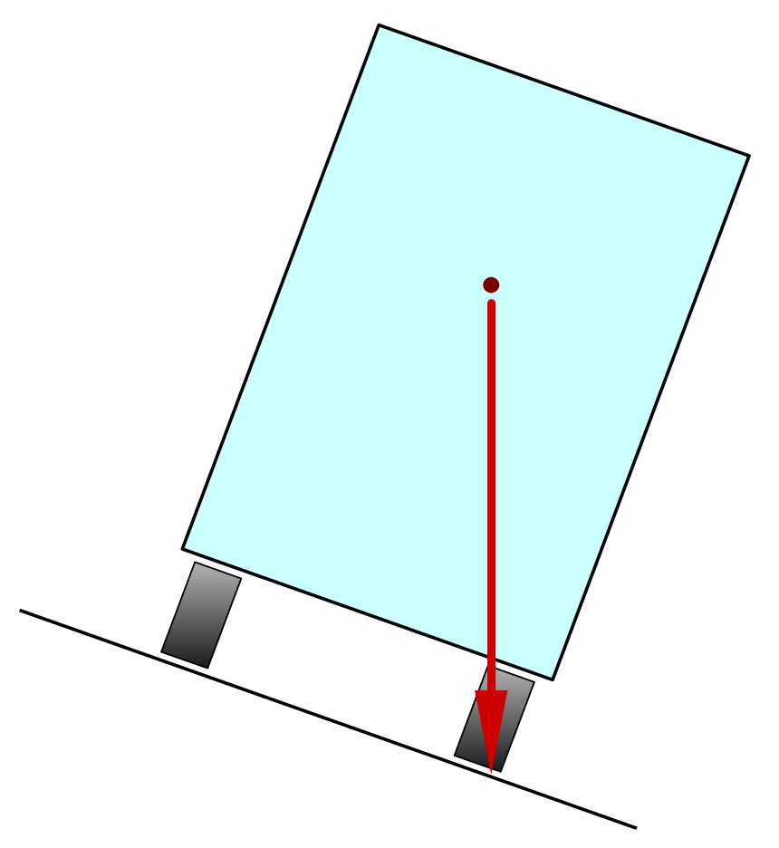


.. _estructuras-estabilidad:

Estabilidad
===========
Las estructuras que estamos estudiando, además de ser rígidas 
para soportar cargas sin romperse ni deformarse, 
deben ser estables para no volcar, deslizarse u oscilar ante 
las fuerzas externas.

Existen varios problemas que pueden presentar las estructuras
debido a su falta de estabilidad.
A continuación se detallan las más comunes.

Vuelco
------
El vuelco de una estructura se produce cuando el centro de
gravedad no se encuentra sobre la base de apoyo de la estructura.

El **centro de gravedad** es el punto medio de toda la masa de
la estructura.
Es el punto donde intuitivamente tenemos que apoyar la estructura
para que esta no vuelque a un lado o a otro.
En el caso de un martillo, su centro de gravedad se encuentra en
el mango, muy cerca de la cabeza, que es la parte que más pesa.

.. image:: mecan/_images/centro-gravedad-04.png
   :width: 240px
   :alt: Camión inestable.

En el caso del camión de la figura, el centro de gravedad está
en el punto rojo, relativamente alto.

En la primera imagen el centro de gravedad cae dentro de la 
zona de apoyo por lo que el camión es estable y no vuelca.

En la segunda imagen el camión está inclinado y el centro 
de gravedad está a punto de salir de la zona de apoyo. 
El camión está a punto de volcar.

En la tercera imagen el camión se ha inclinado más y el centro 
de gravedad no está sobre la zona de apoyo. En este caso el 
camión no es estable y volcará.

Para que se produzca el **vuelco** de una estructura, el
centro de gravedad debe caer fuera de la zona de apoyo de
la estructura con el suelo.

Soluciones al vuelco
--------------------
Existen varias soluciones para evitar que una estructura
vuelque.

**Añadir un contrapeso**
  Cuando una estructura está demasiado escorada hacia un lado
  o un peso lateral puede hacerla volcar, un contrapeso en el
  lado contrario puede solucionar el problema.
  
  Ejemplo: Contrapeso en las grúas de obra o en los camiones-grúa.

**Ampliar la base de apoyo**
  Cuanto mayor sea la base de apoyo, más difícil es que el centro 
  de gravedad caiga fuera de la base.
  
  Ejemplos: 
  Camión grúa con apoyos extensibles. 
  Coche deportivo muy ancho.
  Las personas separan instintivamente los pies entre sí 
  para tener mayor base de apoyo cuando el suelo se mueve.

**Bajar el centro de gravedad**
  Si el centro de gravedad está más bajo, es más difícil que caiga
  fuera de la base de apoyo.
  
  Ejemplos: Para conseguir bajar el centro de gravedad de un 
  camión, hay que colocar los bultos más pesados en la parte baja 
  y los ligeros en la parte alta.
  Los coches deportivos suelen ser bajos para tener el centro 
  de gravedad bajo y conseguir así mayor estabilidad.

**Anclar la estructura al suelo**
  Con esta solución se refuerza la estructura ampliándola al suelo.
  Ejemplos: Vientos de una tienda de campaña. Cables de anclaje de 
  una antena. Farola o mástil de bandera anclados al suelo.

Pandeo
------
.. image:: mecan/_images/mecan-pandeo-01.png
   :width: 120px
   :align: right
   :alt: columna soportando pandeo.

El pandeo se produce en barras y columnas esbeltas sometidas a
compresión.
Cuando la forma de la barra o columna es muy estrecha y muy larga
(esbelta), corre el riesgo de doblarse y perder así su resistencia.
El resultado final es que la estructura se flexiona hasta partirse
y fallar.

Soluciones al pandeo
--------------------
**Hacer el perfil más grueso**
  Si aumentamos el perfil de la barra o de la columna haciendo que
  sean más gruesos, dejarán de ser esbeltos y el pandeo no se
  producirá.

  Por ejemplo se puede utilizar un tubo grueso con paredes finas
  en vez de una barra maciza.
  Los dos tienen el mismo peso y la misma cantidad de hierro,
  pero el tubo hueco no pandea mientras que la barra maciza, 
  que es más esbelta, sí lo hará.

  Esto se utiliza por ejemplo en las estructuras de las bicicletas.

**Sujetar el centro de la barra**
  Si sujetamos el centro de la barra para evitar que se mueva,
  el pandeo no llegará a producirse.

  Por ejemplo una torre de alta tensión está construida con barras
  verticales esbeltas que soportan la mayoría del peso y barras
  horizontales y oblicuas que evitan que las barras verticales
  puedan pandear.

Oscilaciones
------------
Las oscilaciones o vibraciones de una estructura pueden ser
beneficiosas o perjudiciales.

En ciertos casos conviene que la estructura no sea completamente
rígida. Si la estructura puede flexionarse y oscilar ante una carga
externa, esto permite que no llegue a fallar.
Ejemplos de este comportamiento lo tenemos en los rascacielos que
oscilan en su azotea en caso de terremoto o en caso de soportar
vientos fuertes.
Los mástiles de barco o las alas de un avión también son capaces de
oscilar para adaptarse a los esfuerzos que soportan.
Si estas estructuras fuesen completamente rígidas podrían destruirse
con los grandes esfuerzos que soportan.

En otros casos las oscilaciones pueden llegar a sumarse poco a poco
igual que ocurre en un columpio, haciendo que la estructura oscile
cada vez con mayor amplitud hasta llegar a desmoronarse.
Esto es lo que le pasó al famoso puente de
`Tacoma Narrows 
<https://es.wikipedia.org/wiki/Puente_de_Tacoma_Narrows>`_
apodado Gallopin Gertie por las grandes oscilaciones que sufría
cuando soplaba la brisa del verano en que se inauguró.
Al llegar el otoño, un viento de apenas 64 kilómetros por hora
derrumbó el puente, afortunadamente sin producir muertes.
Puedes ver una grabación del suceso en
`YouTube <https://www.youtube.com/watch?v=j-zczJXSxnw>`_.

.. raw:: html

   

   <iframe src="https://www.youtube.com/embed/j-zczJXSxnw"
   frameborder="0" allowfullscreen></iframe>
   

Sin llegar a ser tan dramáticas, las oscilaciones pueden producir en
otros casos ruidos y vibraciones muy molestas.
Esto se produce especialmente en las frecuencias de resonancia
que son las frecuencias en las que vibra una estructura
de forma natural.
Sumando poco a poco los efectos de una pequeña vibración a la misma
frecuencia de resonancia, la oscilación, igual que en un columpio,
puede llegar a hacerse muy grande y peligrosa para la estabilidad.

Soluciones a las oscilaciones
-----------------------------

**Evitar las cargas oscilantes**
  Esta es la solución que toman los soldados que caminan en formación
  por encima de un puente que no es muy rígido. En este caso los
  soldados dejan de caminar a la vez y comienzan a caminar de manera
  desorganizada para que el puente no resuene al mismo ritmo de los
  pasos [#f1]_ .

**Amortiguar la estructura**
  Esta es la solución que se toma en las ruedas de los coches o en
  algunos edificios resistentes a terremotos. Un amortiguador es un
  elemento que frena las oscilaciones y reduce la resonancia.

-------------

Ejercicios
----------
#. ¿Qué problemas de estabilidad pueden tener las estructuras?
#. Dibuja una estructura poco estable y otra que sea muy estable.
#. ¿Cuándo vuelca una estructura?
#. ¿Qué soluciones hay para evitar que una estructura vuelque?
   Escribe un ejemplo de cada una.
#. ¿Qué es el pandeo?
#. ¿Cómo se puede evitar el pandeo?
#. ¿Cómo se pueden evitar las oscilaciones perjudiciales en una
   estructura?

-------------

.. rubric:: Notas

.. [#f1] El `puente de Broughton
         <http://www.wikivia.org/wikivia/index.php/Puente_de_Broughton_(colapso_estructural)>`_
         fue un puente de suspensión en Manchester, Inglaterra, que en 1831
         colapsó a raíz del paso de una tropa de soldados caminando en formación.