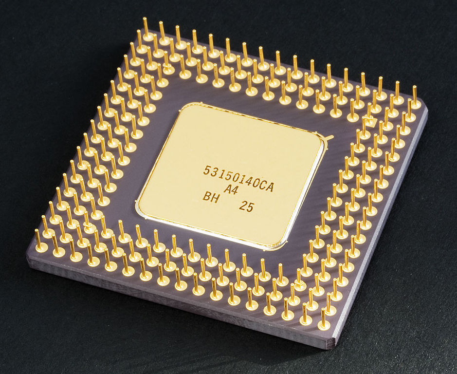

:Date: 08/06/2022
:Author: Carlos Pardo Martín
:Copyright: Creative Commons Attribution-ShareAlike 4.0 International

.. informatica-hardware-cpu:

Procesadores
============
Los procesadores son los cerebros de los ordenadores, los componentes
que realizan las operaciones dictadas por los programas.

.. contents:: Índice de contenidos
   :local:
   :depth: 2

Unidad Central de Proceso (:index:`CPU`)
----------------------------------------
Una `CPU o unidad central de procesamiento
<https://es.wikipedia.org/wiki/Unidad_central_de_procesamiento>`__
también llamado microprocesador, es un componente de un ordenador dedicado
a interpretar las instrucciones de los programas informáticos.
Pueden realizar operaciones lógicas, aritméticas y de movimiento de datos.

Es el componente más complejo de un ordenador. 
Una CPU de ordenador personal, en 2022, tiene
de `25 000 millones a 100 000 millones de transistores 
<https://en.wikipedia.org/wiki/Transistor_count>`__.

Las CPU más conocidas y usadas en la actualidad son las de
la empresa Intel (i3, i5, i7, Xeon) para ordenadores personales y 
servidores y las CPU basadas en ARM (Snapdragon, Kirin, etc.) 
para los teléfonos inteligentes y tabletas.

   CPU 80486DX típica de los PC de mediados de los años 90.

   `Solipsist <https://commons.wikimedia.org/wiki/File:Intel_80486DX2_bottom.jpg>`__,
   `CC BY-SA 2.0 Generic <https://creativecommons.org/licenses/by-sa/2.0/deed.en>`__,
   via Wikimedia Commons.

Unidad de procesamiento gráfico (:index:`GPU`)
----------------------------------------------
Una `GPU o unidad de procesamiento gráfico
<https://es.wikipedia.org/wiki/Unidad_de_procesamiento_gr%C3%A1fico>`__
es un procesador especializado, dedicado a calcular gráficos de forma
intensiva para aligerar la carga del procesador central.
Es capaz de calcular muy rápido operaciones de dibujo en tres dimensiones
tales como el antialiasing (suavizar bordes de las figuras)
dibujar triángulos, cuadrados, elipses, etc.

:index:`Tarjeta gráfica`
   La mayoría de las CPUs actuales tienen ya integradas pequeñas GPUs
   con una capacidad limitada para manejar gráficos. Es suficiente para
   manejar programas ofimáticos o navegar por internet, pero no tienen
   bastante capacidad para manejar videojuegos, programas de diseño, etc.
   Por esa razón en los ordenadores de mayor potencia se utilizan
   `tarjetas gráficas 
   <https://es.wikipedia.org/wiki/Tarjeta_gr%C3%A1fica>`__
   especializadas, que llegan a consumir mucha más potencia eléctrica que
   la propia CPU y realizan un mayor número de operaciones por segundo.

.. figure:: informatica/_images/informatica-tarjeta-video.jpg
   :align: center
   :width: 480px

   Tarjeta gráfica Radeon HD 5570.

   `Evan-Amos <https://commons.wikimedia.org/wiki/File:Sapphire-Radeon-HD-5570-Video-Card.jpg>`__,
   Public Domain, via Wikimedia Commons.

Unidad de procesamiento tensorial (:index:`TPU`)
------------------------------------------------
Una `TPU o unidad de procesamiento tensorial
<https://es.wikipedia.org/wiki/Unidad_de_procesamiento_tensorial>`__
es una unidad central de proceso dedicada a cálculo intensivo de
operaciones de redes neuronales, usadas en Inteligencia Artificial.

El término TPU se utiliza por Google para un circuito inventado por la
empresa, pero cada vez más circuitos traen añadidas capacidades semejantes
para el cálculo de redes neuronales.

Procesador de señales digitales (:index:`DSP`)
----------------------------------------------
Un `DSP o procesador de señales digitales 
<https://es.wikipedia.org/wiki/Procesador_de_se%C3%B1ales_digitales>`__
es un procesador especializado en ejecutar operaciones numéricas
relacionadas con el tratamiento de señales, a muy alta velocidad.

Sus aplicaciones típicas son el tratamiento en tiempo real de señales de
audio, voz, imagen, video, etc.
Con estas aplicaciones se puede eliminar el eco en las líneas de 
comunicaciones, hacer más claras imágenes de órganos en los equipos de 
diagnóstico médico por ultrasonidos o por resonancia magnética, 
realizar ajustes de **auto-tune** en la voz de los cantantes,
decodificar canciones en los reproductores digitales de audio,
comprimir fotografías en cámaras digitales, 
y una larga lista de aplicaciones que pueden ser relacionadas con el 
proceso de señales. 

:index:`Microcontroladores`
---------------------------
Un microcontrolador es un pequeño ordenador dentro de un solo chip.
Incorpora la CPU, la memoria RAM, memoria Flash ROM y periféricos de 
entrada/salida en un espacio pequeño y a bajo precio.

Estos procesadores se utilizan para controlar periféricos tales como 
el teclado, el ratón, la cámara web, el monitor, los discos duros, etc.

Gracias a los microcontroladores, la CPU principal se descarga de las 
tareas de control de los periféricos que serían muy costosas en tiempo
y recursos si tuviera que administrarlas la CPU.

:index:`FPGA`
-------------
Una `FPGA 
<https://es.wikipedia.org/wiki/Field-programmable_gate_array>`__
es un circuito basado en puertas lógicas programables.
Estos circuitos pueden programarse para resolver tareas especializadas
de forma mucho más rápida que una CPU convencional.

Aplicaciones típicas son, sistemas de visión por ordenador, minado de
criptomonedas, emulación de hardware antiguo, machine learning, 
prototipado de circuitos a medida (ASIC), etc.

Al ejecutar las operaciones de forma paralela, pueden acelerar los 
cálculos y ser varias veces más rápidas que una CPU en operaciones 
tales como la compresión de audio y video.

Los lenguajes más utilizados para programar FPGAs son 
VHDL y Verilog.

Características de un procesador
--------------------------------
A la hora de comparar entre sí varios procesadores hay una serie de
características que les diferencian y que se describen a continuación.

Consumo energético
   El consumo de un procesador es cada vez más importante.
   Por una parte, cuanto menor consumo tenga un procesador, más tiempo va 
   a durar una batería del dispositivo que lo contiene. 
   Por otro lado, en los ordenadores enchufados a la red eléctrica,
   cuanto menor sea el consumo de electricidad menor será
   el costo de mantener al ordenador funcionando. 
   Este consumo es tan elevado para los ordenadores de alto rendimiento
   que la electricidad llega a costar anualmente más que el precio del 
   propio procesador.
   Esa es la razón por la que se cambian los procesadores de los
   servidores antes de que acabe su vida útil. Es más barato instalar un
   procesador nuevo más potente.

   El consumo de potencia, también llamado TDP, se mide en vatios.
   Una CPU típica de un ordenador personal consume alrededor de 100 vatios
   en funcionamiento normal.
   Por el contrario una CPU típica de un teléfono inteligente
   consume alrededor de 5 vatios.

Frecuencia de reloj
   Es la frecuencia a la que funciona un procesador y determina la 
   cantidad de instrucciones que podrá ejecutar en un segundo.
   Las frecuencias típicas de los procesadores actuales para ordenadores
   personales y teléfonos inteligentes varían desde
   los 1000MHz hasta los 5000MHz. Cuanto mayor sea la velocidad de reloj,
   más rápida será un procesador, si el resto de parámetros se mantienen 
   iguales.

   El :index:`Overclocking` es una técnica que consiste en hacer 
   funcionar a un procesador a una frecuencia más elevada que la 
   frecuencia para la que está diseñado. 
   Muchos procesadores admiten trabajar a mayor frecuencia que la
   nominal, pero esta técnica conlleva un mayor consumo energético y
   la posibilidad de fallos en el sistema.

Número de núcleos
   Los procesadores actuales en muchos casos están compuestos internamente 
   por varios procesadores individuales llamados núcleos. 
   Cuantos más núcleos tenga un procesador, más operaciones podrá realizar
   en paralelo.

   Hay tareas que se pueden dividir entre varios núcleos y que serán más
   rápidas cuantos más núcleos tenga un procesador.
   Por otro lado, ciertas tareas no se pueden dividir entre varios núcleos
   y su velocidad no será mayor por muchos núcleos que tenga el procesador.

   En 2022 un procesador de tamaño medio para ordenador personal
   suele tener de 6 a 12 núcleos.

Número de hilos de ejecución
   Los hilos de ejecución son la cantidad de programas diferentes
   que se pueden ejecutar a la vez por parte del procesador.
   En realidad un procesador solo podrá ejecutar un programa por núcleo,
   pero los hilos permiten duplicar de forma virtual el número de
   tareas y acelerar un poco más la velocidad de ejecución.

   En 2022 un procesador de Intel suele tener dos hilos de ejecución por 
   núcleo. Es decir, una CPU de 8 núcleos tendrá 16 hilos de ejecución.

Memoria caché
   Es una memoria intermedia que permite acceder a los datos y programas 
   de manera más rápida cuando se hacen accesos repetidos a los
   mismos datos.

   Los procesadores deben leer información de la memoria RAM para realizar
   su tarea, tanto información del programa a ejecutar como de los datos a
   procesar. La velocidad de transferencia de la memoria RAM suele ser más
   lenta que la velocidad de proceso del procesador, de manera que la 
   memoria caché se utiliza como una memoria intermedia que almacena los 
   contenidos de la memoria RAM que se leen de forma repetida, para 
   disponer de ellos más rápido mientras se están procesando.

   Cuanto mayor sea el tamaño de la memoria caché mayor será la velocidad 
   final de la CPU.

   La mayoría de las CPU tienen varios niveles de memoria caché incluidos
   internamente. Cada nivel de memoria caché es más lento que el anterior, 
   pero de mayor tamaño.
   Se suele dar el valor del mayor de ellos. 
   Una CPU típica de un ordenador personal en 2022 suele tener un tamaño 
   de memoria caché en torno a los 6 Mbytes.

Número de Bits
   Es el número de bits que puede manejar un procesador a la vez.
   Determina la cantidad de memoria a la que se puede acceder y la rapidez
   con la que se ejecutarán ciertas operaciones. Un procesador de 
   8 bits moverá información cuatro veces más lento que uno de 32 bits.
   
   Los procesadores más simples, como los que incorpora un teclado de 
   ordenador o un horno microondas, son de 8 bits.

   Por encima de ellas están las CPU de 32 bits, mucho más potentes y
   rápidas. Son las utilizadas en smartphones, smartTV, impresoras, etc.

   Los ordenadores personales actuales utilizan, en la mayoría de los
   casos, procesadores y software de 64 bits.

Tipo de Buses
   Es el tipo de comunicación con el que se transfiere información entre
   el procesador y el exterior. Cuantos más buses tenga un procesador
   y más rápidos sean, mayor será su rendimiento.

   Actualmente los procesadores de ordenador personal tienen tres
   buses de comunicaciones con el exterior, para mejorar la velocidad
   de transferencia:

   * Bus directo con la memoria RAM.
   * Bus directo con los puertos PCI Express.
   * Bus DMI para conectar con el resto de dispositivos
     (USB, PCI, Sata, Ethernet, etc).

Pruebas de rendimiento
----------------------
Las pruebas de rendimiento, también llamadas
`benchmark <https://es.wikipedia.org/wiki/Benchmark_(inform%C3%A1tica)>`__,
son una técnica para medir el rendimiento de un sistema informático o
de sus componentes por separado.
Son pruebas muy útiles a la hora de comparar procesadores dado el gran 
número de parámetros que tienen estos y dado que el rendimiento final 
no está claro teniendo en cuenta solo estos parámetros.

Test clásicos muy conocidos son los siguientes.

.. glossary::

   MIPS
      Los `MIPS <https://es.wikipedia.org/wiki/Millones_de_instrucciones_por_segundo>`__
      o millones de instrucciones por segundo.
      Es un test con ciertos problemas a la hora de comparar diferentes
      arquitecturas, por lo que ha caído en desuso. A pesar de todo, es
      muy útil para comparar de forma relativa procesadores a lo largo de
      la historia y ver cómo crece la potencia de cómputo de forma
      exponencial con el tiempo.

      Un ordenador personal típico de 2022 tiene aproximadamente 200 000
      MIPS.

   FLOPS
      Los `FLOPS <https://es.wikipedia.org/wiki/Operaciones_de_coma_flotante_por_segundo>`__
      u operaciones de coma flotante por segundo, mide cuántas operaciones
      matemáticas con decimales es capaz de realizar un ordenador.
      Son habituales los múltiplos, así un MFLOPS es igual a 1 millón
      de operaciones por segundo.

      Esta medida es útil para conocer cómo es de rápida una máquina
      para resolver problemas científicos y de cálculo intensivo.

      Un ordenador personal típico de 2022 tiene aproximadamente 50 000
      MFLOPS.

   SPECint y SPECfp
      `Standard Performance Evaluation Corporation (SPEC) 
      <https://es.wikipedia.org/wiki/Standard_Performance_Evaluation_Corporation>`__
      es un consorcio sin fines de lucro que incluye a vendedores de 
      computadoras, integradores de sistemas, universidades, grupos de 
      investigación, publicadores y consultores de todo el mundo. 
      Tiene dos objetivos: 
      crear un benchmark estándar para medir el rendimiento de 
      computadoras y controlar y 
      `publicar los resultados de estos tests <http://www.spec.org/>`__.

Otros test comerciales:

PassMark
   El `Test PassMark <https://www.cpubenchmark.net/>`__
   es uno de los test comerciales más conocidos para ordenadores personales.
   
