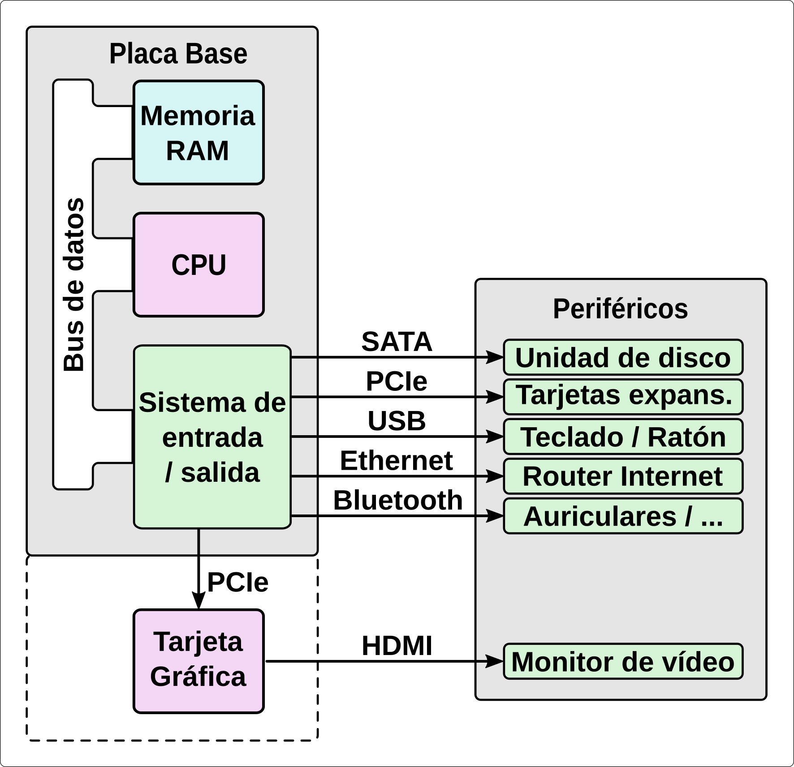

:Date: 08/06/2022
:Author: Carlos Pardo Martín
:Copyright: Creative Commons Attribution-ShareAlike 4.0 International

.. informatica-hardware-intro:

Introducción al :index:`hardware`
=================================
El `hardware <https://es.wikipedia.org/wiki/Hardware>`__
(pronunciado jard.wer)
se refiere a las partes físicas de un sistema informático.
Son los componentes eléctricos, electrónicos y mecánicos​ de un ordenador
tales como cables, cajas, periféricos, etc.

Por el contrario los programas y datos de un ordenador son
intangibles y se denominan software (pronunciado soft.wer).

.. contents:: Índice de contenidos
   :local:
   :depth: 2

Hardware de un ordenador personal
---------------------------------

.. figure:: informatica/_images/informatica-pc-exploded.png
   :align: center
   :width: 480px

   `Gustavb <https://commons.wikimedia.org/wiki/File:Personal_computer,_exploded_5.svg>`__,
   `CC BY-SA 3.0 Unported <https://creativecommons.org/licenses/by-sa/3.0/deed.en>`__,
   via Wikimedia Commons.

1. Monitor.
2. Placa base.
3. Microprocesador (CPU) y zócalo.
4. Módulo de RAM y ranuras.
5. Tarjetas y ranuras de expansión.
6. Fuente de alimentación.
7. Unidad de disco óptico (CD, DVD, BD).
8. Unidad de disco duro o unidad de estado sólido.
9. Teclado.
10. Ratón.

Clasificación de los ordenadores
--------------------------------
En función de la potencia y tamaño del hardware de un ordenador podemos
clasificar a los ordenadores en alguno de los siguientes apartados.

.. glossary::

   Controladores programables
      Son pequeños ordenadores de baja potencia, destinados a controlar
      de forma inteligente aparatos domésticos, elementos de un automóvil,
      etc.
      Estos controladores son los que permiten realizar programas a una
      lavadora, temporizar digitalmente un horno microondas, activar el
      freno ABS de un automóvil, realizar mediciones de consumo eléctrico
      a distancia, validar una tarjeta de transporte en el autobús,
      encender una bombilla mediante conexión wifi, etc.

      En la industria se utilizan controladores programables especializados
      para mover máquinas de forma automática o para recoger datos y
      controlar procesos industriales. Estos controladores
      se denominan `PLC <https://es.wikipedia.org/wiki/Controlador_l%C3%B3gico_programable>`__
      y `SCADA <https://es.wikipedia.org/wiki/SCADA>`__.

      A medida que se abaratan los precios de los componentes electrónicos,
      cada vez más aparatos incorporan pequeños ordenadores que les añaden
      inteligencia.
      Estos pequeños controladores añadidos a los objetos cotidianos
      y conectados a internet es lo que se denomina `Internet de las cosas
      <https://es.wikipedia.org/wiki/Internet_de_las_cosas>`__.

      Uno de los controladores para uso doméstico y de entretenimiento más
      conocido es la placa
      `Arduino UNO <https://es.wikipedia.org/wiki/Arduino_Uno>`__
      con arquitectura de 8 bits y 32kbytes de memoria RAM.

      .. figure:: arduprog/_images/img-0098b.jpg
         :align: center
         :width: 340px

         Placa controladora Arduino UNO.

   Wearables
      Un wearable o `tecnología vestible
      <https://es.wikipedia.org/wiki/Tecnolog%C3%ADa_vestible>`__
      es un pequeño ordenador incorporado a prendas de vestir.
      Incluyen relojes inteligentes (smartwatch), gafas inteligentes, etc.

      Esta tecnología puede ser utilizada para monitorizar la salud
      de los usuarios.

      .. figure:: informatica/_images/informatica-apple-watch.jpg
         :align: center
         :width: 340px

         Apple Watch Serie 6 Navy Blue.

         `Avia Husk <https://commons.wikimedia.org/wiki/File:Apple_Watch_Series_6.jpg>`__,
         `CC BY-SA 4.0 International <https://creativecommons.org/licenses/by-sa/4.0/deed.en>`__,
         via Wikimedia Commons.

   Ordenador de una sola placa (SBC)
      Los `ordenadores de una sola placa
      <https://es.wikipedia.org/wiki/Placa_computadora>`__
      son ordenadores completos en una sola placa de circuito impreso
      de tamaño reducido que incluye CPU, RAM, periféricos, conectores
      y demás componentes típicos de un ordenador.

      Uno de los SBC de bajo costo más conocidos es la placa
      Raspberry Pi. Es un microordenador personal que ejecuta el
      sistema operativo Linux y solo necesita añadir un teclado, un ratón
      y un monitor para tener con ella un PC operativo.

      .. figure:: informatica/_images/informatica-raspberry-pi.jpg
         :align: center
         :width: 340px

         Raspberry Pi 2 model B.

         `Evan-Amos <https://commons.wikimedia.org/wiki/File:Raspberry-Pi-2-Bare-BR.jpg>`__,
         Public Domain, via Wikimedia Commons.

   SmartTV
      Son pequeños ordenadores pensados para añadir inteligencia (smart) a
      una televisión tradicional. Permiten desde decodificar las señales
      digitales vía satélite hasta añadir capacidades como conectarse a
      internet y ver servicios de streaming como Netflix, HBO o Amazon
      Prime.

      Algunos de los más conocidos son
      `Google Chromecast <https://es.wikipedia.org/wiki/Google_Chromecast>`__,
      `Amazon Fire TV <https://es.wikipedia.org/wiki/Amazon_Fire_TV>`__ y
      `Apple TV <https://es.wikipedia.org/wiki/Apple_TV>`__,

      Los televisores actuales (smartTV) ya llevan incorporados ordenadores
      que permiten realizar estas tareas, al igual que conectarse por
      internet a las empresas fabricantes.
      Esto ha ocasionado polémicas debido a que estos televisores pueden
      grabar las conversaciones de su alrededor y enviarlas al fabricante.

      .. figure:: informatica/_images/informatica-fire-tv.jpg
         :align: center
         :width: 340px

         Amazon Fire TV 4K.

         `PAG DEV <https://commons.wikimedia.org/wiki/File:Amazon_Fire_TV_4k.jpg>`__,
         `CC BY-SA 4.0 International <https://creativecommons.org/licenses/by-sa/4.0/deed.en>`__,
         via Wikimedia Commons.

   Videoconsolas
      Las `videoconsolas <https://es.wikipedia.org/wiki/Videoconsola>`__
      son ordenadores orientados a ejecutar videojuegos.
      Pueden tener una potencia relativamente elevada.

      Su uso se reduce exclusivamente al juego y la disponibilidad de
      muchos de estos juegos está limitada a una sola plataforma, por lo
      que muchos usuarios de videojuegos prefieren usar un ordenador
      personal (PC) de altas características en su lugar.
      La diferencia entre los dos tipos de ordenadores reside en el precio.
      Para una misma potencia de cálculo, un PC puede costar el doble que
      una videoconsola de última generación equivalente.

      .. figure:: informatica/_images/informatica-ps4.jpg
         :align: center
         :width: 340px

         Sony PlayStation 4 de 2014.

         `Evan-Amos <https://commons.wikimedia.org/wiki/File:PS4-Console-wDS4.jpg>`__,
         Public Domain, via Wikimedia Commons.

   Ordenadores dedicados
      Existen más tipos de ordenadores dedicados realizar una sola función
      de forma especializada.
      Por ejemplo los servidores de datos `NAS
      <https://es.wikipedia.org/wiki/Almacenamiento_conectado_en_red>`__
      que permiten compartir archivos de datos en una red de ordenadores,
      fotocopiadoras, routers, impresoras, escáner, cajeros automáticos,
      máquinas expendedoras y un largo etcétera.

   Teléfono inteligente
      Un `teléfono inteligente
      <https://es.wikipedia.org/wiki/Tel%C3%A9fono_inteligente>`__
      o smartphone es un dispositivo que combina las funciones
      de un teléfono móvil con el de un ordenador de bolsillo.

      Actualmente son los ordenadores de uso más habitual para la mayoría
      de las personas.

      Su sistema operativo suele ser Android (de Google) o iOS (de Apple).

      .. figure:: informatica/_images/informatica-iphone-13.jpg
         :align: center
         :width: 340px

         Apple iPhone 13.

         `SimonWaldherr <https://commons.wikimedia.org/wiki/File:IPhone_13_Pro.jpg>`__,
         `CC BY-SA 4.0 <https://creativecommons.org/licenses/by-sa/4.0/deed.en>`__,
         via Wikimedia Commons.

   Tableta
      Una `tableta <https://es.wikipedia.org/wiki/Tableta_(computadora)>`__
      o tablet es un pequeño ordenador basado en una pantalla táctil
      que generalmente funciona con los mismos sistemas operativos que
      los teléfonos móviles (Android e iOS).

      En ciertos casos pueden incluir periféricos como un teclado o ratón,
      aunque la mayoría de las veces solo se manejan mediante la pantalla
      táctil.

      Hay teléfonos inteligentes con un tamaño mayor del habitual
      (mayor de 6 pulgadas de diagonal) se les denomina tabléfonos
      o phablet.

   Ordenador portátil
      Un `ordenador portátil
      <https://es.wikipedia.org/wiki/Computadora_port%C3%A1til>`__
      es un ordenador personal (PC) capaz de realizar todas las tareas
      de un ordenador de escritorio, pero con un pequeño tamaño y batería
      incluida por lo que se puede desplazar fácilmente para ser usado
      en cualquier lugar.

      Los portátiles **Netbooks** son ordenadores pensados para conectarse
      a internet y tienen menos capacidades que un portátil habitual.
      Suelen llevar un sistema operativo ligero basado en Linux y tienen
      un precio reducido, aunque no disponen de todas las capacidades
      de otros portátiles.
      Los modelos más conocidos son los **Chromebook** de Google.

      .. figure:: informatica/_images/informatica-laptop.png
         :align: center
         :width: 340px

         `Pixabay <https://commons.wikimedia.org/wiki/File:Black_laptop_computer_open_frontal.svg>`__
         `CC0 1.0 Public Domain <https://creativecommons.org/publicdomain/zero/1.0/deed.en>`__

   Ordenador personal de escritorio
      Con ordenador personal o PC se suele denominar a un microordenador de
      escritorio, de uso general, para ser usado por una persona.
      Los ordenadores personales actuales comenzaron a venderse en 1981
      por IBM aunque pronto aparecieron ordenadores con un
      funcionamiento semejante (clónicos) fabricados por otras empresas.

      Su sistema operativo suele ser Windows, MacOS o Linux.

      Los ordenadores personales de altas prestaciones también se denominan
      `estación de trabajo
      <https://es.wikipedia.org/wiki/Estaci%C3%B3n_de_trabajo>`__.
      Tienen mucha más potencia de cálculo y capacidad de almacenamiento
      que un ordenador personal habitual.

      .. figure:: informatica/_images/informatica-computer-02.png
         :align: center
         :width: 340px

         Imagen de `OpenClipart-Vectors <https://pixabay.com/es/users/openclipart-vectors-30363/>`__
         en `Pixabay <https://pixabay.com/es/vectors/computadora-escritorio-158675/>`__

   Mainframe
      Un mainframe o `unidad central
      <https://es.wikipedia.org/wiki/Unidad_central>`__
      es un ordenador utilizado principalmente por grandes organizaciones
      para aplicaciones críticas que requieren ordenadores muy
      fiables y con gran capacidad de almacenamiento.

      Estos ordenadores se utilizan para realizar operaciones bancarias,
      censos, servidores de internet, etc.

   Clúster de ordenadores
     Un `clúster de ordenadores
     <https://es.wikipedia.org/wiki/Cl%C3%BAster_de_computadoras>`__
     es un gran ordenador compuesto por un conjunto de ordenadores
     unidos entre sí por una red de alta velocidad y sincronizados
     por un sistema operativo, que suele ser Linux, para que se comporten
     como un solo ordenador.

     Actualmente este tipo de ordenadores está sustituyendo poco a poco
     a los mainframes en sus funciones.

      .. figure:: informatica/_images/informatica-cluster-nec.jpg
         :align: center
         :width: 340px

         `Hindermath <https://commons.wikimedia.org/wiki/File:Nec-cluster.jpg>`__,
         `CC BY-SA 3.0 <https://creativecommons.org/licenses/by-sa/3.0/deed.en>`__,
         via Wikimedia Commons.

   Superordenador
      Un `superordenador <https://es.wikipedia.org/wiki/Supercomputadora>`__
      es un ordenador utilizado para realizar grandes cálculos tales como
      predecir el tiempo atmosférico, investigaciones sobre el genoma,
      nuevos medicamentos, etc.
      Manejan grandes cantidades de datos realizando una gran cantidad de
      cálculos por segundo (hasta 16 000 millones de millones de
      operaciones por segundo en 2022)

      En un principio se utilizaban mainframes dedicados a cálculo
      intensivo, pero actualmente están basados en la tecnología de
      clúster de ordenadores.

      En España el superordenador más famoso es el `MareNostrum
      <https://es.wikipedia.org/wiki/MareNostrum>`__
      , compuesto por un clúster de 48 896 procesadores Intel Xeon.

      .. figure:: informatica/_images/informatica-mare-nostrum.jpg
         :align: center
         :width: 340px

         Supercomputador MareNostrum 4 en el centro de supercomputación
         de Barcelona.

         `Vcarceler <https://commons.wikimedia.org/wiki/File:BSC-MareNostrum4-F.jpg>`__,
         `CC BY-SA 4.0 <https://creativecommons.org/licenses/by/4.0/deed.en>`__,
         via Wikimedia Commons.

Esquema simplificado de un ordenador
------------------------------------
En el gráfico siguiente se pueden ver los elementos principales de
un ordenador.

.. image:: informatica/_images/informatica-esquema-ordenador-02.png
   :align: center
   :width: 480px

Estos elementos son los siguientes:

 * La **memoria ROM**, que es la encargada de almacenar a largo plazo
   los programas y los datos, aunque el ordenador esté apagado.
 * La **memoria RAM**, que es la encargada de almacenar los programas y los
   datos para que el procesador pueda trabajar con ellos.
 * La **CPU o unidad central de proceso** que es el "cerebro" del ordenador,
   el elemento que procesa los programas y los datos.
 * El **bus de procesador** que se encarga de transportar los datos
   entre la CPU, la memoria y el sistema de entrada/salida.
 * El **sistema de entrada/salida** que conecta al ordenador con el
   exterior y se encarga de transportar información entre el bus de
   procesador y varios buses de conexión secundarios, que suelen ser
   estándar, como USB, HDMI o Ethernet.
 * Los **periféricos**, que se encargan de realizar 3 tareas fundamentales.

    * Entrada de datos al ordenador (por ejemplo un teclado)
    * Salida de datos del ordenador (por ejemplo una pantalla)
    * Almacenamiento externo (por ejemplo una memoria USB)

La siguiente figura representa el esquema de un ordenador personal.

En este caso la memoria ROM es sustituida por una unidad de almacenamiento
externa (unidad de disco) que se comporta como un periférico de
entrada/salida de datos.

Unidades de medida de datos
---------------------------

Medida de cantidad de información o capacidad de almacenamiento.
   * Bit. Es la unidad mínima de información y equivale a un dígito binario
     que puede valer 0 ó 1.
   * Byte. Es un conjunto de 8 bits. Puede contener un carácter y
     puede tomar valores entre 0 y 255.
   * Word. Una palabra puede tener un número variable de bits dependiendo
     del sistema informático con el que estemos tratando.
     En los ordenadores actuales varía desde 16 bits hasta 128 bits.

Medida de velocidad de transporte o caudal.
   * Bit/s. Un bit transmitido cada segundo.
   * Byte/s. Un byte transmitido cada segundo.

Múltiplos
   Tabla de `Prefijos del Sistema Internacional de unidades
   <https://es.wikipedia.org/wiki/Prefijos_del_Sistema_Internacional>`__.

   .. list-table::
      :widths: auto
      :header-rows: 1

      * - Prefijo
        - Letra
        - Cantidad
        - 10^n
      * - kilo-
        - k
        - 1 000
        - 10^3
      * - Mega-
        - M
        - 1 000 000
        - 10^6
      * - Giga-
        - G
        - 1 000 000 000
        - 10^9
      * - Tera-
        - T
        - 1 000 000 000 000
        - 10^12
      * - Peta-
        - P
        - 1 000 000 000 000 000
        - 10^15
      * - Exa-
        - E
        - 1 000 000 000 000 000 000
        - 10^18

Capacidades y velocidades típicas
   Un mensaje de texto apenas ocupará pocos bytes (alguno más que el número
   de caracteres o letras del texto).

   Una conexión de audio a través de Whatsapp necesita unos 64 kbit/s
   para funcionar.

   Una fotografía o una canción mp3 ocupan unos cientos de kilobytes o
   pocos megabytes dependiendo de su calidad o tamaño.

   Una conexión a internet por fibra óptica tiene alrededor de 100 Mbit/s
   de velocidad de conexión (equivalente a unos 12 Mbyte/s).

   Una conexión por Ethernet con el router suele tener 1Gbit/s de velocidad
   de conexión (equivalente a 125 Mbyte/s).

   Una película en DVD ocupará de 4 a 8 Gigabytes de espacio.

   Un disco duro típico tiene una capacidad de varios Terabytes.

   Un Cluster de ordenadores puede alcanzar varios Petabytes de capacidad.

   Se calcula que en 2020 la capacidad de almacenamiento total de
   internet era de unos `2000 Exabytes
   <https://www.statista.com/statistics/638593/worldwide-data-center-storage-capacity-cloud-vs-traditional/>`__

Ley de Moore
------------
La ley de Moore fue formulada en el año 1965 por Gordon Moore,
cofundador de Intel, y expresa que cada 2 años se duplica el número
de transistores de un microprocesador.

Gracias a esta tendencia a aumentar el número de transistores, la
potencia y capacidad de cálculo ha aumentado de forma exponencial
desde el año 1965 hasta la actualidad. Se espera que todavía siga
aumentando unos años más, hasta que la tecnología se tope con los
efectos cuánticos, que no permitirán seguir fabricando transistores
más pequeños.

Esta ley también es válida para otros dispositivos basados en
transistores como pueden ser la memoria RAM o la memoria Flash.

.. figure:: informatica/_images/informatica-moore-law.png
   :align: center
   :width: 340px

   `Max Roser, Hannah Ritchie <https://commons.wikimedia.org/wiki/File:Moore%27s_Law_Transistor_Count_1970-2020.png>`__,
   `CC BY-SA 4.0 <https://creativecommons.org/licenses/by-sa/4.0/deed.en>`__,
   via Wikimedia Commons.

Relación capacidad-precio
-------------------------
Los dispositivos de hardware informáticos sufren una fuerte deflación de
precios con el tiempo, lo que provoca que un dispositivo muy caro de tope
de gama pase en pocos años a ser un dispositivo obsoleto, en el rango
de precios más baratos.

Una buena pauta a la hora de comprar hardware es no comprar lo más
barato del mercado, puesto que suele tener una baja relación
capacidad-precio.

Por otro lado, los dispositivos más nuevos del mercado se suelen lanzar
con unos precios muy altos debido a que son productos de la mayor capacidad
o rendimiento y eso les hace ser más atractivos.
El resultado es que estos dispositivos altos de gama suelen tener también
una pobre relación capacidad-precio o rendimiento-precio.

En las tablas que se muestran a continuación se pueden ver reflejados
estos conceptos.

Tabla de precios de memorias USB de marca SanDisk en Amazon en 2022.

.. list-table::
   :widths: auto
   :header-rows: 1

   * - Capacidad [Gbyte]
     - Precio [€]
     - Capacidad/precio [Gbyte/€]
   * - 16
     - 6
     - 2,67
   * - 32
     - 8
     - 4,00
   * - 64
     - 10
     - 6,40
   * - 128
     - 17,70
     - 7,23
   * - 256
     - 30,90
     - 8,28
   * - 512
     - 87,80
     - 5,83

Como puede observarse, los dispositivos de precios más bajos se pueden
mejorar duplicando su capacidad por poco dinero más.

La relación de precio por Gbyte mejora constantemente hasta que llegamos
al dispositivo más nuevo y alto de gama que tiene un precio muy superior
al resto durante el periodo de lanzamiento, por lo que no merece la
pena comprarlo por su menor relación capacidad-precio.

Tabla de precios de procesadores Intel en Amazon en 2022.
La capacidad de calculo se ha obtenido de la página
de `PassMark Software <https://www.cpubenchmark.net>`__.

.. list-table::
   :widths: auto
   :header-rows: 1

   * - Modelo
     - Rendimiento [PCMark]
     - Precio [€]
     - Rendimiento/precio
   * - i5-3470 3,2GHz
     - 4666
     - 65,82
     - 71
   * - i5-11400F 2,6GHz
     - 17191
     - 150,45
     - 114
   * - i5-12400 2,5GHz
     - 19500
     - 200,00
     - 98
   * - i5-12600KF
     - 27052
     - 270,00
     - 100
   * - i9-12900KS 2,4GHz
     - 44482
     - 795,00
     - 56

Los modelos de procesadores con menor capacidad no están a la venta como
procesadores independientes, pero se siguen vendiendo en equipos ya
montados, a pesar de ser obsoletos y tener una baja relación
rendimiento/precio.

Podemos observar de nuevo que los equipos más baratos tienen una pobre
relación rendimiento/precio, al igual que los más caros y altos de gama.
La mejor compra está en un equipo intermedio con la mejor relación
rendimiento/precio.