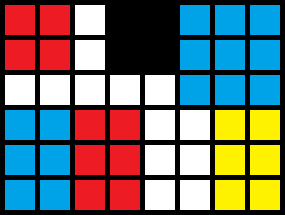
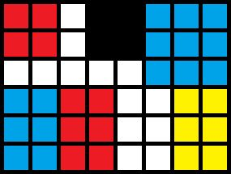
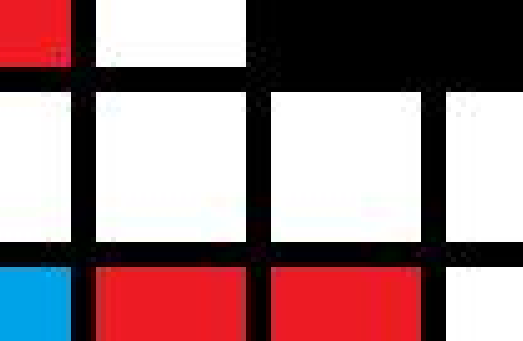

:Date: 24/09/2022
:Author: Carlos Pardo Martín
:Copyright: Creative Commons Attribution-ShareAlike 4.0 International

.. informatica-software-imagenes:

:index:`Formatos de imagen`
===========================

.. Note::

   PÁGINA EN CONSTRUCCIÓN.

Existen dos grandes tipos de formatos de imagen.

Las **imágenes de mapa de bits** también llamadas Raster, que están 
formadas por muchos puntos de color que conforman una fotografía o dibujo.

Las **imágenes vectoriales** están formadas por instrucciones que 
determinan la aparición de objetos como líneas, círculos, `curvas de Bézier 
<https://es.wikipedia.org/wiki/Curva_de_B%C3%A9zier>`__,
etc. con las que se forman las imágenes.

.. figure:: informatica/_images/informatica-bitmap-svg.svg
   :align: center
   :width: 480px

   Diferencia entre una imagen de mapa de bits (Raster) y una imagen
   vectorial (SVG).

   `Yug <https://commons.wikimedia.org/wiki/File:Bitmap_VS_SVG.svg>`__,
   `CC BY-SA 2.5 <https://creativecommons.org/licenses/by-sa/2.5/deed.en>`__,
   via Wikimedia Commons.

Esquemas de color
-----------------
Existen dos grandes esquemas de color, el aditivo y el sustractivo.
Cada uno de ellos tiene un campo de aplicación distinto y es conveniente
utilizar cada uno en su ámbito, para obtener los mejores resultados.

.. figure:: informatica/_images/informatica-rgb-cmyk.png
   :align: center
   :width: 640px

.. glossary::

   Esquema de color aditivo RGB
      Este esquema se denomina aditivo porque genera los diferentes colores
      añadiendo fuentes de luz. 
      
      Los colores primarios a partir de los que se forman todos los demás 
      son el **rojo** (Red), el **verde** (Green) y el **azul** (Blue).
      De esos tres colores proviene el nombre RGB.
      
      Este esquema de color se utiliza en monitores, pantallas de 
      teléfonos inteligentes, tabletas, televisiones, proyectores, etc.  
      
      Este esquema funciona basándose en que el ojo humano tiene tres 
      receptores de color (rojo, verde y azul) que utiliza para detectar
      todos los colores del arcoíris a partir de una combinación de todos
      ellos. Así nuestro ojo percibe el color amarillo como una combinación
      de luz roja más luz verde.
      
      Los colores secundarios se forman sumando dos colores primarios:
      
      Rojo + Verde = Amarillo
      
      Rojo + Azul = Magenta
      
      Verde + Azul = Cian
      
      Rojo + Verde + Azul = Blanco
      
      Ausencia de color = Negro
      
   Esquema de color sustractivo CMYK
      Este esquema se denomina sustractivo porque genera los diferentes
      colores reflejando la luz blanca, que contiene todos los colores, 
      menos algún color que se sustrae con una tinta.
      Por ejemplo la tinta amarilla reflejará toda la luz blanca que le 
      llega, menos el color azul, que se sustrae o absorbe en el interior 
      de la tinta.
      
      Los colores primarios a partir de los que se forman todos los demás
      son el **cian** (Cyan), el magenta (Magent), el **amarillo** (Yellow)
      y el color **negro** (Key). Si las tintas fuesen perfectas, podrían
      conseguir el color negro sumando todas ellas (CMY) pero en la
      práctica resulta más sencillo y se ve más oscuro al utilizar una 
      tinta específica para conseguir el color negro.
      
      Los colores secundarios se obtienen mezclando tintas y por lo tanto
      absorbiendo más de un color. De los tres colores que tiene la luz
      blanca (rojo, verde y azul) la tinta amarilla absorbe azul y la tinta
      cian absorbe rojo. 
      Al mezclar tintas amarilla y cian, se absorben el azul y el 
      rojo, quedando solo el color verde como resultado final.
      
      Este esquema se utiliza para la impresión de revistas, libros, 
      folletos, carteles y todo tipo de trabajos de imprenta.
      También es la base de las impresoras a color y de las pinturas al 
      óleo, acuarelas, ceras, etc.

      Los colores secundarios se forman sumando dos colores primarios:
      
      Cian + Magenta = Azul
      
      Cian + Amarillo = Verde
      
      Magenta + Amarillo = Rojo
      
      Cian + Magenta + Amarillo = Negro
      
      Ausencia de color = Blanco

Profundidad de color
--------------------
La profundidad de color se refiere al número de colores distintos que puede
mostrar una imagen. La menor profundidad de color es la de una imagen que 
solo trabaja con 2 colores (blanco y negro). La mayor profundidad de color
es la de una imagen que trabaja con 16 bit para cada uno de los tres tonos
RGB. Esto da como resultado un total de 281 billones de colores distintos.
Las fotografías jpeg (las más habituales) utilizan una profundidad de color
de 8 bit por cada tono RGB dando un resultado de 16 millones de colores
distintos.

Profundidad de color de 1 bit
   2 colores.
   
   Esta profundidad de color se utiliza para enviar fax, almacenar texto
   o dibujos sencillos. La ventaja que presenta es que ocupa muy poco 
   espacio.
   
   .. figure:: informatica/_images/informatica-flor-2.png
      :align: center

Profundidad de color de 4 bit 
   16 colores.
   
   .. figure:: informatica/_images/informatica-flor-16.png
      :align: center
       
Profundidad de color de 8 bit gris 
   256 tonos de gris.
   
   .. figure:: informatica/_images/informatica-flor-256bn.jpg
      :align: center
       
Profundidad de color de 8 bit
   256 colores.
   
   .. figure:: informatica/_images/informatica-flor-256.png
      :align: center
       
Profundidad de color de 8 bit RGB
   16 millones de colores (256 tonos de rojo, de verde y de azul).
   
   .. figure:: informatica/_images/informatica-flor-24bit.jpg
      :align: center
       
Profundidad de color > 8 bit RGB
   12 bit RGB = 68 mil millones de colores (4096 tonos de rojo, de verde 
   y de azul).
   
   14 bit RGB = 4 billones de colores (16384 tonos de rojo, de verde 
   y de azul)
   
   16 bit RGB = 281 billones de colores (65536 tonos de rojo, de verde 
   y de azul).
   
   Los esquemas con mayor número de colores que el de 8 bit RGB 
   no presentan diferencias apreciables en una pantalla.

   Cuando una imagen tiene más de 8 bit RGB se pueden realizar operaciones
   de edición de imágenes con menos pérdida de calidad que en las imágenes
   con menos colores, que no son apropiadas para las operaciones de edición.

   
Formatos de mapa de bits
------------------------
Los siguientes formatos de **imágenes de mapa de bits** están compuestos
por píxel o puntos de la imagen que se almacenan uno a uno en el archivo
hasta completar la imagen.

.. glossary::

   JPEG (JPG)
      El formato `JPEG
      <https://es.wikipedia.org/wiki/Joint_Photographic_Experts_Group>`__
      (Joint Photographic Experts Group) creado en 1992, es un formato de
      archivo de imagen que se utiliza para almacenar fotografías en un
      formato comprimido.
      Este formato de archivo tiene pérdidas (es lossy), lo que significa
      que se pierde cierta cantidad de información de la imagen al
      comprimirla, especialmente en los pequeños detalles, generando un
      ruido llamado "artefactos".
      Por esa razón no es una buena opción para guardar imágenes de
      dibujos, texto, etc.

      .. figure:: informatica/_images/informatica-venecia.jpg
         :align: center

         Fotografía almacenada en formato JPEG.

      El formato de archivo JPEG se puede utilizar para almacenar imágenes
      en varios formatos de color, incluyendo RGB de 8 bit por color, CMYK
      y YCbCr. La profundidad de color de este formato (8 bit por cada
      color) hace que no sea una buena opción para editar fotografías.
      Para esa tarea es mucho mejor utilizar los formatos RAW
      de cada cámara fotográfica que llegan a tener 36 o 42 bit por pixel.

      El formato JPEG no permite definir transparencias en la imagen por
      lo que no es una buena opción para insertar imágenes recortadas.

   PNG
      El formato `PNG
      <https://es.wikipedia.org/wiki/Portable_Network_Graphics>`__
      (Portable Network Graphics) fue creado en 1995 como
      un formato de imagen de compresión sin pérdidas, es decir, que no
      pierde ningún detalle durante la compresión de la imagen.

      El formato PNG es ideal para almacenar imágenes de dibujos o texto
      ya que al no tener pérdidas se almacenarán sin ruido o "artefactos".

      .. figure:: informatica/_images/informatica-cuadricula-48-4.png
         :align: center

         Imagen PNG de una cuadrícula coloreada.

      Este formato también es ideal para imágenes con un **fondo
      transparente**, ya que cada píxel puede ser almacenado junto a un
      código de color transparente que evita que se noten los bordes.

      Si bien se puede utilizar para guardar fotografías, no es aconsejable
      porque, al no tener pérdidas, su tamaño es mucho mayor que el de las
      imágenes JPEG. Si lo que se desea es guardar una fotografía sin
      pérdidas para poder editarla, es preferible utilizar el formato TIFF.

      El formato PNG puede guardar las imágenes con diversas profundidades
      de color adaptadas a cada aplicación. Con los colores blanco y negro
      se pueden almacenar imágenes de texto o similares con un nivel de
      compresión muy alto. También se pueden almacenar imágenes en escala
      de grises o imágenes con todo el color (RGB de 8 bits por color).

      El formato PNG no permite almacenar colores CMYK adaptados a la
      impresión en papel.

   GIF
      El formato `GIF
      <https://es.wikipedia.org/wiki/Graphics_Interchange_Format>`__
      (Graphics Format Interchange) fue lanzado en 1987
      por CompuServe y es ampliamente utilizado en internet tanto en
      imágenes como en animaciones debido a su amplio soporte y
      compatibilidad.

      Como característica especial, este es el único formato popular que
      puede guardar imágenes en movimiento o animaciones.
      Los vídeos con imágenes fotográficas aparecen con una gran pérdida
      de color debido a que este formato solo puede manejar una paleta
      de 256 colores, pero esto no ha impedido que sea muy utilizado.

      El formato GIF permite guardar dibujos con transparencias, pero con 
      `peor calidad que con el formato PNG de 24 bits
      <https://desarrolloweb.com/articulos/transparencia-formatos-graficos-web-gif-png.html>`__.

      La aplicación principal del formato GIF es almacenar pequeños 
      dibujos y animaciones con o sin transparencia.

      .. figure:: informatica/_images/informatica-rotating-earth.gif
         :align: center

         `Zaqwerdx <https://commons.wikimedia.org/wiki/File:Rotating_earth_mini.gif>`__,
         `CC BY-SA 3.0 <https://creativecommons.org/licenses/by-sa/3.0/deed.en>`__,
         via Wikimedia Commons.

   TIFF
      El formato `TIFF
      <https://es.wikipedia.org/wiki/TIFF>`__
      (Tagged Image File Format) se publicó en su versión 6 en 1992 y
      tiene un gran uso en la industria gráfica y en la fotografía
      profesional por su versatilidad y compresión no destructiva.
      
      Es un formato que ocupa mucha memoria cuando almacena fotografías
      sin pérdidas, especialmente si se utiliza una gran profundidad de
      color, con 16 bit por cada color.
      Sin embargo estas características hacen que el formato TIFF sea muy
      apreciado en edición fotográfica profesional y fotografía científica.
      

   RAW
      El formato `RAW
      <https://es.wikipedia.org/wiki/Raw_(formato)>`__.

   Resumen de los formatos de imagen de mapa de bits.

      .. list-table::
         :header-rows: 1

         * - Formato
           - Compresión
           - Pérdidas
           - Color
           - Transparencias
           - Movimiento
         * - JPG
           - Si
           - Si
           - RGB 8 bit

             CMYK
           - No
           - No
         * - PNG
           - Si
           - No
           - 256 colores

             RGB 8 bit

             RGB + Transparencia
           - Si 
           - No
         * - GIF
           - Si
           - No
           - Solo 256 Colores
           - Si
           - Si
         * - TIFF
           - Si
           - No
           - RGB de 8 bit

             CMYK
           - No
           - No
         * - RAW
           - No
           - No
           - RGB de 12 bit
           - No
           - No

      .. list-table::
         :widths: 15 30
         :header-rows: 1

         * - Formato
           - Tipo de imagen
         * - JPG
           - Fotografías.
         * - PNG
           - Dibujos.
         * - GIF
           - Dibujos.
           
             Imagenes con movimiento.
         * - TIFF
           - Fotografía profesional.
           
             Fotografía científica.

             Impresión en papel.
         * - RAW
           - Fotografía profesional.

Comparativa entre formatos JPEG y PNG
-------------------------------------
En las siguientes imágenes podemos comprobar las diferencias y la
utilidad de cada uno de los formatos de imagen.

A la hora de guardar textos o imágenes de dibujo, siempre será mejor
utilizar el formato PNG que ocupará menos tamaño dando mejor calidad.

.. figure:: informatica/_images/informatica-liberation-sans.png
   :align: center

   Archivo de imagen PNG de 6kb de tamaño, sin errores.

.. figure:: informatica/_images/informatica-liberation-sans.jpg
   :align: center

   Archivo de imagen JPEG de 7kb de tamaño, con "artefactos".

   Archivo de imagen PNG de 210 bytes de tamaño, sin errores.

   Archivo de imagen JPEG de 11284 bytes de tamaño, con "artefactos".

A la hora de guardar fotografías, siempre será mejor utilizar el formato
JPEG que ocupará menos tamaño dando una calidad semejante. En realidad
la calidad del formato JPEG será menor, pero no se apreciará a simple
vista.

.. figure:: informatica/_images/informatica-venecia.png
   :align: center

   Archivo de imagen PNG de 262kb de tamaño.

.. figure:: informatica/_images/informatica-venecia.jpg
   :align: center

   Archivo de imagen JPEG de 52kb de tamaño.

Formatos vectoriales
--------------------
Los formatos de **imágenes vectoriales** están compuestos por vectores, que
son instrucciones matemáticas que se le dan al navegador o a programas de
edición de estos gráficos para que se puedan visualizar.
Estas imágenes se pueden escalar de manera infinita sin perder resolución
o calidad.

.. glossary::

   SVG
      El formato `SVG
      <https://es.wikipedia.org/wiki/Gr%C3%A1ficos_vectoriales_escalables>`__
      (Scalable Vector Graphics) es un estándar abierto publicado en 1999
      para definir imágenes en dos dimensiones para la Web.

      .. figure:: informatica/_images/informatica-tomate.svg
         :align: center
         :width: 280px

         `Stephen Winsor <https://commons.wikimedia.org/wiki/File:Tomate.svg>`__,
         `GNU General Public License v3 <https://www.gnu.org/licenses/gpl-3.0.html>`__,
         via Wikimedia Commons.

   PDF
      PDF

   EPS
      EPS