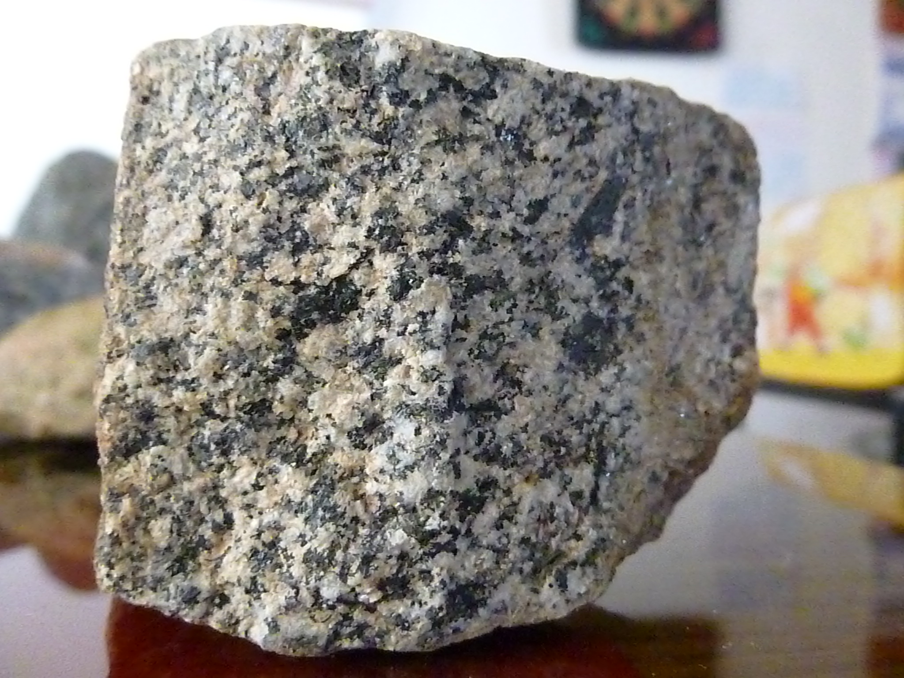
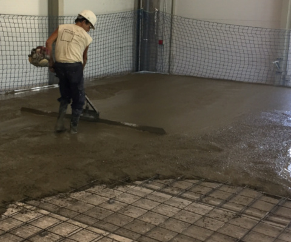
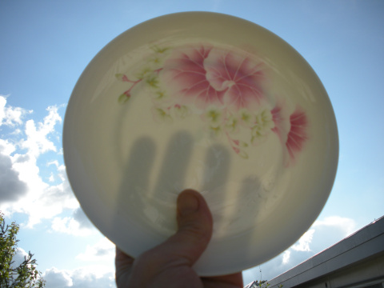


.. _material-petreos:

Los materiales pétreos
======================
Provienen de las piedras o arenas de la naturaleza.

Propiedades de los pétreos
--------------------------

**Propiedades mecánicas de los pétreos**
   Son materiales duros, relativamente frágiles, y con suficiente 
   resistencia mecánica para ser muy utilizados en la construcción de
   edificios y otras estructuras.

**Densidad**
   En general es mayor que la del agua y varían desde los 1.5 kg/litro de
   la arena hasta los 2.8 kg/litro de la pizarra, mármol o granito.
   
   La piedra pómez o la diatomita son excepciones con una densidad muy baja, 
   menor que la del agua, al ser muy porosas. 
   
**Respuesta a la luz**
   La mayoría de los materiales pétreos son opacos y tienen muy buena 
   resistencia a la radiación del sol.
   
   Algunos pétreos como el vidrio utilizado en las ventanas, el cuarzo 
   o el zafiro utilizado en esferas de relojes son muy transparentes.
   
   Otros pétreos como la porcelana son traslúcidos.

**Propiedades de fabricación de los pétreos**
   Los pétreos naturales no son maleables ni dúctiles ni se funden con 
   facilidad. Se pueden cortar y pulir para producir láminas y bloques.
   
   Los aglomerantes como el cemento son líquidos cuando se mezclan con agua
   y pueden moldearse con facilidad antes de que endurezcan.

   Los materiales cerámicos tienen consistencia de pasta muy maleable aunque 
   poco dúctil. Se pueden moldear con facilidad antes de cocer. 
   
   El vidrio se puede fundir con facilidad y actúa como un material
   plástico muy maleable y muy dúctil mientras está caliente.
   Puede formar hilos muy finos que sirven como refuerzo a otros materiales.

**Conductividad de los pétreos**
   Los materiales pétreos tienen muy poca conductividad térmica y eléctrica
   y resisten bien las altas tensiones y temperaturas.
   Por esa razón los vidrios y cerámicas se utilizan como separadores 
   eléctricos en líneas de alta tensión y como material refractario en hornos.

**Propiedades químicas de los pétreos**
   Los pétreos son muy estables y resisten bien la oxidación y a los 
   ácidos y cáusticos y a la radiación del sol.
   
   La excepción a esto son las rocas calizas y el mármol que se ven atacados
   por los ácidos y se deshacen poco a poco con la lluvia ácida.

**Propiedades ecológicas de los pétreos**
   Los materiales pétreos suelen ser poco reciclables, excepto el vidrio
   que se puede reciclar muchas veces sin pérdida de calidad.
   
   No son tóxicos en la naturaleza, aunque la fabricación del cemento
   produce muchos gases de efecto invernadero. Se calcula que el 8%
   de todas las emisiones de CO2 provienen de su fabricación.
   
   El asbesto, también llamado amianto o uralita, es altamente cancerígeno 
   por lo que su uso y fabricación se ha prohibido hace años en los países 
   occidentales.
   
   El granito produce un gas radiactivo y cancerígeno llamado radón.
   Las zonas habitadas que contienen mucho granito en los alrededores
   deben tener esto en cuenta en las construcciones.

Pétreos naturales
-----------------

**Mármol**
   Se ha usado desde la antigüedad para construir edificios o tallar
   esculturas. En la actualidad todavía se usa en la construcción
   para cubrir suelos o paredes de forma lujosa.
   
   El mármol está compuesto de caliza cristalizada por lo que le atacan 
   los ácidos.
   
.. figure:: material/_images/material-marmol.jpg
   :align: center

   `Lysippos <https://commons.wikimedia.org/wiki/File:Milv.jpg>`__
   `CC BY-SA 2.0 DE <https://creativecommons.org/licenses/by-sa/2.0/de/deed.en>`__
   via Wikimedia Commons.

**Granito**
  Se ha utilizado desde la prehistoria para la construcción y es muy
  apreciado por su gran resistencia a la erosión y a la corrosión.
  
  Se ha usado ampliamente como recubrimiento en edificios públicos
  y monumentos. También se usa para encimeras de cocina.
  
  Al incrementarse la lluvia ácida, el granito está sustituyendo al mármol
  para construcciones a la intemperie.

   `Rojinegro81 <https://commons.wikimedia.org/wiki/File:Roca_Granito.JPG>`__
   `CC BY-SA 3.0 <https://creativecommons.org/licenses/by-sa/3.0>`__
   via Wikimedia Commons.

**Pizarra**
   Está formada por lajas u hojas planas que la hace adecuada para fabricar
   paneles planos usados para cubrir tejados y, antiguamente, para escribir.

.. figure:: material/_images/material-pizarra.jpg
   :align: center

   `Dontworry <https://commons.wikimedia.org/wiki/File:St.leonhard-ffm002.jpg>`__
   `CC BY-SA 3.0 <https://creativecommons.org/licenses/by-sa/3.0/deed.en>`__
   via Wikimedia Commons.

**Piedra caliza**
   Se utiliza desde la antigüedad como elemento de construcción.
   La catedral de Burgos está construida con piedra caliza.
   
   Al quemarla en un horno produce cal, un componente fundamental del 
   cemento gris.  
   
   La lluvia ácida la disuelve.

.. figure:: material/_images/material-caliza.jpg
   :align: center

   Gran Pirámide de Guiza. Recubierta por completo de piedra caliza.

   `Berthold Werner <https://commons.wikimedia.org/wiki/File:Gizeh_Cheops_BW_1.jpg>`__
   `CC BY-SA 3.0 <https://creativecommons.org/licenses/by-sa/3.0/deed.en>`__
   via Wikimedia Commons.

**Piedra arenisca**
   Es la roca sedimentaria más común, compuesta de granos de cuarzo 
   y otras rocas unidos por un cemento natural (carbonato de calcio u otros).
   
   Se emplea como material de construcción y piedra de afilar.

.. figure:: material/_images/material-arenisca.jpg
   :align: center

   `Sarranpa <https://commons.wikimedia.org/wiki/File:Arenisca.jpg>`__
   `CC BY-SA 4.0 <https://creativecommons.org/licenses/by-sa/4.0/deed.en>`__
   via Wikimedia Commons.

**Grava y arenas**
   Son rocas de un tamaño pequeño. Se utilizan junto al cemento
   para formar hormigón.

Pétreos aglomerantes
--------------------
Están formados por polvo que se mezcla con agua para producir una pasta
que se endurece al poco tiempo de la mezcla.

**Yeso**
   Es un aglomerante de color blanco.
   
   Se utiliza desde la prehistoria para unir y sellar piedras de 
   construcciones. También se utiliza para revestimiento y
   decoración de paredes y techos.
   
   El yeso de grano más fino se denomina **escayola**.

.. figure:: material/_images/material-escayola.jpg
   :align: center

   `Joseph Rose <https://commons.wikimedia.org/wiki/File:Tapestry_Room_from_Croome_Court_MET_DP341270.jpg>`__
   `CC0 Public Domain. <https://creativecommons.org/publicdomain/zero/1.0/deed.en>`__

**Cemento**
   Está formado por piedra caliza y arcilla calcinadas en un horno
   a las que se añade yeso para mejorar sus propiedades.
   Generalmente es de color **gris**.
   
   Se calcula que la producción anual es de más de 4000 millones de toneladas.
   Su uso principal es para producción de hormigón.

.. figure:: material/_images/material-cemento.jpg
   :align: center

   `Anónimo <https://commons.wikimedia.org/wiki/File:USMC-110806-M-IX060-148.jpg>`__
   `CC0 Public Domain. <https://creativecommons.org/publicdomain/zero/1.0/deed.en>`__

**Hormigón**
   Está formado por **cemento** mezclado con arena y grava.
   
   El hormigón armado tiene en su interior barras de acero para mejorar
   su resistencia.
   
   Se utiliza para hacer vigas y suelos de los edificios, carreteras,
   puentes, presas, puertos, etc.   

   `Dafran <https://commons.wikimedia.org/wiki/File:Hormigon-autonivelante.png>`__
   `CC BY-SA 4.0 <https://creativecommons.org/licenses/by-sa/4.0/deed.en>`__
   via Wikimedia Commons.

Pétreos cerámicos
-----------------
Están compuestos de un polvo fino mezclado con agua con apariencia pastosa
que una vez conformado se hornea para que las partículas que lo forman 
se fundan uniéndose entre sí.

**Arcilla**
   Es una roca sedimentaria formada por granos muy finos, menores de 0,004mm.
   
   Fue la primera cerámica elaborada por los seres humanos y aún hoy es uno
   de los materiales más baratos y de más amplio uso.
   
   Se utiliza para fabricar ladrillos, tejas, recipientes y producir cemento.

.. figure:: material/_images/material-arcilla.jpg
   :align: center

   `Siim Sepp <https://commons.wikimedia.org/wiki/File:Clay-ss-2005.jpg>`__
   `CC BY-SA 3.0 <https://creativecommons.org/licenses/by-sa/3.0/deed.en>`__
   via Wikimedia Commons.

**Loza**
   Se fabrica con arcilla mezclada con arena. Es un material poroso igual
   que la arcilla, por lo que se suele recubrir con un barniz externo que
   cristaliza en la cocción haciendo a la pieza impermeable.
   
   Se utiliza para hacer vajillas.
   
.. figure:: material/_images/material-loza.jpg
   :align: center
   
   `Lourdes Cardenal <https://commons.wikimedia.org/wiki/File:Cuenco_barro_ceramica_popular_lou.jpg>`__
   `CC BY-SA 3.0 <https://creativecommons.org/licenses/by-sa/3.0/deed.en>`__
   via Wikimedia Commons.

**Gres**
   Es una mezcla de arcilla con materiales como el sílice que aportan 
   una mayor resistencia mecánica y a la cocción (desgrasantes).
   
   Es un material muy duro e impermeable. Se utiliza sobre todo en la 
   fabricación de baldosas para suelos.

.. figure:: material/_images/material-gres.jpg
   :align: center

   Gres usado en la industria química.
   
   `Patrick Charpiat <https://commons.wikimedia.org/wiki/File:Beau_021.jpg>`__
   `CC BY-SA 3.0 <https://creativecommons.org/licenses/by-sa/3.0/deed.en>`__
   via Wikimedia Commons.

**Porcelana**
   Es un material cerámico generalmente blanco, duro, impermeable,
   translúcido, muy resistente a la corrosión, al choque térmico y 
   mal conductor de la electricidad.
   
   Formado por polvo de caolín, cuarzo y feldespato es el material
   cerámico más fino y parecido al vidrio.   
   
   Se utiliza para hacer vajillas, jarrones, aisladores eléctricos, inodoros,
   lavabos, etc.

   `Klausbo <https://commons.wikimedia.org/wiki/File:Transparent_porcelain.jpg>`__
   Public Domain.

Vidrio
------
Es un material que se obtiene fundiendo arena de sílice, caliza y 
carbonato de sodio.
   
Se utiliza para hacer vajillas, botellas, cerrar ventanas, parabrisas,
espejos, lentes, material de laboratorio, etc.
   
Con fibras de vidrio se pueden reforzar otros materiales para que tengan
mayor resistencia mecánica (planchas de escayola, resina plástica, etc.)

.. figure:: material/_images/material-vidrio.jpg
   :align: center

   `Matthew Bowden. <https://commons.wikimedia.org/wiki/File:Colorful_bottle.jpg>`__

Cuestionario
------------
Cuestionario de tipo test sobre los materiales pétreos.

`Questionary. Los materiales pétreos. <https://www.picuino.com/questionary/es-material-stone.html>`__
