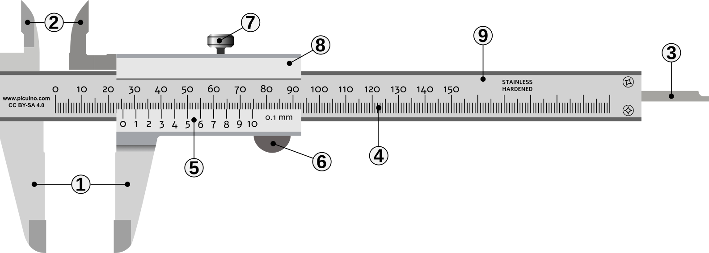
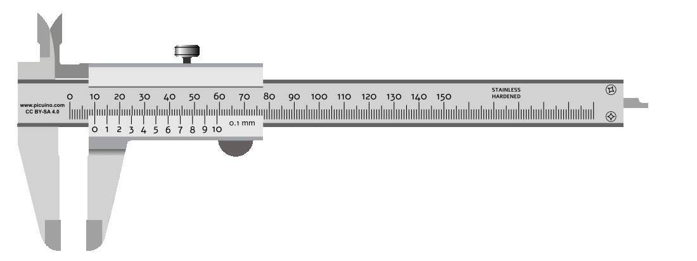
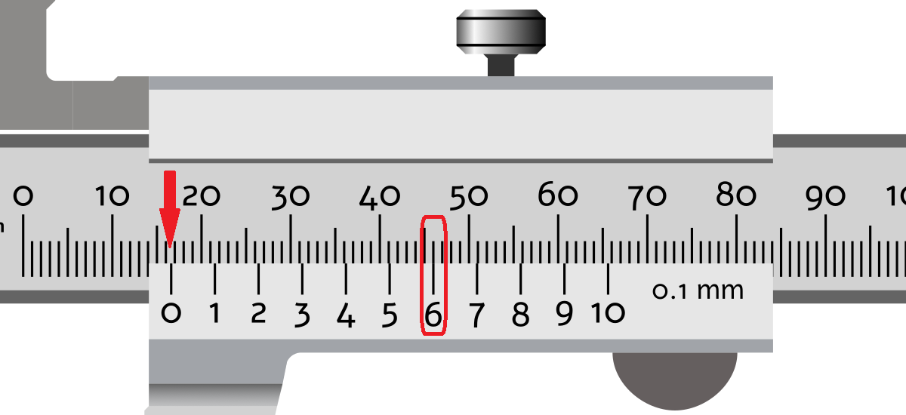

:Date: 01/12/2022
:Author: Carlos Pardo Martín
:Copyright: Creative Commons Attribution-ShareAlike 4.0 International

.. _mecan-calibre:

:index:`Calibre`
================

Un **calibre**, también llamado **pie de rey**, es un instrumento
de medición de mayor precisión que una regla milimetrada.

El calibre dispone de varias mordazas y una sonda con las que se pueden
medir medir con facilidad diámetros exteriores, diámetros interiores
y profundidades.

Su **nonio** también llamado escala **vernier** es una escala auxiliar 
que permite la medición de distancias con una precisión de 0.1 milímetros
(hasta 0.02 milímetros en algunos instrumentos).
Esta precisión mejora 10 o más veces la precisión de una regla milimetrada.

Partes del calibre
------------------
Un calibre está compuesto de las siguientes partes.

   Partes de un calibre o pie de rey.

1. Mordazas para medir exteriores.
2. Mordazas para medir interiores.
3. Sonda para medir profundidades.
4. Escala principal milimetrada.
5. Nonio para leer fracciones de milímetros.
6. Botón de deslizamiento.
7. Tornillo de freno.
8. Corredera (parte móvil del calibre).
9. Regla (parte fija del calibre).

   Corredera de un calibre moviéndose sobre la regla.

Medición con el nonio
---------------------
La medida en milímetros de un calibre se puede observar en la escala 
principal, donde coincide con la marca de 0 del nonio.

La medida en décimas de milímetro se puede observar en el punto donde
una de las líneas del nonio coincide con una línea de la escala principal.

   Medición de una distancia de 16,6 milímetros.
   
   
Calibre virtual
---------------
Simulación de un `calibre con precisión de 0.05 milímetros
<https://www.stefanelli.eng.br/es/calibre-virtual-simulador-milimetro-05/>`__.

Test de la unidad
-----------------

`Test de medidas con el calibre.
<https://www.picuino.com/test/es-mecan-calibre-medidas.html>`__
