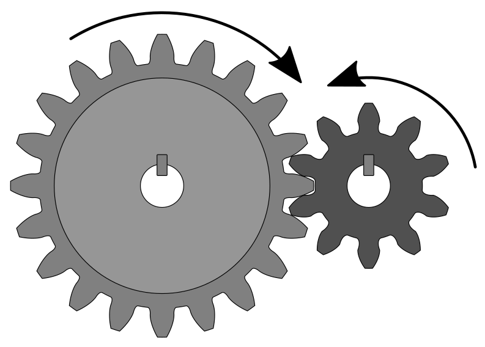


.. _mecan-engranajes:

Engranajes
==========
Un engranaje es un mecanismo compuesto por dos o más ruedas dentadas.
Sirve para transmitir movimiento circular y para transformar la velocidad
y la fuerza de giro.

Si las dos ruedas son de distinto tamaño, la rueda mayor se denomina 
**corona** y la rueda menor se denomina **piñon**.

Una de las aplicaciones más importantes de los engranajes es la
transformación de la velocidad de giro desde un motor, generalmente rápido
y con poco par de giro, hasta la aplicación que ha de realizar trabajo, 
generalmente más lenta y con mayor par de giro. 

Por ejemplo con engranajes se transforma la velocidad de giro del motor 
de un automóvil a una velocidad menor y con mayor par, de las ruedas 
del automóvil.

Cálculo de engranajes
---------------------
La velocidad de giro de cada rueda dentada de un engranaje depende del
número de dientes.

La fórmula que relaciona las velocidades de dos ruedas dentadas
iguala el producto del número de dientes por la velocidad angular
según la siguiente fórmula.

.. math::

    Z_{1} \cdot N_{1} = Z_{2} \cdot N_{2}

Siendo

   Z1 = Dientes de la primera rueda dentada
    
   N1 = Velocidad angular de la primera rueda dentada

   Z2 = Dientes de la segunda rueda dentada
    
   N1 = Velocidad angular de la segunda rueda dentada

La velocidad angular se suele medir en **revoluciones por minuto**
también escrito como **rpm**, que significa el número de
vueltas completas que gira la rueda en un minuto.
Un motor típico suele tener una velocidad angular en un rango
desde 1000 rpm  hasta 6000 rpm.

Ejercicio aerogenerador
-----------------------
En este caso vamos a calcular un engranaje que sirve para 
multiplicar la velocidad de giro de un eje.

Un aerogenerador gira sus aspas a una velocidad de
20rpm y debe multiplicar esa velocidad hasta la velocidad del
generador que es de 1000rpm.
Si el piñón conectado al generador tiene 15 dientes
¿Cuántos dientes tendrá la corona?

El primer paso será escribir los datos del problema.

.. math::

   N_{1} = 20 \: rpm

.. math::

   N_{2} = 1000 \: rpm

.. math::

   Z_{2} = 15 \: dientes

A continuación escribimos la fórmula y sustituimos los valores conocidos.

.. math::

   Z_{1} \cdot N_{1} = Z_{2} \cdot N_{2}

.. math::

   Z_{1} \cdot 20 \: rpm = 15 \cdot 1000 \: rpm
    
    
Por último despejamos la ecuación y calculamos el valor de la incógnita.

.. math::

   Z_{1} = \cfrac{15 \cdot 1000 \: rpm}{20 \: rpm} 

.. math::

   Z_{1} = 750 \: dientes 

En la práctica, cuando la relación entre los dientes es tan grande, se 
suelen utilizar trenes de engranajes con más de dos ruedas conectadas
entre sí para reducir o aumentar la velocidad de giro en varias etapas.

.. image:: mecan/_images/mecan-gears-02.png
   :align: center
   :width: 604px

