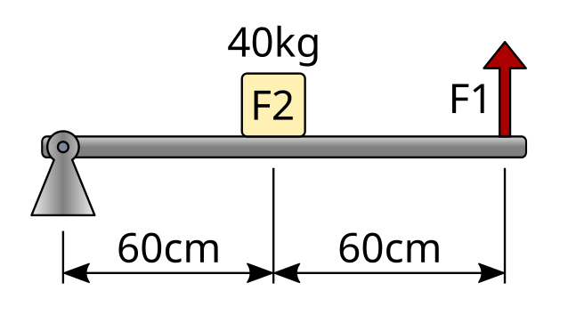

:Date: 25/05/2022
:Author: Carlos Pardo Martín
:Copyright: Creative Commons Attribution-ShareAlike 4.0 International

.. _mecan-palancas:

:index:`Palancas`
=================
La palanca​ es una máquina simple​ compuesta por una barra rígida que gira
alrededor de un punto de apoyo llamado fulcro. 
La función de la palanca consiste en transmitir una fuerza y 
desplazamiento desde un punto a otro. Se puede utilizar para amplificar
la fuerza aplicada o para incrementar el desplazamiento aplicado.

Dependiendo de la situación de la fuerza aplicada (F) de la resistencia
a mover (R) y del fulcro (△) podemos distinguir tres tipos de palancas.

Palancas de primera especie
---------------------------

Las palancas de primera especie tienen el apoyo en el medio
de la barra, entre la fuerza aplicada y la resistencia.

.. image:: mecan/_images/mecan-palancas-01.png
   :align: center
   :height: 142px

Ejemplos de este tipo de palanca son un balancín, unas tijeras o
unos alicates.

.. image:: mecan/_images/mecan-palancas-04.png
   :align: center
   :height: 213px

Palancas de segunda especie
---------------------------

Las palancas de segunda especie tienen la resistencia en el medio
de la barra, entre el fulcro y la fuerza aplicada.

.. image:: mecan/_images/mecan-palancas-02.png
   :align: center
   :height: 142px

Ejemplos de este tipo de palanca son una carretilla
o un cascanueces.

.. image:: mecan/_images/mecan-palancas-05.png
   :align: center
   :height: 260px

Palancas de tercera especie
---------------------------

Las palancas de tercera especie tienen la fuerza aplicada en el medio
de la barra, entre el fulcro y la resistencia.

.. image:: mecan/_images/mecan-palancas-03.png
   :align: center
   :height: 142px

Ejemplos de este tipo de palanca son unas pinzas de depilar o nuestro
antebrazo cuando sube la mano.

.. image:: mecan/_images/mecan-palancas-06.png
   :align: center
   :height: 189px

Cálculo de fuerzas y distancias
-------------------------------
La fórmula para calcular las fuerzas y distancias involucradas en una 
palanca iguala los torques producidos por las fuerzas. 
El torque es el producto de una fuerza por su distancia al punto de 
apoyo, de manera que la fórmula queda como sigue.

.. image:: mecan/_images/mecan-palancas-07.png
   :align: center
   :height: 177px

.. math::

   F_{1} \cdot d_{1} = F_{2} \cdot d_{2}

Siendo

   F1 = Fuerza aplicada 1
    
   d1 = Distancia desde la fuerza 1 hasta el punto de apoyo

   F2 = Resistencia o fuerza 2
    
   d2 = Distancia desde la fuerza 2 hasta el punto de apoyo
    
Las distancias pueden medirse en metros, centímetros, milímetros, 
pulgadas, etc. Pero ambas distancias deben medirse siempre 
con la misma unidad.

Las fuerzas pueden medirse en kilogramos-fuerza o en Newtons, siempre
que ambas fuerzas se midan con la misma unidad.

Ejercicio alicates
------------------
Como ejemplo, vamos a calcular la fuerza que realizan unos alicates 
a los que aplicamos una fuerza de 10kgf en el mango, 
con las siguientes distancias.

.. image:: mecan/_images/mecan-palancas-08.png
   :align: center
   :height: 177px

El primer paso será escribir los datos del problema y traducir los 
valores de distancia a la misma unidad, por ejemplo en milímetros.

.. math::

   F_{1} = 10 \: kgf
    
.. math::

   d_{1} = 5,6 \: cm = 56 \: mm
    
.. math::

   d_{2} = 20 \: mm
    
A continuación escribimos la fórmula y sustituimos los valores conocidos.

.. math::

   F_{1} \cdot d_{1} = F_{2} \cdot d_{2}

.. math::

   10 \: kgf \cdot 56 \: mm = F_{2} \cdot 20 \: mm
    
    
Por último despejamos la ecuación y calculamos el valor de la incógnita
con las mismas unidades que tenía la fuerza conocida.

.. math::

   \cfrac{10 \: kgf \cdot 56 \: mm}{20 \: mm} = F_{2} 

.. math::

   F_{2} = \cfrac{560}{20} = 28 \: kgf 

Ejercicio carretilla
--------------------
En este ejercicio vamos a calcular la fuerza que hay que realizar para
levantar una carretilla que lleva en su interior un peso de 40kgf.
Las dimensiones de la carretilla simplificada son las siguientes.

El primer paso será escribir los datos del problema. 
En este caso no es necesario convertir las unidades de distancia, 
pues ambas distancias nos las dan en centímetros.

.. math::

   F_{2} = 40 \: kgf
    
.. math::

   d_{1} = 60 \: cm + 60 \: cm = 120 \: cm
    
.. math::

   d_{2} = 60 \: cm
    
Como podemos ver, para calcular la distancia desde la fuerza 1 hasta el 
punto de apoyo es necesario sumar las dos distancias que aparecen en
el dibujo.
    
A continuación escribimos la fórmula y sustituimos los valores conocidos.

.. math::

   F_{1} \cdot d_{1} = F_{2} \cdot d_{2}

.. math::

   F_{1} \cdot 120 \: cm = 40 \: kgf \cdot 60 \: cm
    
    
Por último despejamos la ecuación y calculamos el valor de la incógnita
(F1) con las mismas unidades que tenía la fuerza conocida, 
kilogramo-fuerza.

.. math::

   F_{1} = \cfrac{40 \: kgf \cdot 60 \: cm}{120 \: cm}

.. math::

   F_{1} = \cfrac{2400}{120} = 20 \: kgf 

Ejercicios de palancas
----------------------

:download:`Ejercicio para identificar palancas de primera, segunda 
o tercera especie. Formato PDF <mecan/mecan-palancas-02.pdf>`

:download:`Ejercicio para identificar palancas de primera, segunda 
o tercera especie. Formato DOC <mecan/mecan-palancas-02.doc>`
