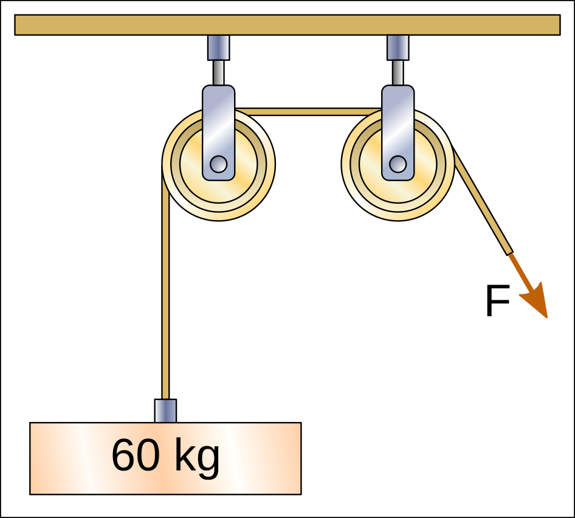
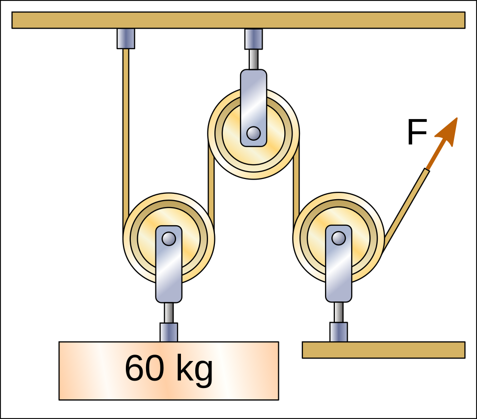
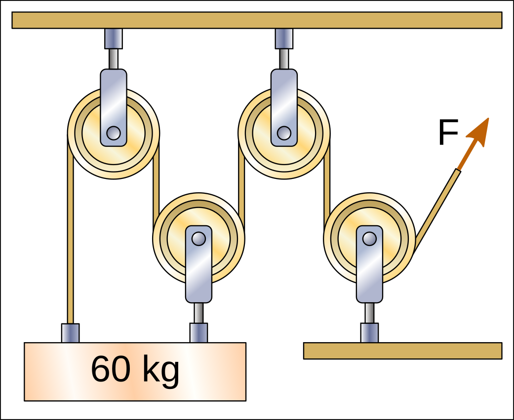

:Date: 22/05/2022
:Author: Carlos Pardo Martín
:Copyright: Creative Commons Attribution-ShareAlike 4.0 International

.. _mecan-poleas:

:index:`Poleas`
===============
Una polea es una máquina simple compuesta de una rueda acanalada por
la que pasa una cuerda.
La función de la polea es desviar la dirección y la posición
de la cuerda y por lo tanto de la fuerza aplicada.
De esta manera la cuerda de un pozo puede levantar un cubo de agua
haciendo fuerza hacia abajo lejos del brocal, lo que significa una
ventaja al poder tirar desde una posición más cómoda.

.. image:: mecan/_images/mecan-poleas-01.png
   :align: center
   :height: 284px

.. image:: mecan/_images/mecan-poleas-02.png
   :align: center
   :height: 300px

Una cortina puede moverse hacia un lado y al otro gracias a una
cuerda de la que tiramos hacia abajo a nivel del suelo.
La función de las poleas aquí es mover la fuerza desde el suelo
hasta una posición elevada y de lado a lado.

En todos los casos anteriores las poleas desvían la dirección y la 
posición de la fuerza, pero no reducen la fuerza necesaria para levantar 
el peso.
Por lo tanto todas estas poleas necesitan que se estire el extremo de la 
cuerda con una fuerza de 60kgf (60 kilogramos-fuerza) para poder levantar 
los pesos.

:index:`Polipastos`
-------------------
Uniendo varias poleas se puede formar un polipasto, que levantará pesos
con ventaja mecánica, es decir que podrá levantar más peso que la fuerza
aplicada sobre la cuerda.

Para calcular la fuerza necesaria para levantar el peso, hay que dividir
el peso entre el número de tramos de cuerda que están tirando del peso 
hacia arriba.

En los siguientes polipastos hay **2 tramos de cuerda** que tiran del 
peso hacia arriba y por lo tanto la fuerza que hay que realizar para 
levantar el peso será la mitad, es decir 30kgf.

.. image:: mecan/_images/mecan-poleas-03.png
   :align: center
   :height: 284px

.. image:: mecan/_images/mecan-poleas-04.png
   :align: center
   :height: 284px

En los siguientes polipastos hay **3 tramos de cuerda** que tiran del 
peso hacia arriba y por lo tanto la fuerza que hay que realizar para 
levantar el peso será un tercio, es decir 20kgf.

.. image:: mecan/_images/mecan-poleas-05.png
   :align: center
   :height: 284px

.. image:: mecan/_images/mecan-poleas-07.png
   :align: center
   :height: 284px

En los siguientes polipastos hay **4 tramos de cuerda** que tiran del
peso hacia arriba y por lo tanto la fuerza que hay que realizar para
levantar el peso será una cuarta parte, es decir 15kgf.

.. image:: mecan/_images/mecan-poleas-06.png
   :align: center
   :height: 284px

.. image:: mecan/_images/mecan-poleas-08.png
   :align: center
   :height: 284px

Hay que tener en cuenta que a veces las poleas de abajo no están
enganchadas al peso y por lo tanto no cuentan a la hora de calcular
la fuerza con la que hay que tirar de la cuerda.

En este polipasto hay **2 tramos de cuerda** que tiran del peso hacia
arriba y por lo tanto la fuerza que hay que realizar para levantar
el peso será la mitad, es decir 30kgf.

En este polipasto hay **3 tramos de cuerda** que tiran del peso hacia
arriba y por lo tanto la fuerza que hay que realizar para levantar
el peso será un tercio, es decir 20kgf.

Polipastos anidados
-------------------
Un polipasto puede tirar de la cuerda de otro polipasto y en ese
caso nos encontramos con un polipasto anidado.
Cada uno de los polipastos divide la fuerza que hay que realizar
sobre la cuerda.

En el siguiente polipasto, la polea de abajo divide entre **dos
tramos de cuerda** el peso de 60kg, por lo que la primera cuerda
tendrá una tensión de solo 30kgf.

La polea de arriba vuelve a dividir entre **dos tramos de cuerda** la
fuerza de la primera cuerda, por lo que la tensión será de 15kgf.
Esta será la fuerza F que hay que realizar para subir el peso.

.. image:: mecan/_images/mecan-poleas-12.png
   :align: center
   :height: 331px

Ejercicios
----------
Ejercicios de poleas y polipastos para calcular la fuerza 
con la que debemos tirar de la cuerda para levantar un peso.

| :download:`Ejercicios de poleas y polipastos.
  Formato PDF. <mecan/mecan-poleas-ejercicios.pdf>`
|
| :download:`Ejercicios de poleas y polipastos.
  Formato editable ODT. <mecan/mecan-poleas-ejercicios.odt>`