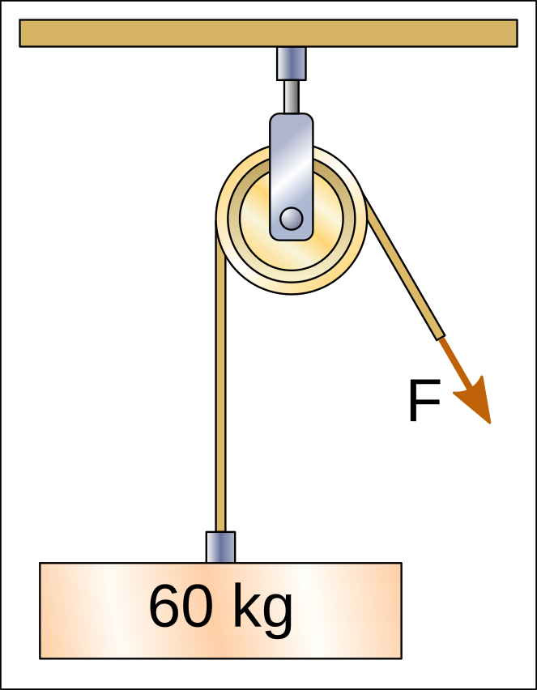
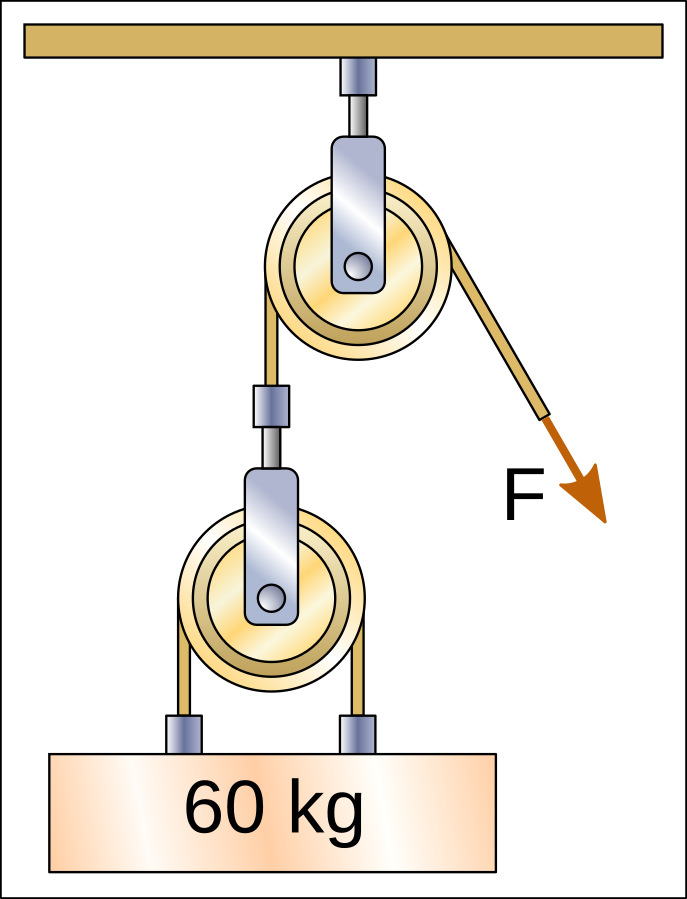
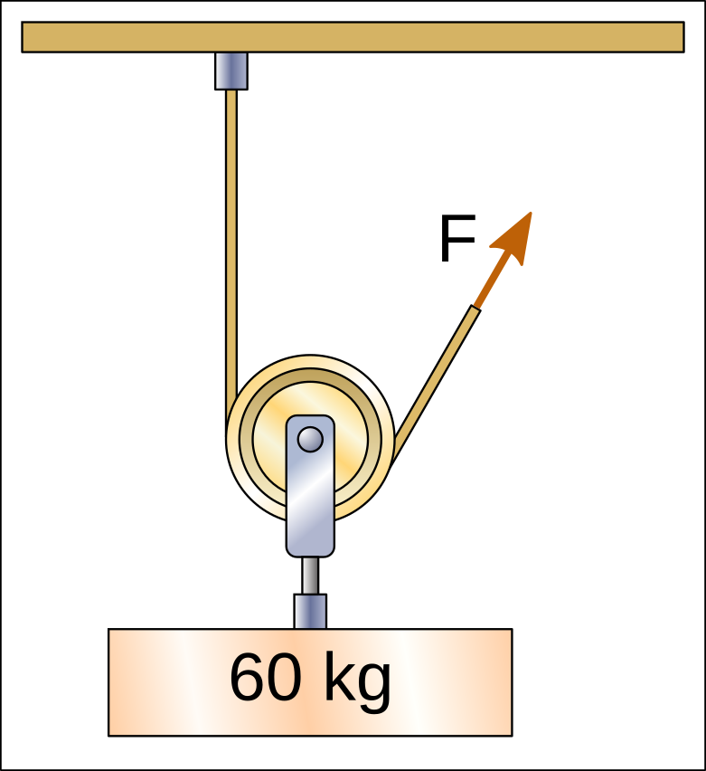
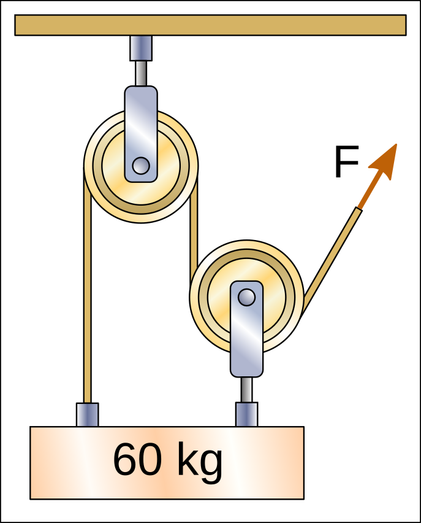
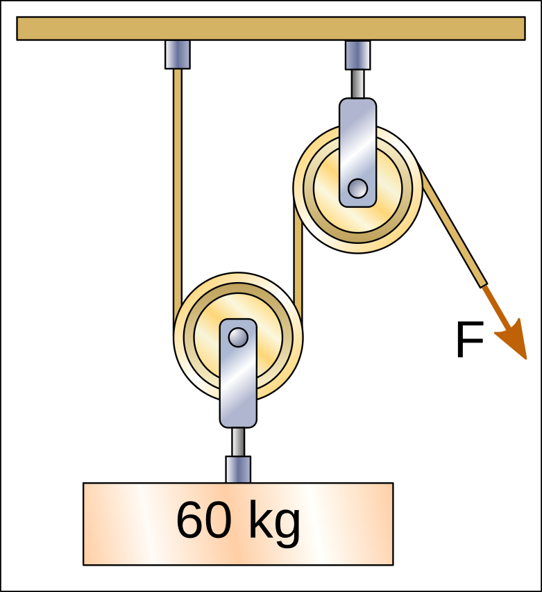
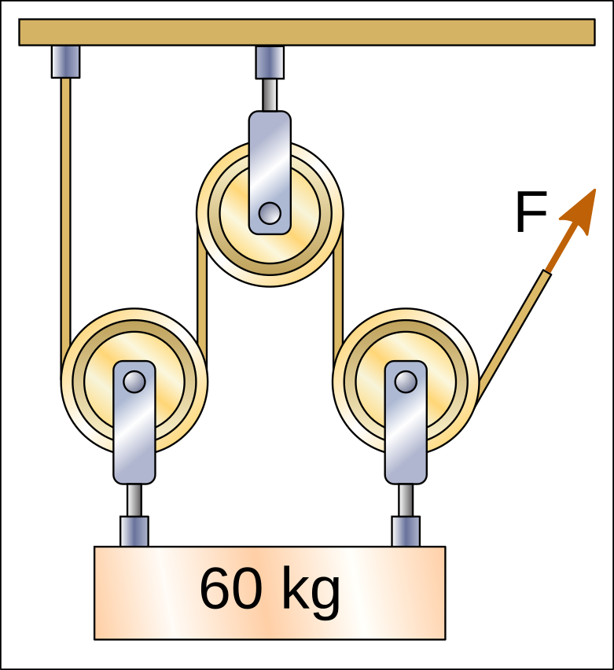
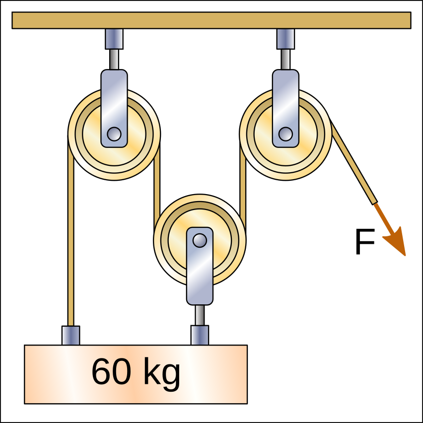


.. _mecan-poleas:

Poleas
======
Una polea es una máquina simple compuesta de una rueda acanalada por
la que pasa una cuerda.
La función de la polea es desviar la dirección y la posición
de la cuerda y por lo tanto de la fuerza aplicada.
De manera que una cuerda de un pozo puede levantar un cubo de agua
haciendo fuerza hacia abajo lejos del brocal, lo que significa una 
ventaja.

Polipastos
----------
Uniendo varias poleas se puede formar un polipasto, que levantará pesos
con ventaja mecánica, es decir que podrá levantar más peso que la fuerza
aplicada.

.. image:: mecan/_images/mecan-poleas-05.png
   :align: center
   :height: 284px

