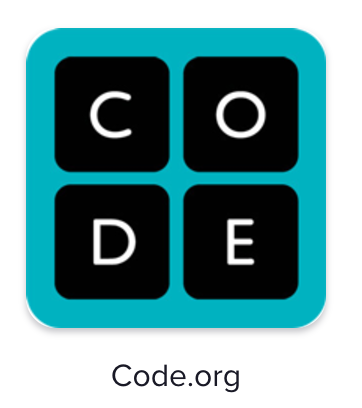
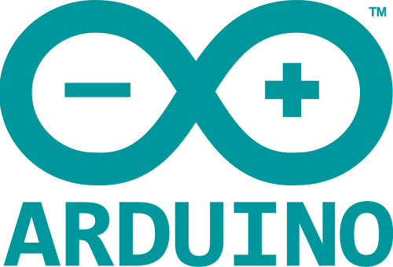
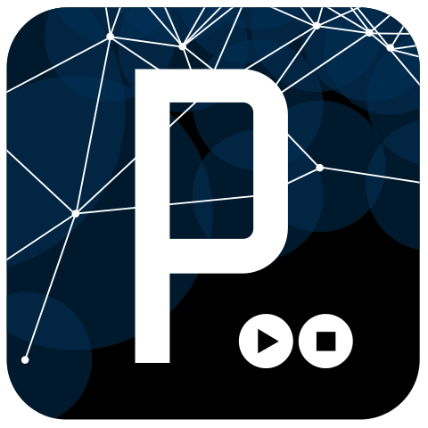


.. _prog-lang-edu:

***************************
 Lenguajes de programación
***************************

Comparativa de diferentes lenguajes de programación para la enseñanza.

Programación por bloques
========================

Cursos Code
-----------

* Website: `Code Studio <https://studio.code.org/courses>`_
* Desarrollador: Code.org
* Programación: por bloques (basado en `Blockly
  <https://developers.google.com/blockly/>`_)
* Gratuita y multiplataforma

Cursos guiados de diferentes niveles, desde 4 hasta 16 años, y de
diferentes duraciones, desde 1 hora hasta 24 horas.

Enseñan los fundamentos de la programación imperativa y estructurada.
Secuencias, bucles, condicionales, variables, funciones y parámetros.

Scratch
-------

.. image:: prog/_images/scratch-logo.png
   :width: 240px

* Website: `Scratch <https://scratch.mit.edu/>`_
* Desarrollador: MIT
* Programación: por bloques
* Para programar: en navegador y PC
* Multitarea
* Software libre. Mutiplataforma.

Proyecto del MIT para enseñar programación a los niños en un
entorno creativo. La web tiene multitud de proyectos compartidos
que se pueden estudiar y reutilizar.

Tutoriales scratch: :ref:`scratch-index`

Mblock
------

.. image:: prog/_images/mblock-logo.png
   :height: 120px

* Website: `mBlock <https://www.makeblock.es/soporte/mblock/>`_
* Desarrollador: Makeblock, basado en Scratch
* Programación: por bloques
* Para programar: PC y Arduino
* Multitarea
* Software libre. Mutiplataforma.

Proyecto basado en Scratch offline, que incluye instrucciones
para Arduino y para los robots de Makeblock basados en Arduino.

Se puede programar en Scratch y también se pueden hacer programas
con bloques para Arduino. Una vez descargados a Arduino, los
programas son independientes y funcionan sin conexión al PC.

-----

Programación de Smartphones
===========================
Los smartphones Android, los más extendidos, se programan con el
lenguaje Java. Existen alternativas más sencillas orientadas a
la educación.

AppLab
------

.. image:: prog/_images/applab-logo.png
   :height: 120px

* Website: `AppLab <https://code.org/educate/applab>`_
* Desarrollador: Code.org
* Programación: por bloques o en texto JavaScript
* Gratuita y multiplataforma
* Necesita crear una cuenta
* Las apps se ejecutan en cualquier **smartphone** a
  través del navegador

AppInventor
-----------
.. image:: prog/_images/appinventor-logo.png
   :width: 240px

* Website: `AppInventor <http://appinventor.mit.edu>`_
* Desarrollador: MIT
* Programación: por bloques
* Para programar: smartphones

-----

Programación en texto
=====================
Estos lenguajes tienen un nivel de dificultad más alto al programarse
escribiendo código en formato texto. Necesitan aprender una gramática
que es más complicada que el simple movimiento de bloques.
Como ventaja, son mucho más potentes y flexibles.

Arduino
-------

* Website: `Arduino <https://www.arduino.cc/>`_
* Desarrollador: Arduino
* Programación: texto, basado en lenguaje C
* Para programar: Placas electrónicas Arduino y similares
* Software libre
* Gran cantidad de tutoriales de diversos niveles y calidad,
  orientados a proyectos DIY

Arduino se programa en lenguaje C con añadidos para hacerlo más
sencillo. Está dirigido a la programación de circuitos electrónicos,
montajes Maker y robots. Su objetivo es acercar la programación de
los microcontroladores a los estudiantes sin preparación técnica.

Python
------

.. image:: prog/_images/python-logo.png
   :height: 120px

* Website: `Python <https://www.python.org>`_
* Desarrollador: Python foundation
* Programación: texto
* Para programar: PC
* Software libre. Mutiplataforma
* Muchos Tutoriales de muchos niveles, también en castellano.

Tutoriales:

* `Learn Python <http://www.learnpython.org/>`_
* `Code Academy <https://www.codecademy.com/learn/learn-python>`_

Lenguaje multiparadigma, muy sencillo de programar y de entender.
Es el lenguaje preferido para enseñar a programar de múltiples
colegios y universidades de todo el mundo [1]_ por la rapidez
y sencillez con la que se pueden hacer proyectos desde cero.

Por otro lado es uno de los primeros 5 lenguajes profesionales más
usados y el que más crece en la actualidad [2]_.
Está apoyado por Google y es el lenguaje seleccionado para
desarrollar sus aplicaciones de inteligencia artificial y Deep
Learning, el futuro de la informática.

Tiene multitud de tutoriales de todo tipo y de todos los niveles,
en inglés y en español y en formato libre y gratuíto.

A la hora de programar entornos gráficos y juegos para ordenador,
el entorno `Pygame <https://www.pygame.org/tags/all>`_ facilita
mucho esta tarea y ofrece ejemplos didácticos creados por otros
programadores.

A su vez, el entorno `Python Turtle
<https://docs.python.org/3.3/library/turtle.html>`_ emula al
entorno del lenguaje LOGO, creado por `Seymour Papert
<https://es.wikipedia.org/wiki/Seymour_Papert>`_ en el
MIT para enseñar a los niños a programar.

Processing
----------

* Website: `Processing <https://processing.org/>`_
* Desarrollador: Processing foundation
* Programación: texto, basado en lenguaje Java
* Para programar: PC y smartphones
* Grandes posibilidades gráficas
* Software libre. Mutiplataforma
* Tutoriales solo en ingles y con nivel Bachillerato.

Tutoriales:

* `Tutoriales oficiales <https://processing.org/tutorials/>`_
* `Hour of code <http://hello.processing.org/editor/>`_

Processing es un entorno de programación en Java que añade muchas
facilidades para acercar la programación a los artistas. Tiene
muchas facilidades para la programación de aplicaciones visuales
con dibujos e imágenes en pantalla.

Al programar en Java, las aplicaciones se pueden subir a los
smartphones y tablets basadas en Android.

Como desventajas, los tutoriales están en inglés y tienen un nivel
de bachillerato y el lenguaje no facilita el aprendizaje de la
programación.

Recursos en Internet
--------------------

`Lenguajes de programación educativa.
<https://www.educaciontrespuntocero.com/recursos/programacion/lenguajes-programacion-educativa-alternativas-a-scratch/35925.html>`_

`Qué lenguaje o herramientas de programación deberían enseñarse a 
los niños según su edad.
<https://www.xataka.com/otros/que-lenguaje-o-herramientas-de-programacion-deberian-ensenarse-a-los-ninos-segun-su-edad>`_

-----

.. [1] `Schools using Python
       <https://wiki.python.org/moin/SchoolsUsingPython>`_

.. [2] `Índice Tiobe de lenguajes de programación
       <https://www.tiobe.com/tiobe-index/>`_
