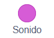
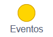
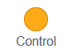
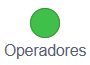
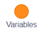
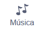


.. **********  SCRATCH 3 subs  **********

.. |br| raw:: html

    

.. |editor_de_Scratch| raw:: html

   <a href="https://scratch.mit.edu/projects/editor"
   target="_blank">editor de Scratch</a>

.. |bandera-verde| image:: scratch3/_images/scratch3-bandera-verde.png
                      :align: middle

.. |borrar-gato| image:: scratch3/_images/scratch3-borrar-gato.png
                      :align: middle

.. =====================
   BARRA SUPERIOR
   =====================

.. |boton-tutoriales| image:: scratch3/_images/scratch3-boton-tutoriales.png
                      :align: middle

.. |boton-animacion| image:: scratch3/_images/scratch3-boton-animacion.png
                      :align: middle

.. |boton-idioma| image:: scratch3/_images/scratch3-boton-idioma.png
                      :align: middle

.. =====================
   BOTONES DE CÓDIGO
   =====================

.. |boton-movimiento| image:: scratch3/_images/scratch3-boton-movimiento.png
                      :align: middle
                      :width: 60px

.. |boton-apariencia| image:: scratch3/_images/scratch3-boton-apariencia.png
                      :align: middle
                      :width: 60px

.. |boton-sensores| image:: scratch3/_images/scratch3-boton-sensores.png
                      :align: middle
                      :width: 60px

.. |boton-misbloques| image:: scratch3/_images/scratch3-boton-misbloques.png
                      :align: middle
                      :width: 60px

.. |boton-lapiz| image:: scratch3/_images/scratch3-boton-lapiz.png
                      :align: middle
                      :width: 60px

.. |boton-crear-bloque| image:: scratch3/_images/scratch3-boton-crear-bloque.png
                            :align: middle
                            :width: 133px

.. =====================
   PESTAÑAS DE CONTROL
   =====================

.. |pestania-codigo| image:: scratch3/_images/scratch3-pestania-codigo.png
                      :align: middle

.. |pestania-fondos| image:: scratch3/_images/scratch3-pestania-fondos.png
                      :align: middle

.. |pestania-sonidos| image:: scratch3/_images/scratch3-pestania-sonidos.png
                      :align: middle

.. =====================
   BOTONES DE CONTROL
   =====================

.. |seleccionar-fondo| image:: scratch3/_images/scratch3-seleccionar-fondo.png
                      :align: middle

.. |seleccionar-objeto| image:: scratch3/_images/scratch3-seleccionar-objeto.png
                      :align: middle

.. |seleccionar-sonido| image:: scratch3/_images/scratch3-seleccionar-sonido.png
                      :align: middle

.. |aniadir-extension| image:: scratch3/_images/scratch3-aniadir-extension.png
                      :align: middle

.. =======================
   BOTONES DE DISFRACES
   =======================

.. |boton-seleccion| image:: scratch3/_images/scratch3-boton-seleccion.png
                      :align: middle

.. =======================
   INSTRUCCIONES DE CÓDIGO
   =======================

.. |instruccion-iraxy| image:: scratch3/_images/scratch3-instruccion-iraxy.png
                      :align: middle

.. |instruccion-deslizarxy| image:: scratch3/_images/scratch3-instruccion-deslizarxy.png
                      :align: middle

.. |instruccion-decir| image:: scratch3/_images/scratch3-instruccion-decir.png
                      :align: middle

.. |instruccion-cambiafondo| image:: scratch3/_images/scratch3-instruccion-cambiafondo.png
                      :align: middle
