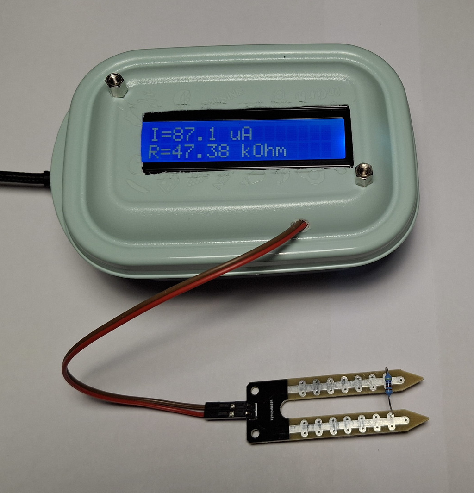
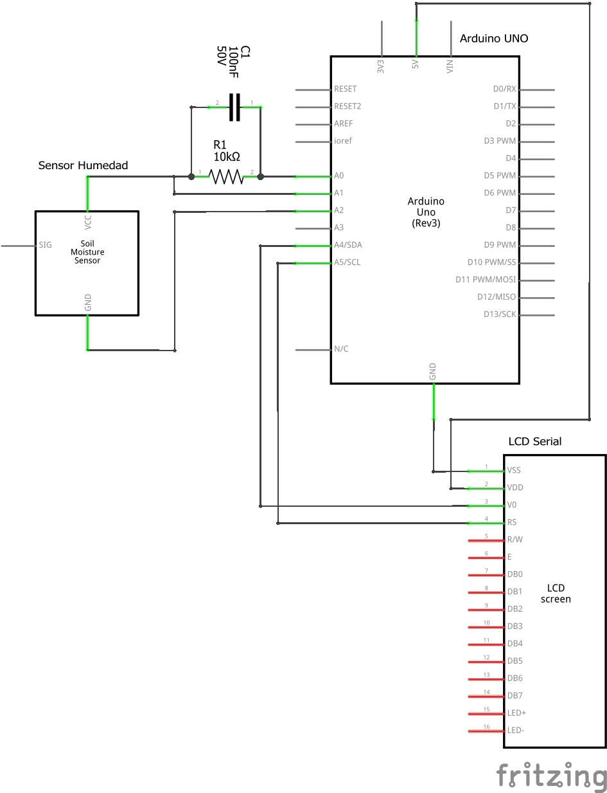
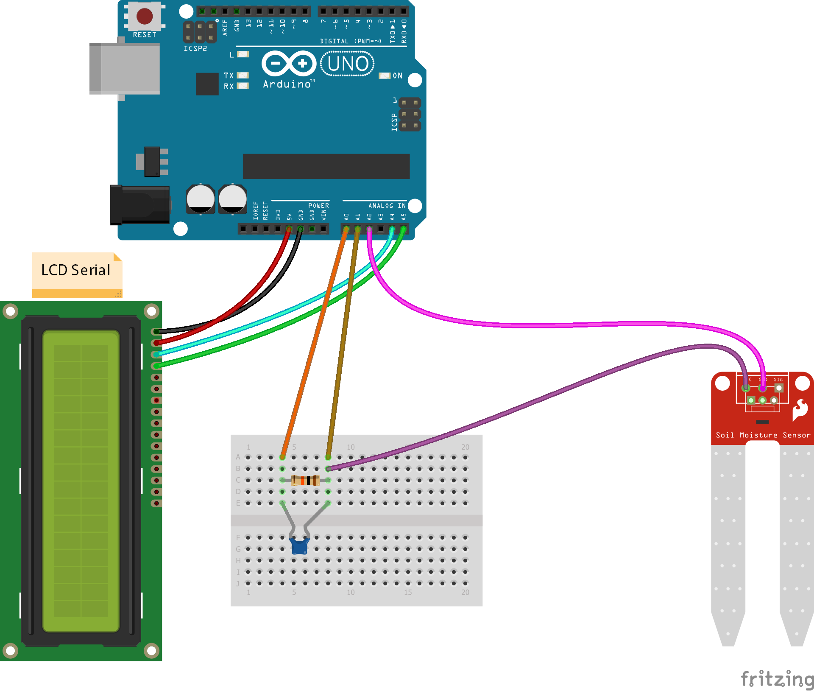
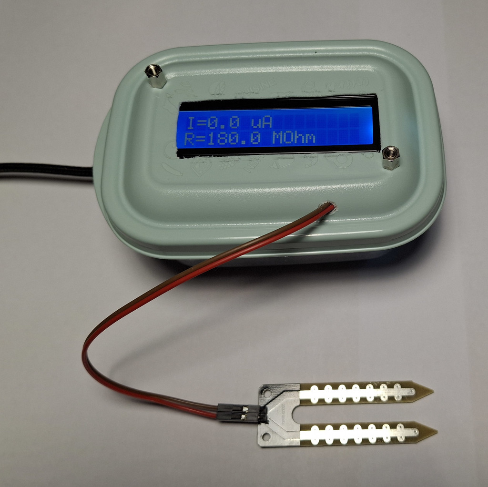
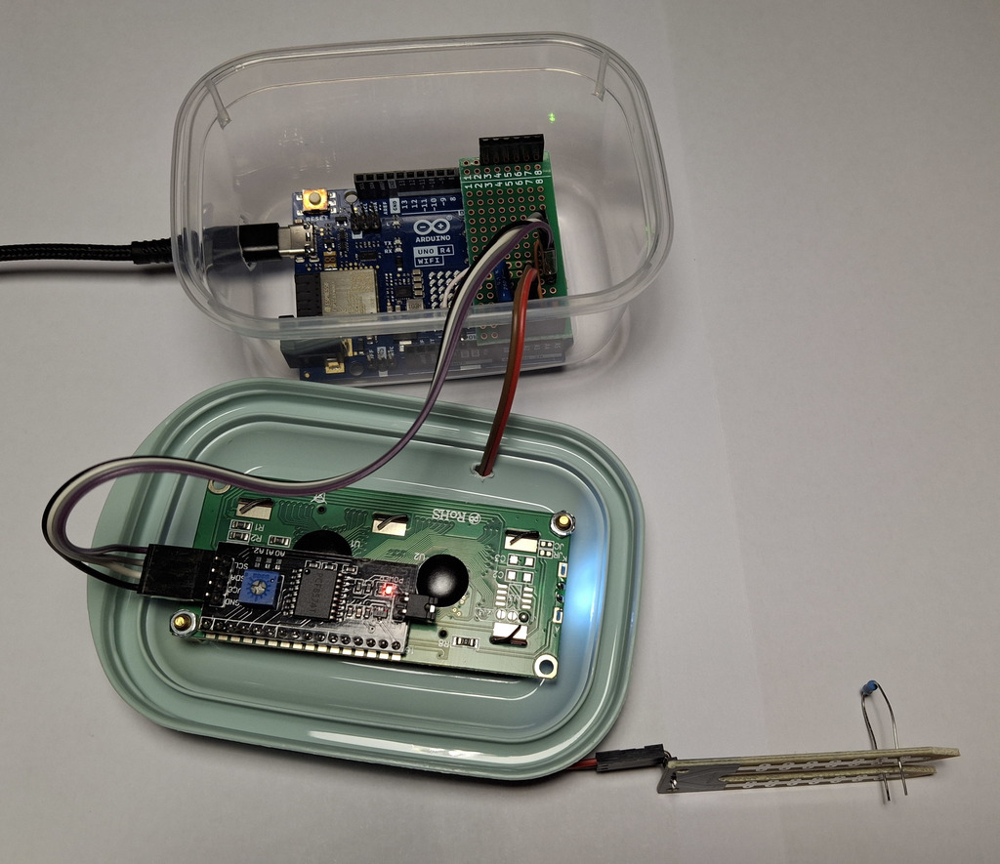
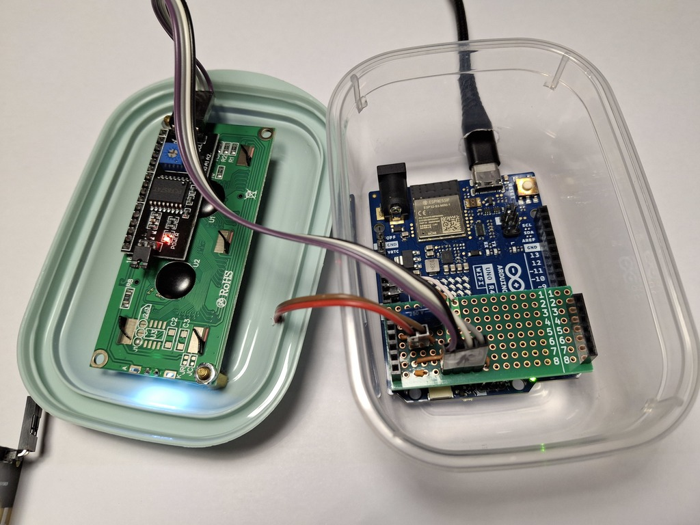

:Date: 12/12/2025
:Author: Carlos Félix Pardo Martín
:License: Creative Commons Attribution-ShareAlike 4.0 International

.. _ardu-conduct-meter:

Conductímetro
=============
Este proyecto tiene como objetivo construir un medidor de conductividad
para sólidos y líquidos basado en Arduino.
El medidor sirve para medir la conductividad o la resistencia al paso de
la corriente eléctrica de diferentes sustancias y del agua con diferentes
solutos.

Este medidor se puede usar en un laboratorio de Física y Química o de
Biología y Geología para realizar experimentos.

.. contents:: Índice de contenidos:
   :local:
   :depth: 2

Puntos a destacar
-----------------
Ventajas:
   * La medición de conductividad se realiza con un divisor resistivo,
     lo que permite tener un gran margen de medida, desde pocos ohmios
     hasta decenas de megaohmios.
   * El divisor resistivo está conectado a tensión mediante salidas
     digitales del Arduino, lo que permite mantener la tensión solo un
     pequeño tiempo durante la medición. La mayor parte del tiempo el
     sensor no tiene tensión y esto reduce mucho la degradación por la 
     electrólisis que provoca la tensión de medida.
     Además, la medida se realiza con tensiones alternas, más adecuado
     para un conductímetro que las tensiones continuas.
   * Utiliza el nuevo modelo de Arduino UNO Revisión 4, que tiene un 
     conversor analógico-digital de mayor resolución, 14 bits (16384
     puntos) frente al conversor tradicional del Arduino UNO Revisión 3
     que solo tenía 10 bits de resolución (1024 puntos).

Inconvenientes:
   * La medida de resistencia (o conductividad), al realizarse con un
     divisor resistivo, tiene poca resolución y maneja un error, en
     ocasiones, mayor del 1%.
   * Al conectar el sensor a tensión mediante salidas digitales, se añade
     una pequeña resistencia extra de unos 40 Ohmios correspondiente a las
     salidas digitales.
   * El nuevo modelo de Arduino UNO Revisión 4 utilizado no está tan
     disponible en tiendas ni es tan económico como la revisión anterior.
   * Al utilizar un divisor resistivo propio, es necesario montarlo en una
     placa de prototipos para soldadura, en vez de poder utilizar un sensor
     estándar de conductividad.

Materiales y herramientas
-------------------------
Listado de materiales y herramientas necesarios para construir el proyecto.

Materiales:
  * Placa de control: Arduino Uno R4
  * Cable de conexión USB C - USB A
  * Cargador para móvil de 5V (Opcional)
  * Display LCD de 16x2 caracteres, con conexión serie I2C
  * Sensor de humedad para líquidos, con dos electrodos
  * Resistencia de 10kOhm (preferiblemente del 1%)
  * Condensador 100nF 50V (preferiblemente de película de poliéster/polietileno)
  * Cables de conexión unifilares
  * Cables Dupont hembra-hembra
  * Placa de prototipos (para realizar las pruebas)
  * Placa para soldar prototipos (para el montaje final)
  * Tira de pines macho 1x40 paso 2.54mm
  * Caja de plástico
  * Tornillos y separadores de paso de 3mm

Herramientas:
  * Soldador y soporte de soldador
  * Cable de estaño-plomo para soldar
  * Alicates de punta fina
  * Alicates de corte
  * Segueta con hilo (para cortar la caja de plástico)
  * Barrena o broca para iniciar los agujeros de la segueta
  * Pequeña lima plana para madera

Esquema eléctrico
-----------------

   Esquema eléctrico del conductímetro.

Cableado eléctrico
------------------

   Montaje y cableado del conductímetro.

Programa de Arduino
-------------------
A continuación se muestra el código del programa con el que hay que
programar la placa de control Arduino UNO R4.

Este programa hace funcionar la placa como conductímetro
midiendo la conductividad y calculando y mostrando los
valores en el display LDC y por el puerto serie.

.. code-block:: arduino
   :linenos:

   /*
      Conductímetro basado en Arduino.
   
      Copyright (c) 2025 Carlos Félix Pardo Martín.
   
      This program is free software: you can redistribute it and/or modify
      it under the terms of the GNU General Public License as published by
      the Free Software Foundation, either version 3 of the License, or
      (at your option) any later version.
   
      This program is distributed in the hope that it will be useful,
      but WITHOUT ANY WARRANTY; without even the implied warranty of
      MERCHANTABILITY or FITNESS FOR A PARTICULAR PURPOSE.  See the
      GNU General Public License for more details.
   
      You should have received a copy of the GNU General Public License
      along with this program. If not, see <https://www.gnu.org/licenses/>.
   */
   
   #include <Wire.h>
   #include <LiquidCrystal_I2C.h>
   
   
   const float resistencia = 10000.0;        // Resistencia R1 en ohmios
   const float v_alimentacion = 5.0;         // Tensión de alimentación en voltios
   const float to_micros = 1000000.0;        // Convertir una unidad en micro-unidades
   const float pasos_adc = 16 * 1024.0 - 1;  // Pasos de conversión máximos del ADC
   const float resistencia_max = round(pasos_adc * resistencia * 0.000001) * 1000000;
   
   unsigned long tiempo_anterior = 0;  // Variable del temporizador
   unsigned long intervalo = 1000;     // Intervalo de temporización. 1000ms = 1s
   
   LiquidCrystal_I2C lcd(0x27, 16, 2);
   
   
   void setup() {
     descarga_condensador();
   
     Serial.begin(9600);
   
     lcd.init();       // Inicializar LCD
     lcd.backlight();  // Encender backlight
   
     analogReadResolution(14);  // 14 bits de resolución en el ADC
   }
   
   
   void loop() {
     int vr1, vr2;
     float current, r2;
   
     // Si ha pasado un segundo de intervalo,
     // entonces ejecuta el código del conductímetro
     if (millis() - tiempo_anterior > intervalo) {
       tiempo_anterior += intervalo;
   
       vr1 = adc_read_vr1();
       vr2 = pasos_adc - vr1;
   
       current = adc_to_current(vr1);
       r2 = adc_to_resistance(vr1, vr2);
   
       lcd_output(current, r2);
       serial_output(current, r2);
     }
   }
   
   void descarga_condensador(void) {
     pinMode(A0, OUTPUT);
     pinMode(A1, OUTPUT);
     pinMode(A2, OUTPUT);
     digitalWrite(A0, LOW);
     digitalWrite(A1, LOW);
     digitalWrite(A2, LOW);
     delayMicroseconds(50);
   }
   
   
   int adc_read_vr1() {
     int adc1, adc2;
     int delay = 4000;
   
     // Establecer A1 como pin de entrada analógica
     pinMode(A1, INPUT);
   
     // Conectar tensión positiva en el sensor
     digitalWrite(A0, LOW);
     digitalWrite(A2, HIGH);
     delayMicroseconds(delay);
   
     // Leer el valor de tensión en R1
     adc1 = analogRead(A1);
   
     // Descargar el condensador
     descarga_condensador();
     pinMode(A1, INPUT);
   
     // Conectar tensión negativa en el sensor
     digitalWrite(A0, HIGH);
     digitalWrite(A2, LOW);
     delayMicroseconds(delay);
   
     // Leer el valor de tensión en R1
     adc2 = pasos_adc - analogRead(A1);
   
     // Descargar el condensador y devolver la lectura
     descarga_condensador();
   
     return (adc1 + adc2)>>1;
   }
   
   float adc_to_current(int vr1) {
     return vr1 * to_micros * v_alimentacion / (pasos_adc * resistencia);
   }
   
   float adc_to_resistance(int vr1, int vr2) {
     if (vr1 == 0) {
       // Si no hay corriente, devolver la menor resistencia posible.
       return resistencia_max;
     }
     return vr2 * resistencia / vr1;
   }
   
   int lcd_output(float current, float r2) {
     lcd.setCursor(0, 0);  // Columna 0, fila 0
     lcd.print("I=");
     lcd.print(current, 1);
     lcd.print(" uA     ");
   
     // Si no hay corriente, imprime la resistencia máxima medible
     if (current == 0) {
       lcd.setCursor(0, 1);  // Columna 0, fila 1
       lcd.print("R>");
       lcd.print(resistencia_max * 0.000001, 0);
       lcd.print(" MOhm");
     } else {
       lcd.setCursor(0, 1);  // Columna 0, fila 1
       lcd.print("R=");
   
       // Imprime solo 4 cifras significativas de R
       if (r2 < 10000) {
         lcd.print(r2, 0);
         lcd.print(" Ohm");
       } else if (r2 < 100000) {
         lcd.print(r2 * 0.001, 2);
         lcd.print(" kOhm");
       } else if (r2 < 1000000) {
         lcd.print(r2 * 0.001, 1);
         lcd.print(" kOhm");
       } else if (r2 < 10000000) {
         lcd.print(r2 * 0.000001, 3);
         lcd.print(" MOhm");
       } else if (r2 < 100000000) {
         lcd.print(r2 * 0.000001, 2);
         lcd.print(" MOhm");
       } else {
         lcd.print(r2 * 0.000001, 1);
         lcd.print(" MOhm");
       }
       lcd.print("     ");
     }
   }
   
   // Salida por el puerto serie, separado por tabuladores
   int serial_output(float current, float r2) {
     Serial.print("I=\t");
     Serial.print(current, 1);
     Serial.print("\tuA");
   
     Serial.print("\tR=\t");
     Serial.print(r2, 0);
     Serial.print("\tOhm");
   
     Serial.println();
   }

Fotografías del proyecto
------------------------
Algunas fotografías del proyecto final, montado dentro de una caja y
con los componentes soldados en una PCB de prototipos para soldar.

   Conductímetro basado en Arduino sin resistencia en el sensor.
   La medición muestra una resistencia mayor de 180 megaohmios.

   Conductímetro con una resistencia de 47000 ohmios en el sensor.

   Interior de la caja del conductímetro I.

   Interior de la caja del conductímetro II.
