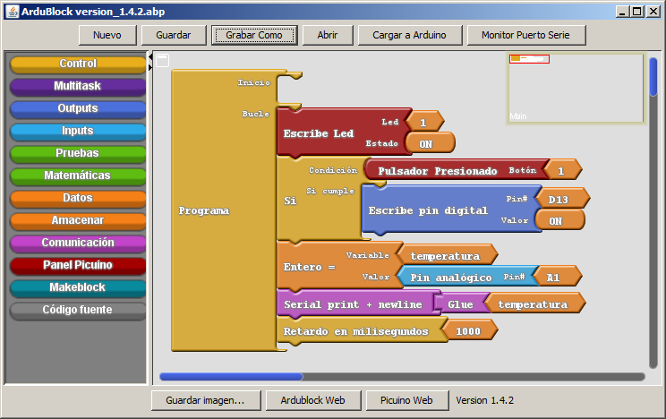

:Date: 10/12/2018
:Author: Carlos Félix Pardo Martín
:License: Creative Commons Attribution-ShareAlike 4.0 International

.. _ardublock-intro:

Introducción a Ardublock
========================

Ardublock es una herramienta para Arduino que permite programar
con bloques gráficos.
Está orientado a facilitar la programación a los usuarios sin
experiencia previa, simplificando mucho la tarea de realizar
programas con un sencillo entorno gráfico.

Es una herramienta del entorno de programación de Arduino y no
puede funcionar separado de él.

La versión que se suministra en esta página web es una versión
modificada de Ardublock original, en la que se han simplificado
los colores, los menús y el número de bloques con el objetivo de
que sea más sencillo de utilizar.

Instalación de Ardublock
------------------------
Para instalar la última versión de Ardublock-Picuino hay que
seguir los siguentes pasos:

  1. Descargar la :download:`herramienta Ardublock-Picuino
     <_downloads/ardublock-picuino.zip>`
  2. Copiar el archivo en el directorio de Arduino.
     El directorio se puede encontrar en el entorno de Arduino,
     pulsando el menú:

     ``Archivo... Preferencias... Localización del proyecto``.
  3. Descomprir el archivo en el directorio de Arduino.
  4. Cerrar y volver a abrir el entorno de Arduino.
     La nueva herramienta debe aparecer en el menú:

     ``Herramientas... Ardublock``

Instalación de librerías auxiliares para Arduino
------------------------------------------------
Estas librerías permiten que la placa Arduino controle periféricos
tales como un un panel visualizador LCD o emisores y receptores
infrarrojos.

Para **instalar todas las librerías a la vez**, hay que seguir los
siguientes pasos:

  1. Descargar el `archivo con las librerías para Arduino.
     <../_static/downloads/arduino-libraries.zip>`__
  2. Copiar el archivo en el directorio de Arduino.
     El directorio se puede encontrar en el entorno de Arduino,
     pulsando el menú:

     ``Archivo... Preferencias... Localización del proyecto``.
  3. Descomprir el archivo en el directorio de Arduino.
  4. Cerrar y volver a abrir el entorno de Arduino.
     Las nuevas librerías deben aparecer en el menú:

     ``Programa... Incluir librería...``

Para instalar librerías individuales utilizando el entorno Arduino,
se puede leer el siguiente enlace sobre
:ref:`cómo añadir una librería al entorno Arduino <add-library>`.

Manejo básico de Ardublock
--------------------------

1. **Abrir el entorno de Arduino:** para abrir ardublock es necesario
   primero tener abierto el entorno Arduino, pulsando en el siguiente
   icono.

   .. image:: _images/arduino-desktop-icon.png
      :alt: Icono del entorno IDE de Arduino.

2. **Conectar el puerto correcto:**
   en el menú de herramientas... puerto... hay que seleccionar el
   puerto al que esté conectada la placa Arduino.
   Para más información ver
   :ref:`solución de problemas con Arduino <troubleshooting-arduino>`

3. **Abrir Ardublock:**
   en el menú de herramientas del entorno de Arduino aparecerá la
   palabra Ardublock.
   Pulsando sobre ella, aparecerá el entorno sin ningún programa.

4. **Realizar el programa:**
   desplazando los bloques desde los menús de la izquierda hasta
   conectarlos con el bloque de programa.

5. **Duplicar bloques:**
   pulsando sobre un bloque con el botón derecho del ratón, aparece
   la opción de 'Clonar' que duplica el bloque y todos los bloques
   que cuelgan por debajo.

6. **Añadir comentarios:**
   pulsando sobre un bloque con el botón derecho del ratón, aparece
   la opción 'Añadir comentario' que permite escribir un texto que
   explique la función del bloque. El comentario se puede ocultar o
   mostrar pulsando el icono de interrogación '?' a la izquierda
   del bloque.

7. **Organizar los bloques:**
   pulsando sobre una zona vacía con el botón derecho del ratón,
   aparece la opción de 'Organizar todos los bloques'.
   pulsándola, todos los bloques se organizan de forma ordenada.

8. **Borrar bloques no deseados:**
   desplazando los bloques hacia la izquierda en la zona de los
   menús, los bloques desaparecerán.

9. **Cargar el programa a Arduino:** pinchando el botón superior
   'Cargar a Arduino' los bloques se transformarán en código que se
   cargará en la placa Arduino que esté conectada.
   Si es el primer programa que se carga, el entorno pedirá
   confirmación para guardar el programa. Hay que responder 'guardar'.

   Este proceso no es inmediato, hay que esperar unos segundos hasta
   que termina.

10. **Guardar el programa de Ardublock:**
    Pulsando el botón superior 'Guardar como' aparecerá un cuadro en
    el que escribir el nombre del programa y su localización.

