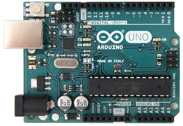

:Date: 10/12/2018
:Author: Carlos Félix Pardo Martín
:License: Creative Commons Attribution-ShareAlike 4.0 International

.. Programación con Arduino documentation master file.
   Created by sphinx-quickstart on Sun Jan 18 17:04:07 2015.

.. _arduprog-index:

#########
 Arduino
#########

Programación de la placa de control Arduino UNO.

.. toctree::
   :maxdepth: 2

   protoboard-index
   prog-index
   resource-index
   pc42-index
   ardublock-index
   ../uno-doc/index

.. nocontents
   actuator-index.rst
