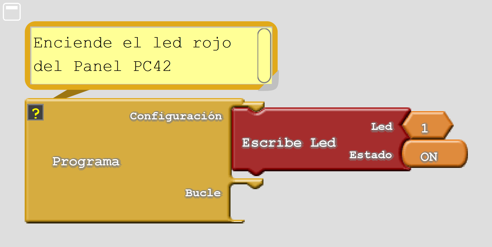
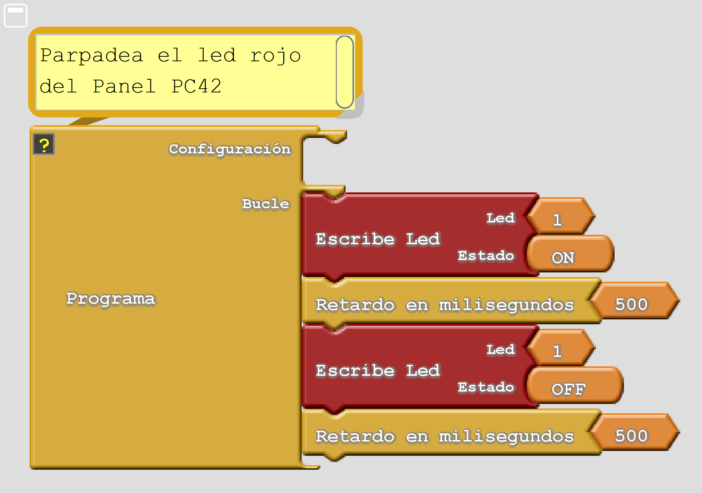

:Date: 10/12/2018
:Author: Carlos Félix Pardo Martín
:License: Creative Commons Attribution-ShareAlike 4.0 International

.. _pc42-led1:

Encendido y apagado de los LED
==============================

.. only:: html

   .. image:: _thumbs/img-0090.jpg
      :width: 300px
      :alt: LED de colores y RGB.
      :align: center

.. only:: latex

   .. figure:: _images/img-0090.jpg
      :width: 65mm
      :alt: LED de colores y RGB.
      :align: center

Objetivos
---------
* Encender y apagar los diodos led del panel de control PC42.
* Generar parpadeo de ledes mediante esperas de tiempo.

Ledes del panel de control PC42
-------------------------------

El panel de control dispone de 6 ledes. 5 led son de un solo color.
El último led de la derecha es un led RGB con los tres colores
básicos rojo, verde y azul en su interior.

   +-------+-------------+
   | Led   | Color       |
   +=======+=============+
   | 1     | ROJO        |
   +-------+-------------+
   | 2     | AMARILLO    |
   +-------+-------------+
   | 3     | VERDE       |
   +-------+-------------+
   | 4     | AZUL        |
   +-------+-------------+
   | 5     | BLANCO      |
   +-------+-------------+
   | 6     | RGB-ROJO    |
   +-------+-------------+
   | 7     | RGB-VERDE   |
   +-------+-------------+
   | 8     | RGB-AZUL    |
   +-------+-------------+

El led RGB permite generar colores compuestos por la suma de otros:

   +-----------+---------------+
   | Led       | Color         |
   +===========+===============+
   | 6 + 7     | RGB-AMARILLO  |
   +-----------+---------------+
   | 7 + 8     | RGB-CYAN      |
   +-----------+---------------+
   | 6 + 8     | RGB-MORADO    |
   +-----------+---------------+
   | 6 + 7 + 8 | RGB-BLANCO    |
   +-----------+---------------+

La función :cpp:func:`ledWrite`
-------------------------------

.. cpp:function:: ledWrite(int ledNum, int bright)

   Esta función permite encender o apagar un led concreto.
   Sus parámetros son los siguientes:

   ``ledNum``: led que se va a encender o apagar.
   Los valores válidos van desde 1 para el led D1 hasta 8
   para el color azul del led D6.

   El led D6 es un led RGB, que contiene 3 ledes en su interior.
   Los números 6, 7, 8 representan respectivamente los colores
   rojo, verde y azul del led D6.

   ``bright``: brillo con el que se va a encender el led.

      * ``LED_OFF``: apaga el led. Se puede sustituir por el
        número cero.
      * ``LED_ON``: enciende el led con la intensidad máxima.

La función :cpp:func:`digitalWrite`
-----------------------------------

.. cpp:function:: digitalWrite(int ledNum, int bright)

   Esta función es semejante a la función anterior `ledWrite`.
   Su funcionamiento es idéntico, acepta dos parámetros ``ledNum``
   y ``bright`` para establecer el led que se manejará y su brillo.

   La función tiene el mismo nombre que la función de Arduino para
   manejar los pines de salida digital. De esta forma se mantiene la
   compatibilidad de nombres para aquellos programadores acostumbrados
   al entorno Arduino.

.. La función `digitalWrite` también permite encender y apagar
   individualmente cada uno de los segmentos del display de 7
   segmentos, como se verá en el capítulo dedicado al display.

Ejemplo: encender el led D1
---------------------------
El siguiente programa encenderá de forma permanente el led D1
utilizando la función `ledWrite`

.. literalinclude:: sourcecode/led/ledWrite_On/ledWrite_On.ino
   :language: Arduino
   :linenos:
   :name: led-ledWrite_On

Programa equivalente en el entorno Ardublock:

         control PC42

En este enlace se puede descargar el
:download:`archivo de programa para entorno Ardublock 'ledWrite_On'
<_downloads/ardublock_ledWrite_On.abp>`

Ejemplo: parpadeo del led D1
----------------------------
Si se desea encender y apagar el led D1 con un periodo de un segundo,
una forma de realizarlo es encender el led, esperar medio segundo,
apagar el led y esperar medio segundo. Cuando esta secuencia se
repite, el led parpadea.
Para conseguir una espera de medio segundo se utiliza la función
``delay(500)`` que provoca una espera de 500 milisegundos
(0,5 segundos).
Para conseguir que la secuencia se repita indefinidamente, el código
se introduce dentro del bloque ``loop()``, que se repite una y otra
vez dentro del programa de Arduino.

.. literalinclude:: sourcecode/led/ledWrite_On_Off/ledWrite_On_Off.ino
   :language: Arduino
   :linenos:
   :name: led-ledWrite_On_Off

Programa equivalente en el entorno Ardublock:

         panel de control PC42

En este enlace se puede descargar el
:download:`archivo de programa para entorno Ardublock 'ledWrite_On_Off'
<_downloads/ardublock_ledWrite_On_Off.abp>`

Ejercicios
----------
Programa el código necesario para resolver los siguientes problemas.

1. Encender los ledes D1, D3 y D5 de forma permanente.

2. Encender el led D1, esperar un segundo, encender el led D2,
   esperar un segundo, continuar la secuencia hasta que estén
   encendidos los 4 primeros led.
   Una vez terminado, el programa mantendrá los 4 ledes encendidos.

3. Encender los ledes rojo, ámbar y verde como en un semáforo.

   Primero se encenderá el led verde y permanecerá encendido durante
   4 segundos.
   A continuación se apagará el led verde y se encenderá el led ámbar
   durante 2 segundos.
   Por último se apagará el led ámbar y se encenderá el rojo, que
   permanecerá encendido durante 4 segundos.

   Esta secuencia se repetirá indefinidamente.

4. Modificar el ejercicio anterior para que el led ámbar parpadee
   tres veces, cambiando de encendido a apagado cada medio segundo,
   antes de pasar a encender el led rojo.

5. Programar una baliza que encienda alternativamente el led rojo y
   el led azul. Cada led debe permanecer encendido durante un segundo.
   Siempre debe estar uno de los dos led encendidos y  nunca estarán
   los dos led encendidos a la vez.

6. Encender el led D1, esperar un segundo, apagar el led D1 y
   encender el led D2.
   Se encenderán de esta forma, consecutivamente, los 5 primeros ledes.
   En cada momento solo un led estará encendido.
   Una vez terminada la secuencia, comenzará de nuevo desde el
   principio.

7. Realizar una modificación al ejercicio anterior para que en todo
   momento haya 2 ledes encendidos.

   Al comenzar el programa deben encenderse los ledes D1 y D2.

   Pasado un segundo se encenderán los ledes D2 y D3.

   La secuencia continuará hasta que estén encendidos los ledes D6 y D1.

   A partir de este momento, el programa se repetirá comenzando
   otra vez desde el principio.

8. El siguiente programa tiene varios errores. Corrige los errores
   sintácticos para que funcione correctamente.

   .. code-block:: arduino
      :linenos:

      // Programa con errores sintácticos
      // Enciende 6 ledes en secuencia a derecha y a izquierda

      #include <Wire.h>
      #include <PC42.h>

      void setup() {
         pc.begin();                   // Inicializar el módulo PC42
         pc.ledWrite(1, LED_on);
      }

      void loop() {
         for(char i=1; i<=5; i++) {
            pc.ledWrite(i+1, LED_ON);  // Encender el led siguiente
            delay(250);                // Esperar 250 milisegundos
            pc.ledWrite(i, LED_OFF);   // Apagar el led anterior
            delay(100);                // Esperar 100 milisegundos
         }

         for(char i=5; i>=1; i--) {
            pc.ledWrite(i, LED_ON);    // Encender el led anterior
            delay(250);                // Esperar 250 milisegundos
            pc.ledWrite(i+1, LED_OFF); // Apagar el led siguiente
            delay(100);                // Esperar 100 milisegundos
         }

9. Realizar un programa que haga parpadear D1 una vez por segundo a
   la vez que D2 parpadea dos veces por segundo.
