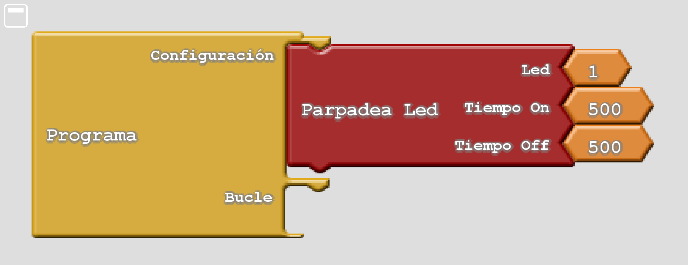

:Date: 10/12/2018
:Author: Carlos Félix Pardo Martín
:License: Creative Commons Attribution-ShareAlike 4.0 International

.. _pc42-led2:

Parpadeo de los LED
===================

.. only:: html

   .. image:: _thumbs/img-0090.jpg
      :width: 300px
      :alt: LED de colores y RGB.
      :align: center

.. only:: latex

   .. figure:: _images/img-0090.jpg
      :width: 65mm
      :alt: LED de colores y RGB.
      :align: center

Objetivos
---------
* Generar parpadeo de ledes mediante la función ledBlink.

La función :cpp:func:`ledBlink`
-------------------------------

.. cpp:function:: ledBlink(int ledNum, int time_on, int time_off)

   Esta función hace parpadear a un led con una cadencia determinada.
   Sus parámetros son los siguientes:

   ``ledNum``: led que va a parpadear. Los valores válidos van desde 1 para el led
   D1 hasta 8 para el color azul del led D6.

   El led D6 es un led RGB, que integra 3 ledes en su interior.
   Los números 6, 7, 8 representan respectivamente los colores rojo, verde y azul del led D6.

   ``time_on``: tiempo, en milésimas de segundo, que el led debe permanecer encendido.
   Si este parámetro vale cero, el led permanecerá encendido todo el tiempo.

   ``time_off``: tiempo, en milésimas de segundo, que el led debe permanecer apagado.

   .. note::

      Cada vez que se ejecuta la función :cpp:func:`ledBlink`, el led comienza el ciclo
      encendiéndose durante el tiempo ``time_on``.
      Esto puede servir para sincronizar el comienzo del parpadeo de un led.
      Si la función :cpp:func:`ledBlink` se ejecuta repetidamente cada poco tiempo,
      el led permanecerá todo el tiempo encendido, puesto que su tiempo encendido
      se reinicia una y otra vez.

Parpadeo del led D1
-------------------

En este ejemplo se desea hacer parpadear al led D1 con un tiempo encendido de medio segundo y
un tiempo apagado de medio segundo. El periodo de parpadeo será por lo tanto de un segundo.
En este caso la función se dará desde el bloque ``setup()`` una sola vez.

.. literalinclude:: sourcecode/led/ledBlink/ledBlink.ino
   :language: Arduino
   :linenos:
   :name: led-ledBlink

Programa equivalente en el entorno Ardublock:

En este enlace se puede descargar el
:download:`archivo de programa para entorno Ardublock
'ledBlink' <_downloads/ardublock_ledBlink.abp>`

Ejercicios
----------
Programa el código necesario para resolver los siguientes problemas.

1. Hacer parpadear el led D1 y el led D4 con un tiempo de encendido de
   medio segundo y un tiempo de apagado de medio segundo.
   Los dos ledes se deben encender y apagar al mismo tiempo.
   Utilizar la función :cpp:func:`ledBlink`.

2. Modificar el ejercicio anterior para que el encendido de los dos ledes
   D1 y D4 sea alternativo, de manera que solo un led esté encendido en cada
   momento. El tiempo de encendido de cada led será de medio segundo.

3. Hacer parpadear dos led a la vez con una frecuencia de un segundo.
   El led D1 se programará con la función ``ledBlink(1, 500, 500)``,
   por el contrario el led D3 se programará con el siguiente código.

   .. code-block:: arduino
      :linenos:

      void loop() {
         pc.ledWrite(3, LED_ON);  // Encender el led D3
         delay(500);              // Esperar medio segundo (500 ms)
         pc.ledWrite(3, LED_OFF); // Apagar el led D3
         delay(500);              // Esperar medio segundo (500 ms)
      }

   Se debe intentar sincronizar los dos ledes para que parpadeen a la
   vez ajustando los tiempos de encendido modificando el tiempo de la
   función ``delay(500)``.

4. Corregir los errores sintácticos del siguiente programa para conseguir
   que funcione correctamente.

   .. code-block:: arduino
      :linenos:

      // Programa con errores sintácticos.
      // Luces de Navidad.

      #include <Wire.h>
      #include <PC42.h>

      void setup() {
         int time_on;   // Declara la variable time_on como un número entero
         int time_off;  // Declara la variable time_off como un número entero

         pc.begin();    // Inicializar el módulo PC42

         // Repite y asigna valores a variable 'num' desde 1 hasta 5
         for(int num=1; num<=5; num++) {

            // Tiempo encendido = aleatorio entre 0,5 y 3,0 segundos
            time_on = random(500, 3000)

            // Tiempo apagado = aleatorio entre 0,5 y 3,0 segundos
            time_off = Random(500, 3000)

            // Parpadea el led 'num' un tiempo aleatorio
            pc.ledblink(num, time_on, time_off)

      }

      void loop() {
      }

5. Hacer parpadear a un led de manera que se encienda durante dos
   décimas de segundo cada diez segundos, para indicar que el módulo
   está funcionando gastando muy poca energía.

6. Hacer parpadear a un led de manera que se encienda durante dos
   décimas de segundo, cada segundo.

7. Los seis primeros ledes se deben encender en secuencia de manera que
   comience por encenderse el led D1 y termine por encenderse el led D6.
   entre el encendido de un led y el siguiente debe pasar entre 250 y 500
   milésimas de segundo.
   Una vez que todos los ledes estén encendidos, comenzarán a apagarse por
   el led D1 hasta que todos estén apagados.
   Nota: Para resolver este problema, se debe utilizar solo una función
   :cpp:func:`ledBlink` por cada led, junto con una función `delay()` para
   esperar un tiempo entre un encendido y el siguiente.
