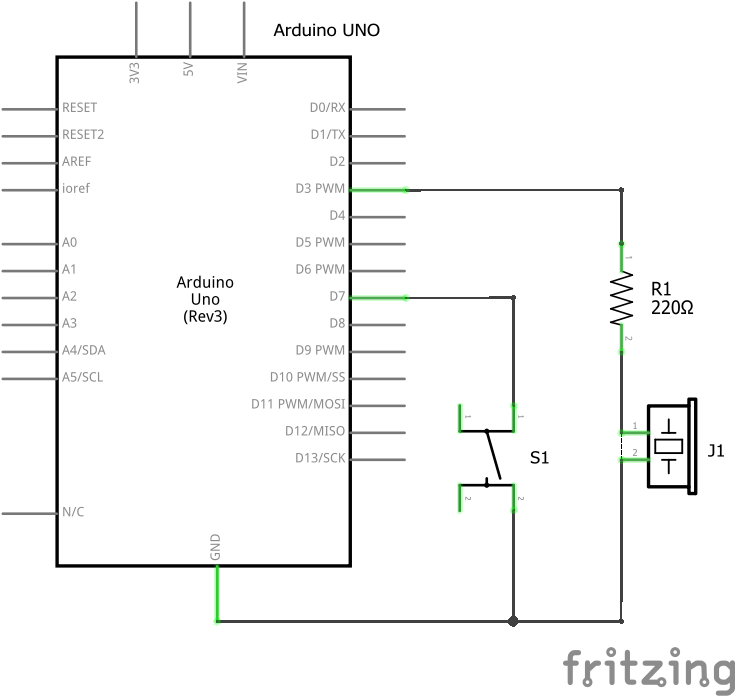
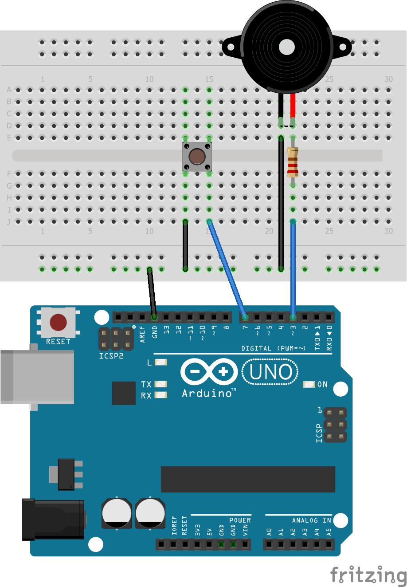

:Date: 21/12/2019
:Author: Carlos Félix Pardo Martín
:License: Creative Commons Attribution-ShareAlike 4.0 International

.. _protoboard-buzzer:

Zumbador
========
Monta en protoboard el siguiente esquema eléctrico.

:download:`Circuito eléctrico en formato Fritzing
<protoboard/arduino-proto-06-buzzer.fzz>`

----

Ejercicios
----------

1. Sube a la placa Arduino UNO el siguiente programa.
   Al presionar el pulsador, en el zumbador sonará la
   **alarma de un despertador**.

   .. image:: protoboard/arduino-proto-06-code01.png
      :alt: Código del programa para Arduino que hace sonar una alarma de despertador

#. Sube a la placa Arduino UNO el siguiente programa.
   Al presionar el pulsador, en el zumbador sonará la canción
   de **cumpleaños feliz**.

   .. code-block:: arduino
      :linenos:

      // Definición de la frecuencia de las notas musicales
      // S al final significa nota sostenida.

      #define NOTE_DO4   262
      #define NOTE_DO4S  277
      #define NOTE_RE4   294
      #define NOTE_RE4S  311
      #define NOTE_MI4   330
      #define NOTE_FA4   349
      #define NOTE_FA4S  370
      #define NOTE_SOL4  392
      #define NOTE_SOL4S 415
      #define NOTE_LA4   440
      #define NOTE_LA4S  466
      #define NOTE_SI4   494

      #define NOTE_DO5   523
      #define NOTE_DO5S  554
      #define NOTE_RE5   587
      #define NOTE_RE5S  622
      #define NOTE_MI5   659
      #define NOTE_FA5   698
      #define NOTE_FA5S  740
      #define NOTE_SOL5  784
      #define NOTE_SOL5S 831
      #define NOTE_LA5   880
      #define NOTE_LA5S  932
      #define NOTE_SI5   988

      #define NOTE_DO6   1047
      #define NOTE_DO6S  1109
      #define NOTE_RE6   1175
      #define NOTE_RE6S  1245
      #define NOTE_MI6   1319
      #define NOTE_FA6   1397
      #define NOTE_FA6S  1480
      #define NOTE_SOL6  1568
      #define NOTE_SOL6S 1661
      #define NOTE_LA6   1760
      #define NOTE_LA6S  1865
      #define NOTE_SI6   1976

      // Define la melodía a tocar.
      // Cada línea define una nota y su tempo.
      // Cumpleaños feliz
      int melody[] = {
         NOTE_SOL4, 4,
         NOTE_SOL4, 4,
         NOTE_LA4, 8,
         NOTE_SOL4, 8,
         NOTE_DO5, 8,
         NOTE_SI4, 16,

         NOTE_SOL4, 4,
         NOTE_SOL4, 4,
         NOTE_LA4, 8,
         NOTE_SOL4, 8,
         NOTE_RE5, 8,
         NOTE_DO5, 16,

         NOTE_SOL4, 4,
         NOTE_SOL4, 4,
         NOTE_SOL5, 8,
         NOTE_MI5, 8,
         NOTE_DO5, 8,
         NOTE_SI4, 8,
         NOTE_LA4, 16,

         NOTE_FA5, 4,
         NOTE_FA5, 4,
         NOTE_MI5, 8,
         NOTE_DO5, 8,
         NOTE_RE5, 8,
         NOTE_DO5, 16,
      };

      int num_notas = sizeof(melody) / (2 * sizeof(melody[0]));

      // Define los pines de entrada y salida
      int BUZZER  3
      int PUSH    7

      // Ejecuta una sola vez las siguientes instrucciones
      void setup() {
         // Conecta el zumbador a una salida
         pinMode(BUZZER, OUTPUT);

         // Conecta el pulsador a una entrada
         pinMode(PUSH, INPUT_PULLUP);
      }

      // Repite para siempre las siguientes instrucciones
      void loop() {
         // Esperar a que se presione el pulsador
         while (digitalRead(PUSH) == HIGH);

         // Tocar la melodía en el zumbador
         for(int nota = 0; nota < num_notas*2; nota += 2) {
            int nota_tono = melody[nota];
            int nota_duracion = melody[nota+1];
            tone(BUZZER, nota_tono, nota_duracion*50);
            delay(nota_duracion * 50 + 30);
         }
         delay(2000);
      }

#. Modifica el programa anterior para que suene la melodía de
   **la cucaracha** según las siguientes notas.

   .. code-block::

      DO4 DO4 DO4 FA4 LA4
      DO4 DO4 DO4 FA4 LA4
      FA4 FA4 MI4 MI4 RE4 RE4 DO4
      DO4 DO4 DO4 MI4 SOL4
      DO4 DO4 DO4 MI4 SOL4
      DO5 RE5 DO5 LA4S LA4 SOL4 FA4

   Hay que añadir tempos y ajustarlos a cada nota.

#. Modifica el programa anterior con la melodía que prefieras.
   Puedes encontrar muchas melodías en Internet buscando el nombre
   de la canción y la palabra notas.
