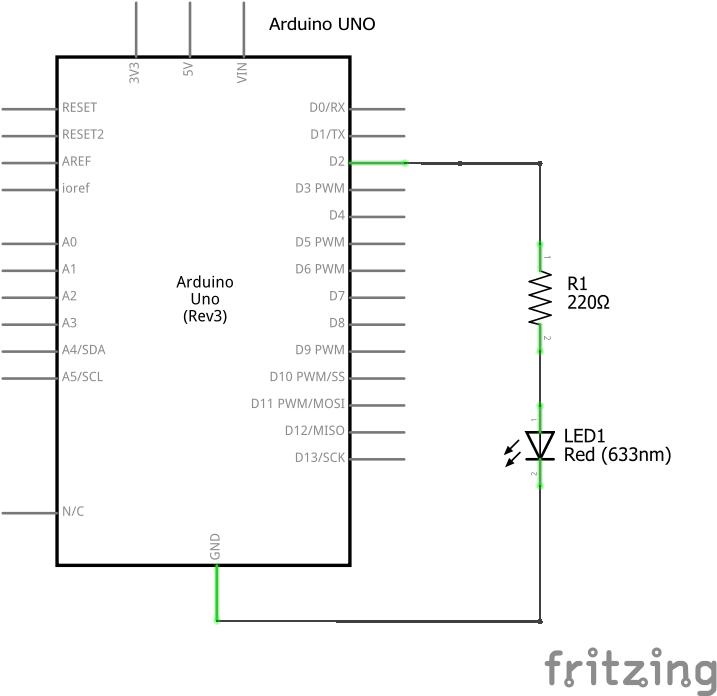
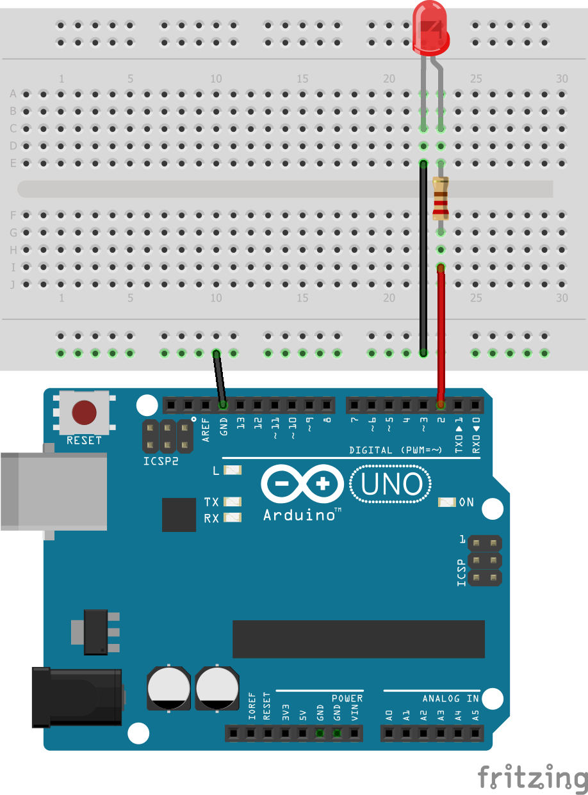

:Date: 14/12/2019
:Author: Carlos Félix Pardo Martín
:License: Creative Commons Attribution-ShareAlike 4.0 International

.. _protoboard-led-d2:

Led controlado por la placa Arduino
===================================
Monta en protoboard el siguiente esquema eléctrico.

         un pin de salida
   :width: 400px
   :align: center

         un pin de salida
   :width: 400px
   :align: center

Ahora es necesario programar la placa Arduino UNO para que
el led rojo se encienda.

:download:`Circuito eléctrico en formato Fritzing
<protoboard/arduino-proto-02-led-d2.fzz>`

----

Ejercicios
----------

1. Sube a la placa Arduino UNO el siguiente programa.
   El led rojo debe parpadear, encendido durante un segundo y
   apagado durante otro segundo.

   .. code-block:: arduino
      :linenos:

      int LED_PIN = 2;

      // Ejecuta una sola vez las siguientes instrucciones
      void setup() {
         // El led se conecta a un pin de salida
         pinMode(LED_PIN, OUTPUT);
      }

      // Repite para siempre las siguientes instrucciones
      void loop() {
         // Enciende el LED (a nivel alto)
         digitalWrite(LED_PIN, HIGH);

         // Espera 1000 milisegundos (1 segundo)
         delay(1000);

         // Apaga el pin 2 (a nivel bajo)
         digitalWrite(LED_PIN, LOW);

         // Espera 1000 milisegundos (1 segundo)
         delay(1000);
      }

#. Modifica el programa anterior para que el led luzca como el de
   una alarma. Debe encenderse durante una décima de segundo y
   apagarse durante diez segundos.

#. Modifica el programa para que el led luzca como una vela
   artificial.
   El tiempo de encendido debe ser aleatorio entre 100 y 300
   milisegundos.
   El tiempo de apagado debe ser aleatorio entre 50 y 150
   milisegundos.

   La instrucción que se debe utilizar es:

   .. code-block:: arduino
      :linenos:

      delay( random(mínimo, máximo) );

#. Modifica el programa para que el led se encienda y se apague
   rápidamente (durante 100 milisegundos) y luego se
   encienda y se apague lentamente (durante 1 segundo).

#. Modifica el programa para que el led parpadee dos veces rápido
   (cada 100 milisegundos) y luego se mantenga apagado durante
   2 segundos.

#. Modifica el programa para que el led realice lo contrario que en
   el ejercicio anterior.
   Se debe apagar rápido dos veces (cada 100 milisegundos) y luego se
   debe mantener encendido durante 2 segundos.

#. Modifica el primer programa para que encienda y apague el led cada
   pocos milisegundos (de 1 a 100 milisegundos).
   Experimenta con varios tiempos para ver que ocurre.

   El ojo humano no puede ver parpadeos de luz demasiado rápidos.
   ¿A partir de cuántos milisegundos se puede observar el parpadeo?
