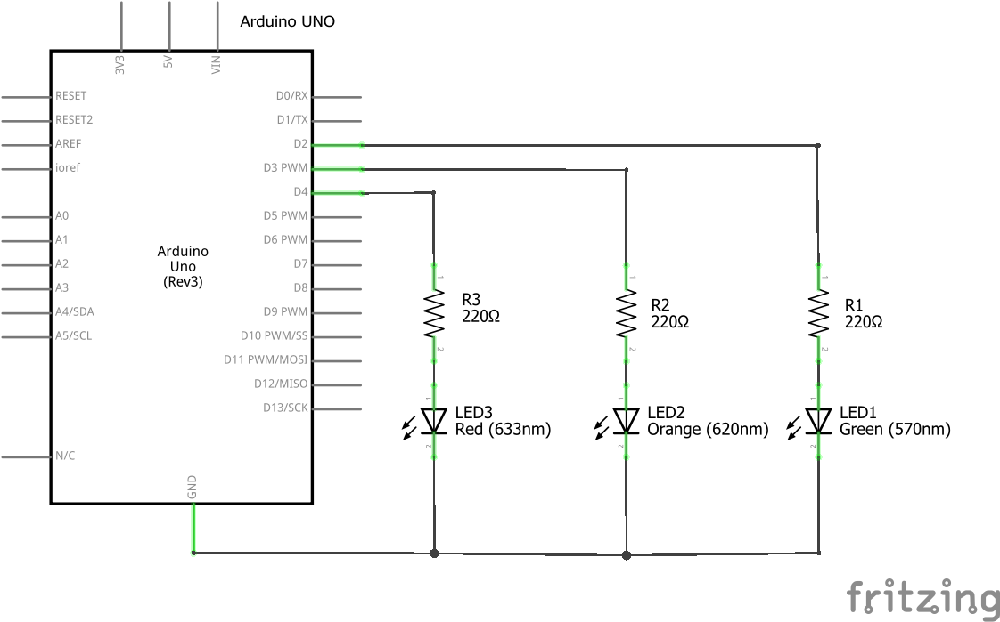
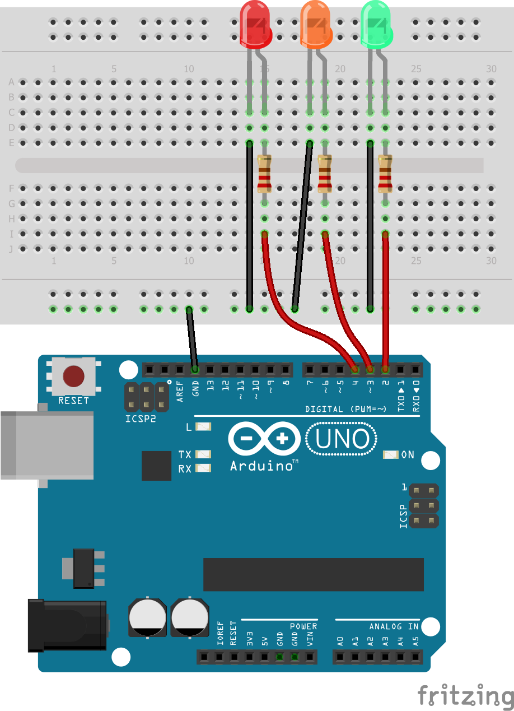

:Date: 16/12/2019
:Author: Carlos Félix Pardo Martín
:License: Creative Commons Attribution-ShareAlike 4.0 International

.. _protoboard-tres-ledes:

Tres ledes
==========
Monta en protoboard el siguiente esquema eléctrico.

         tres pines de salida
   :width: 700px
   :align: center

         tres pines de salida
   :width: 400px
   :align: center

:download:`Circuito eléctrico en formato Fritzing
<protoboard/arduino-proto-03-tres-ledes.fzz>`

----

Ejercicios
----------

1. Sube a la placa Arduino UNO el siguiente programa.
   Los tres ledes deben encenderse a la vez.

   .. code-block:: arduino
      :linenos:

      // Define el pin de cada led
      int LED_VERDE = 2;
      int LED_AMBAR = 3;
      int LED_ROJO = 4;

      // Ejecuta una sola vez las siguientes instrucciones
      void setup() {
         // Conecta los tres ledes a salidas
         pinMode(LED_VERDE, OUTPUT);
         pinMode(LED_AMBAR, OUTPUT);
         pinMode(LED_ROJO, OUTPUT);
      }

      // Repite para siempre las siguientes instrucciones
      void loop() {
         // Enciende los tres ledes
         digitalWrite(LED_VERDE, HIGH);
         digitalWrite(LED_AMBAR, HIGH);
         digitalWrite(LED_ROJO, HIGH);
      }

#. Modifica el programa anterior para que se encienda primero el
   led verde, un segundo después el led ámbar y un segundo después
   el led rojo.

   La instrucción que se debe utilizar para esperar un segundo es:

   .. code-block:: arduino
      :linenos:

      delay(1000);

#. Modifica el programa anterior para que después de estar todos los
   ledes encendidos, se vayan apagando uno a uno, comenzando por
   apagar el led rojo y terminando por apagar el led verde.
   El tiempo entre apagados será de un segundo.

#. Modifica el programa para que funcione como un semáforo.

   Primero se encenderá el led **verde** durante **3 segundos**.

   A continuación se apagará el led verde y se encenderá el led
   **ámbar** durante **1 segundo**.

   A continuación se apagará el led ámbar y se encenderá el led
   **rojo** durante **3 segundos**.

   La secuencia se repetirá continuamente.

#. Modifica el programa anterior para que el led ámbar parpadee tres
   veces. El tiempo de encendido y de apagado será de medio segundo.

#. Realiza un programa con una secuencia diferente a los ejercicios
   anteriores.

