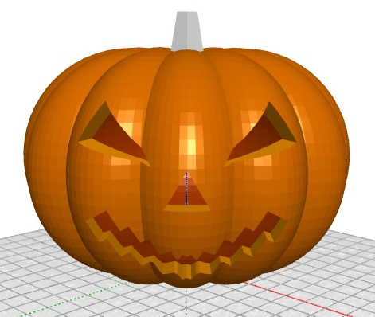
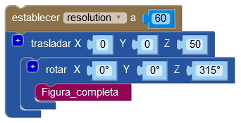
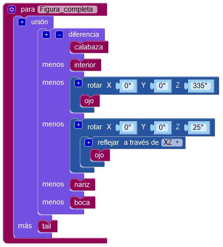
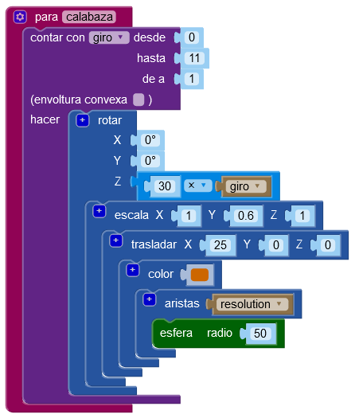
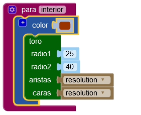
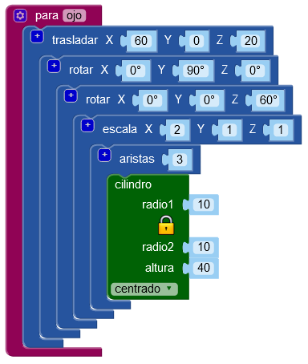
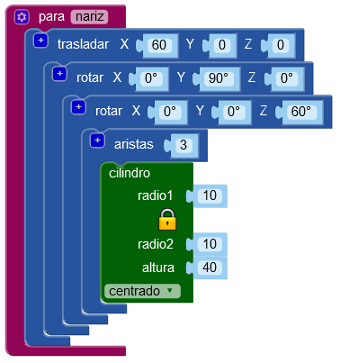
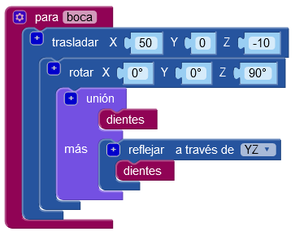
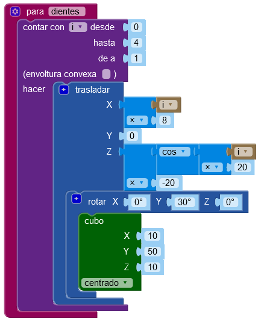
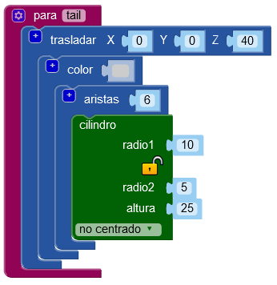

:Date: 15/11/2023
:Author: Carlos Félix Pardo Martín
:License: Creative Commons Attribution-ShareAlike 4.0 International

.. _blockscad-calabaza:

Calabaza
========
En este tutorial vamos a programar una calabaza de Halloween.

Primero vamos a abrir el
`editor online de BlocksCAD <https://www.blockscad3d.com/editor/>`__.

Los bloques necesarios para realizar la figura son los siguientes:

