:Date: 19/11/2023
:Author: Carlos Félix Pardo Martín
:License: Creative Commons Attribution-ShareAlike 4.0 International

.. _blockscad-parts-basic:

Piezas simples
==============
En este tutorial vamos a programar seis piezas de los
`ejercicios simples de vistas y perspectivas
<dibujo-vistas.html#ejercicios-simples>`__.

Pieza simple 01
---------------

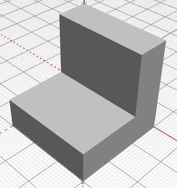

Primero vamos a abrir el
`editor online de BlocksCAD <https://www.blockscad3d.com/editor/>`__.

Los bloques necesarios para realizar la figura son los siguientes:

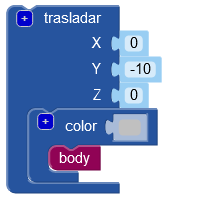

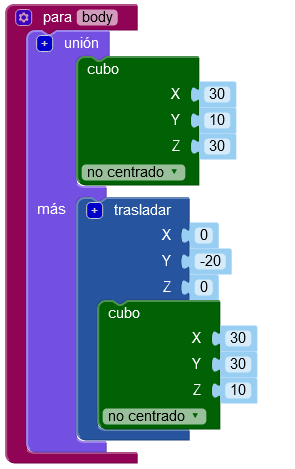

Pieza simple 02
---------------

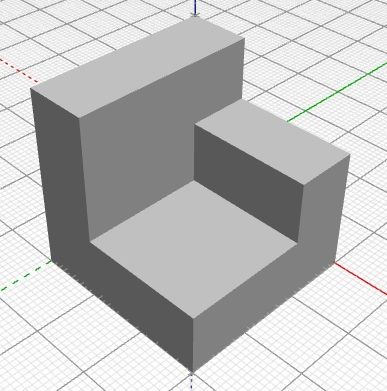

Primero vamos a abrir el
`editor online de BlocksCAD <https://www.blockscad3d.com/editor/>`__.

Los bloques necesarios para realizar la figura son los siguientes:

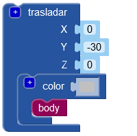

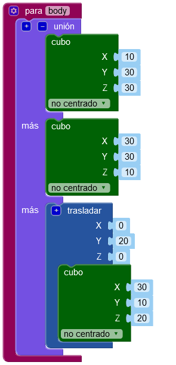

Pieza simple 03
---------------

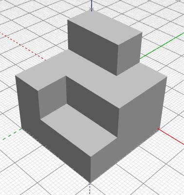

Primero vamos a abrir el
`editor online de BlocksCAD <https://www.blockscad3d.com/editor/>`__.

Los bloques necesarios para realizar la figura son los siguientes:

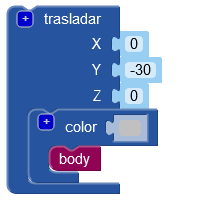

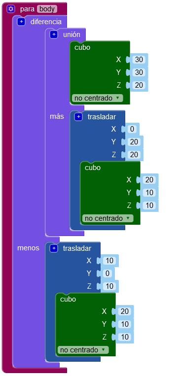

Pieza simple 04
---------------

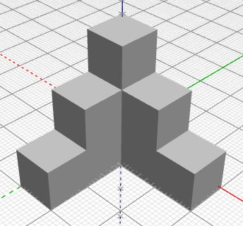

Primero vamos a abrir el
`editor online de BlocksCAD <https://www.blockscad3d.com/editor/>`__.

Los bloques necesarios para realizar la figura son los siguientes:

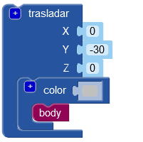

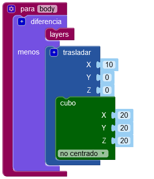

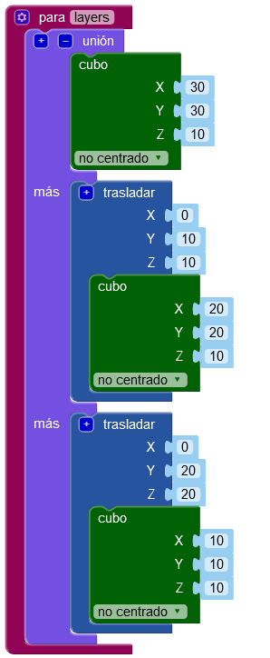

Pieza simple 05
---------------

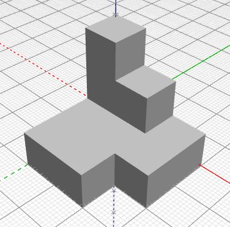

Primero vamos a abrir el
`editor online de BlocksCAD <https://www.blockscad3d.com/editor/>`__.

Los bloques necesarios para realizar la figura son los siguientes:

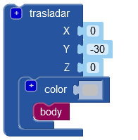

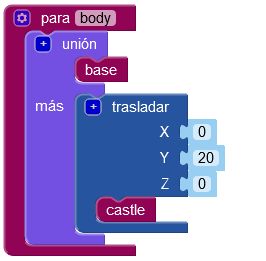

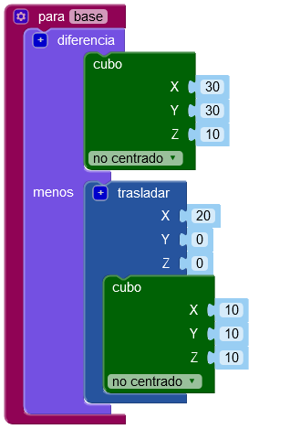

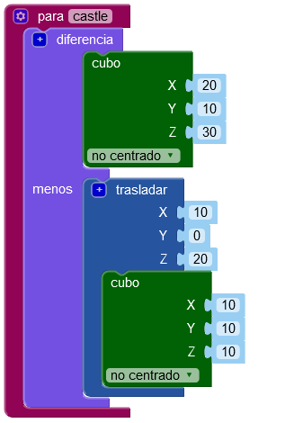

Pieza simple 06
---------------

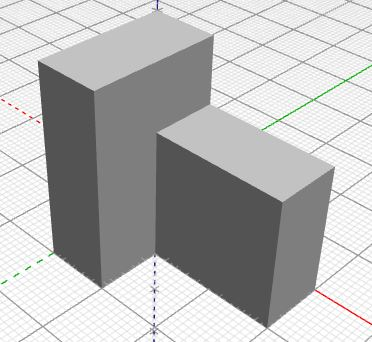

Primero vamos a abrir el
`editor online de BlocksCAD <https://www.blockscad3d.com/editor/>`__.

Los bloques necesarios para realizar la figura son los siguientes:

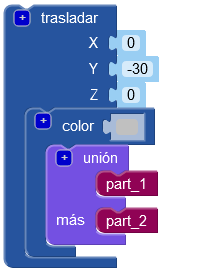

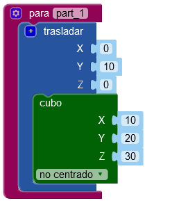

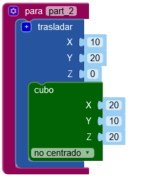
