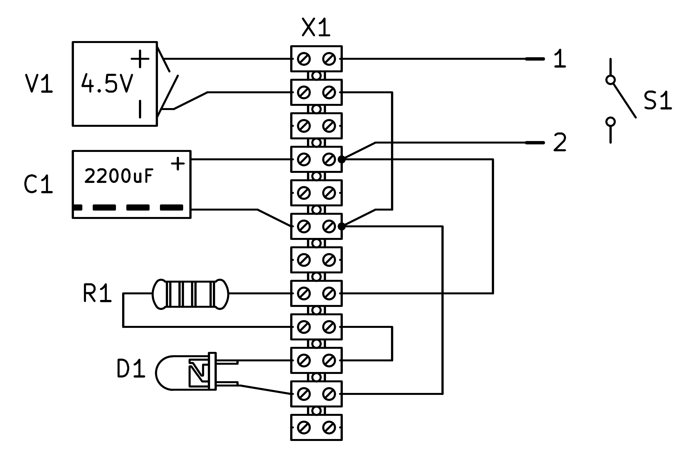

:Date: 21/12/2018
:Author: Carlos Félix Pardo Martín
:License: Creative Commons Attribution-ShareAlike 4.0 International

.. _bornas-condensador:

Carga y descarga de un condensador
==================================

En esta práctica vamos a comprobar cómo se carga y se
descarga un condensador.

El efecto que se observa es el mismo que ocurre en una
televisión u otro aparato electrónico cuando se desenchufa
y el led de encendido se va apagando poco a poco.

La ficha para realizar la actividad tiene por una cara
el esquema sin terminar, para que se complete a lápiz.
Por la otra cara está el esquema completo ya terminado.

|  :download:`Carga y descarga de un condensador cableado con bornas.
   Formato PDF.
   <electronic/electronic-bornas-condensador.pdf>`
|
|  :download:`Esquemas eléctricos en formato KiCad.
   <electronic/electronic-bornas-2.zip>`

