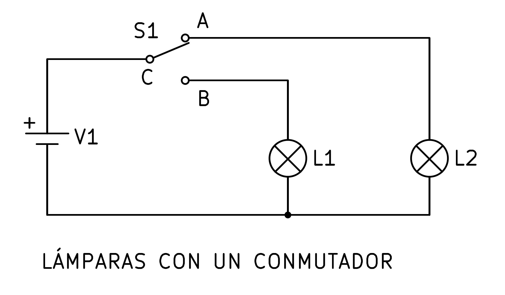

:date: 2018-12-28
:modified: 2026-06-13
:author: Carlos Félix Pardo Martín
:license: Creative Commons Attribution-ShareAlike 4.0 International
:license_url: https://creativecommons.org/licenses/by-sa/4.0/

.. _bornas-conmutador:

Conmutador y dos lámparas
=========================

:download:`Circuito con un conmutador y dos lámparas,
cableado con bornas. Formato PDF.
<electric/electric-bornas-conmutador.pdf>`

Ejercicio con simulador
-----------------------
Completa en el simulador los cables necesarios para que el circuito
de la derecha funcione igual que el circuito de la izquierda.

Para trabajar con más facilidad no olvides pulsar en el menú
``Archivo``... ``Cambiar a Pantalla Completa``.

.. raw:: html

   

   <iframe src="/circuits/index.html?startCircuit=bornas-conmutador.txt"></iframe>
   

