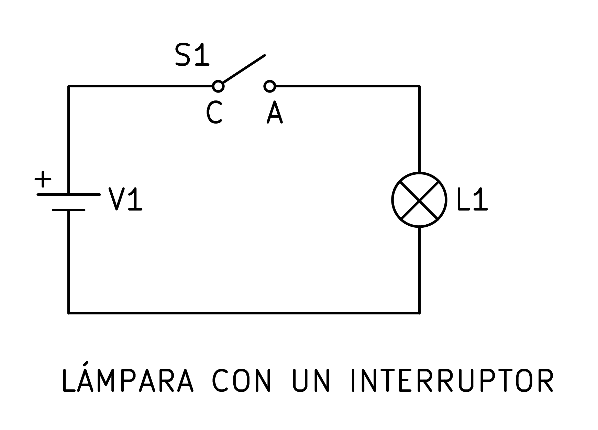

:Date: 28/12/2018
:Author: Carlos Félix Pardo Martín
:License: Creative Commons Attribution-ShareAlike 4.0 International

.. _bornas-interruptor:

Interruptor y lámpara
=====================

En esta práctica vamos a montar el circuito práctico más sencillo
que se puede hacer. Una pila conectada mediante un interruptor a
una lámpara.

:download:`Circuito con una lámpara y un interruptor,
cableado con bornas. Formato PDF.
<electric/electric-bornas-interruptor.pdf>`

Ejercicio con Crocodile Clips
-----------------------------
:download:`Circuito con una lámpara y un interruptor,
cableado con bornas. Formato CKT.
<electric/bornas-crocodile/bornas-01-interruptor.ckt>`
