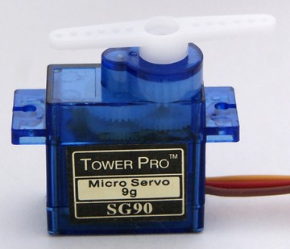

:date: 2018-12-10
:modified: 2026-06-13
:author: Carlos Félix Pardo Martín
:license: Creative Commons Attribution-ShareAlike 4.0 International
:license_url: https://creativecommons.org/licenses/by-sa/4.0/

.. _actuator-index:

**********
Actuadores
**********

Dispositivos producen movimiento, sonido, luz, etc.

.. toctree::
   :numbered: 1
   :maxdepth: 1

   control-actuator-servomotor.rst
   control-actuator-buzzer.rst
   control-actuator-speaker.rst
   control-actuator-stepper-motor.rst
   control-actuator-brushless.rst

..
   control-actuator-dc-motor.rst
