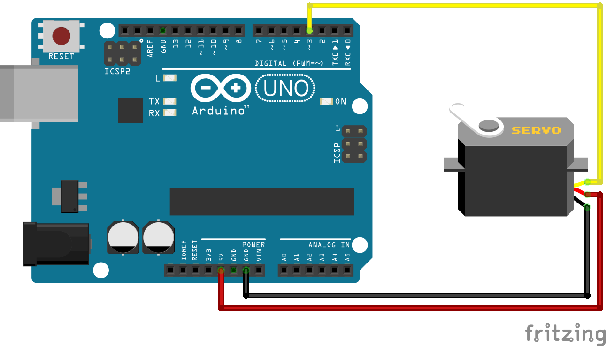

:Date: 10/12/2018
:Author: Carlos Félix Pardo Martín
:License: Creative Commons Attribution-ShareAlike 4.0 International
:tocdepth: 1

.. _actuator-servomotor:

Servomotor
==========
.. ¿Qué es?. Foto. Vídeo

Un servomotor es un motor eléctrico que puede girar a la posición
angular deseada y mantenerse estable en esa posición.

.. image:: control/_thumbs/img-0085.jpg
   :width: 200px
   :alt: Servomotor de radiocontrol
   :align: center

.. ¿Qué hace? ¿Para qué sirve?

Un servomotor puede girar un componente mecánico o mover un elemento
de forma lineal.

..  Aparatos cotidianos que lo usan

Aplicaciones típicas que utilizan servomotores son:

  * Vídeo: `Compuerta de un panel de aire acondicionado
    <https://www.youtube-nocookie.com/embed/_xZjp3gaNE4>`__
  * Giro de la dirección de un vehículo a radio control.
  * Movimiento del cabezal de lectura de un lector de CDROM o DVD.
  * Movimiento automático del espejo retrovisor de un automóvil.
  * Apertura y cierre de una caja de seguridad con cerradura
    electrónica.

Funcionamiento
--------------

.. ¿Cómo funciona? (para el usuario)

Para mover un servomotor es necesario conectarle a una fuente de
alimentación eléctrica y enviarle una señal electrónica que le
indique la posición deseada.
La mayoría de servomotores de radio control tienen un cable de
conexión de 3 hilos por donde circula la corriente de alimentación
y la señal de control.

.. ¿Cómo funciona? (descripción técnica) Partes y nomenclatura

**Composición interna:**

Vídeo: `composición y funcionamiento interno de un servomotor
<https://www.youtube-nocookie.com/embed/ZZhuD78BLDk>`__

Internamente el servomotor está formado por los siguientes componentes.

  * Motor eléctrico.
  * Reductora mecánica.
  * Sensor de posición. Generalmente es un potenciómetro.
  * Circuito de control.

El motor es el elemento que produce el movimiento.

El giro de los motores eléctricos suele ser muy rápido y con poca
fuerza, la reductora mecánica consigue reducir la velocidad de giro
y aumentar la fuerza, de manera que el giro final es más útil.

El sensor de posición permite conocer la posición exacta del eje de
giro del servomotor.
Con el sensor, se puede corregir la posición del eje para que en todo
momento se encuentre en la posición deseada.

El circuito de control recibe por el cable la señal de la posición
deseada y la compara con la posición real del eje, medida por el
sensor. Este circuito se encarga de mover al motor para llevar al
eje a la posición deseada y mantenerle en esa posición.
En ocasiones parece que el eje del servomotor tiembla.
Esto se debe al circuito de control que corrige continuamente la
posición con giros a derecha y a izquierda para mantener estable la
posición final.

Especificaciones
----------------
Existen muchos tipos de servomotores. Como ejemplo se muestran las
especificaciones de un pequeño
`servomotor Tower Pro 9g <../_static/document/SG90Servo.pdf>`__.

  * Tensión de alimentación = 4,8 a 6,0 v
  * Corriente máxima = 570 a 730 mA
  * Corriente en movimiento sin carga = 170 a 270 mA
  * Ángulo de giro = 0 a 180º
  * Fuerza de giro = 1,8 kg-cm a 4,8v
  * Velocidad de giro =  180º en 0,36 s
  * Peso = 9 gramos
  * Precisión = 10us = 1,8º

La mayoría de servomotores permiten ángulos de giro menores de 180º.
En el siguiente vídeo se puede ver el funcionamiento del servomotor,
su velocidad de giro y su rango de acción.
En una imagen de osciloscopio también puede verse la señal electrónica
que controla el servomotor.

* Vídeo: `RC servo processor.
  <https://www.youtube-nocookie.com/embed/em4JUrM49FI>`__

Esquema de conexión
-------------------
El siguiente esquema muestra cómo conectar un servomotor a la placa
Arduino UNO.

Hay que tener en cuenta que se ha utilizado para realizar este esquema
el sistema de colores y conexiones de Hitec.
Otros servomotores tienen un esquema de colores diferente e, incluso,
conexiones en diferente orden.

Programa de control
-------------------

La librería de control para servomotores viene de forma estándar con
el entorno Arduino. Su nombre es <Servo.h>

En el siguiente ejemplo se utiliza la librería Servo.h para mover un
servomotor conectado al pin digital 3, a dos posiciones extremas cada
medio segundo.

.. code-block:: Arduino
   :linenos:

   // Programa de prueba para mover un servomotor a dos posiciones.
   #include <Servo.h>

   Servo myservo;         // Crea un objeto de tipo servomotor llamado myservo

   void setup() {
      myservo.attach(3);  // Conecta el servomotor al pin digital 3
   }

   void loop() {
      myservo.write(0);   // Mueve el servomotor a la posición de 0 grados
      delay(500);         // Espera medio segundo
      myservo.write(180); // Mueve el servomotor a la posición de 180 grados
      delay(500);         // Espera medio segundo
   }

-----

Ejercicios
----------

1. Completar el siguiente programa que mueve lentamente el servomotor
   entre dos posiciones distintas.

   .. code-block:: Arduino
      :linenos:

      // Mueve el servomotor conectado al pin digital 3
      // lentamente entre dos posiciones distintas
      #include <Servo.h>

      Servo myservo;         // Crea un objeto de tipo servomotor llamado myservo

      void setup() {
        myservo.attach(3);   // Conecta el servomotor al pin digital 3
      }

      void loop() {

         // Mueve lentamente el servomotor desde 0 hasta 180
         int angle = 0;
         while(angle < 180) {
            myservo.write(angle);  // Mueve el servomotor a la posición 'angle'
            delay(20);             // Espera 20 milisegundos
            angle = angle + 2;
         }

         // Mueve lentamente el servomotor desde 180 hasta 0

      }

2. Realizar una modificación al programa anterior para que el
   servomotor se mueva despacio desde la posición 0 grados hasta la
   posición 180 grados.
   Una vez terminado ese movimiento, debe volver con rapidez a la
   posición de 0 grados.
   El movimiento rápido se puede conseguir reduciendo el tiempo de
   espera `delay()` o aumentando mas el ángulo de giro en la
   instrucción `angle = angle + 2`.

   Hay que tener en cuenta que el servomotor tarda aproximadamente
   360 milisegundos en volver a su posición inicial.
   El tiempo total programado para el movimiento no debe ser menor.

3. Realizar un programa que mueva un servomotor a la posición 0
   grados al presionar el pulsador 1 y que mueva el servomotor a la
   posición 90 grados al presionar el pulsador 2.

Extras
------

 * Vídeo: explicación en inglés del `funcionamiento de un servomotor
   <https://www.youtube-nocookie.com/embed/hg3TIFIxWCo>`__
 * Vídeo: `how Servo Motors Work & How To Control Servos using Arduino
   <https://www.youtube-nocookie.com/embed/LXURLvga8bQ>`__
