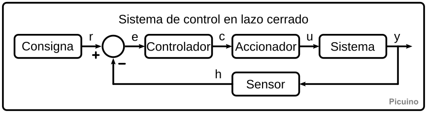

:Date: 10/12/2018
:Author: Carlos Félix Pardo Martín
:License: Creative Commons Attribution-ShareAlike 4.0 International
:tocdepth: 1

.. _control-auto:

Control Automático
==================

Los controladores o reguladores automáticos forman parte de muchos de
los dispositivos que nos rodean, aunque no seamos conscientes de
ello.

Podemos encontrar ejemplos de controladores en el termostato de la
calefacción o del aire acondicionado, en el control de temperatura del
horno o de la nevera, en el regulador de nivel de luz, en la dirección
asistida de los automóviles, el sistema de parada en un piso de los
ascensores o, incluso, en el sistema de llenado de agua de la cisterna
del inodoro.
Allí donde una velocidad, un movimiento, temperatura, presión o nivel
se mantienen regulados, hay un controlador que realiza este trabajo.

Para referirse a este tipo de sistemas se utiliza la denominación de
controladores automáticos o reguladores automáticos.

En esta página se van a revisar los diferentes componentes de un sistema
de control automático y los diferentes tipos de control que existen,
de lazo abierto y de lazo cerrado.

Elementos de un sistema de control en lazo abierto
--------------------------------------------------
En la siguiente imagen se muestra un esquema del sistema de control más
sencillo, el control de lazo abierto.

.. image:: control/_images/img-0052.png
   :width: 509px
   :alt: Sistema de control en lazo abierto
   :align: center

En este esquema se pueden reconocer cuatro bloques:

.. glossary::

   Consigna
      Es la parte del sistema que describe lo que deseamos obtener del
      controlador.

      Por ejemplo, una consigna puede ser un mando manual en el que
      seleccionamos un tiempo de funcionamiento de 2 minutos en un
      microondas.
      Otro ejemplo sería el mando con el que seleccionamos la potencia de
      calentamiento que deseamos obtener en una vitrocerámica al cocinar.

   Controlador
      Se encarga de recibir una señal de consigna o señal de
      referencia y convertirla en una señal que consiga que el sistema
      alcance la referencia deseada.

      Un ejemplo de controlador es un temporizador que enciende y apaga
      el horno microondas cada pocos segundos para controlar su potencia.

   Accionador
      Es el encargado de convertir la señal de control, que
      tiene poca potencia, en una acción sobre el sistema, con mayor
      potencia.

      Volviendo al ejemplo del horno eléctrico, el accionador será
      la resistencia calefactora y el sistema de potencia que la enciende.
      En el caso de un servomecanismo, el accionador será el conjunto de
      transistores y el motor que mueven el mecanismo.

   Sistema
      También llamado en ocasiones planta, es aquello que se
      desea controlar.

      En un horno el sistema será la caja del horno en la
      que se desea controlar la temperatura. En el caso de un
      servomecanismo, el sistema será el motor y la caja reductora cuya
      posición se desea controlar.

En ocasiones la consigna, el controlador o el accionador no
tienen límites bien definidos o no existen en algún sistema.
En cualquier caso es interesante conocer estos elementos a la hora de
identificar las diferentes partes de un sistema de control.

Ejemplos de sistemas de control en lazo abierto
-----------------------------------------------

Podemos encontrar ejemplos de sistemas de control en lazo abierto en
múltiples dispositivos de nuestro entorno.

Control de potencia de un horno microondas
   La **consigna** es el mando giratorio con el que seleccionamos el tiempo
   de encendido.

   El **controlador** está formado por un temporizador que enciende el horno
   y lo apaga al terminar el tiempo consignado.

   El **accionador** es un
   `magnetrón <https://es.wikipedia.org/wiki/Magnetr%C3%B3n>`__
   que produce las microondas que calientan la leche.

   El **sistema** será, por ejemplo, el vaso de leche que se calienta en el
   interior del horno.

Control de potencia de un calentador eléctrico de aire
   La **consigna** es el mando que giramos para conseguir una potencia
   media o potencia completa.

   El **controlador** es el interruptor que selecciona entre una o
   dos resistencias calefactoras.

   El **accionador** está formado por las resistencias calefactoras y
   el ventilador.

   El **sistema** es la habitación calentada por el aire caliente del
   calefactor.

Control de intensidad de luz
   La **consigna** es el
   `potenciómetro <https://es.wikipedia.org/wiki/Potenci%C3%B3metro>`__
   o resistencia variable que se gira para conseguir mayor o menor
   luminosidad.

   El **controlador** es un circuito electrónico que decide cuanto tiempo
   estará conectada la lámpara varias veces por segundo.

   El **accionador** es un circuito electrónico de potencia y la
   lámpara que produce luz.

   El **sistema** es la habitación con más o menos iluminación.

Control de nivel de sonido en un equipo de audio
   La **consigna** es el potenciómetro que se mueve para
   conseguir mayor o menor nivel de sonido.

   El **accionador** es el amplificador y los altavoces del equipo de
   música.

   El **sistema** es la habitación y el nivel de sonido que se consigue.

Uno de los controladores en lazo abierto más habituales es el
**temporizador**.
Este se puede encontrar en múltiples dispositivos como encendido
temporizado de las luces de escalera de un edificio, apagado automático de
escaleras automáticas, temporizador de un horno microondas, etc.

En los sistemas en lazo abierto se puede controlar que el sistema reciba
del accionador más o menos potencia, pero no se puede controlar con
exactitud el punto en el que se encontrará el sistema controlado.

En el caso del horno microondas, por ejemplo, no podemos estar seguros
de la temperatura que alcanzará la leche en su interior.
Tampoco con el calentador eléctrico de aire podemos conocer con exactitud
la temperatura que alcanzará la habitación.
En ambos casos el resultado final dependerá del tamaño del vaso o de la
habitación, de la temperatura ambiente, del aislamiento, de la potencia
total del calentador, etc.

Esta desventaja de los sistemas en lazo abierto no impide que se utilicen
con mucha frecuencia por su gran sencillez y por ser muy robustos.

Elementos de un sistema de control en lazo cerrado
--------------------------------------------------

En la siguiente imagen se muestra un esquema de un sistema de control
en lazo cerrado.

Este tipo de sistema de control soluciona el problema de los sistemas
en lazo abierto, que dependen del accionador, de las condiciones
ambientales, etc.
El nombre de lazo cerrado proviene de la señal del sensor que vuelve al
controlador, cerrando el lazo de control.
Los elementos del sistema de control en lazo cerrado son los mismos que
los elementos del sistema de control en lazo abierto con dos añadidos:

.. glossary::

   Sensor
      El sensor mide el estado o variable a controlar en el sistema
      (posición, temperatura, humedad, etc.) Esto permite conocer el
      estado del sistema y corregir las desviaciones para que se pueda
      conseguir el estado deseado.

      Por ejemplo, en un frigorífico, el sensor de temperatura detecta la
      temperatura interior para apagar el motor cuando hace demasiado frio
      y encender el motor si la temperatura sube demasiado.

   Comparador
      Este elemento está representado por un círculo en el esquema.
      Su función es comparar la señal de referencia r que proviene de
      la consigna y la señal de realimentación h que proviene del sensor
      y calcular el error e que existe entre la respuesta deseada y
      el estado real del sistema.

      A partir de ese error se puede conseguir llevar al sistema al estado
      deseado, que es el que dicta la consigna.

Este tipo de control conseguirá que el sistema se encuentre en el estado
deseado independientemente de las condiciones ambientales.

Las señales del sistema de control son las siguientes:

========   ==================  ===========================================
Señal      Nombre                 Función
========   ==================  ===========================================
**r**      **Referencia**      Es el estado que se desea alcanzar en
                               el sistema.
**e**      **Error**           Es la diferencia entre el estado deseado y
                               el estado real del sistema a controlar.
**c**      **Control**         Es la señal que genera el controlador.
**u**      **Accionamiento**   Es la acción que se ejerce sobre el
                               sistema para controlarle.
**y**      **Salida**          Es el estado real que ha alcanzado el
                               sistema a controlar.
**h**      **Realimentación**  Es la medida del estado del sistema.
========   ==================  ===========================================

Ejemplos de sistemas de control en lazo cerrado
-----------------------------------------------

Al igual que en el caso de los controladores en lazo abierto, también
existen múltiples aparatos cotidianos que tienen sistemas de control
en lazo cerrado. Estos se caracterizan por tener un sensor que permite
medir el estado del sistema y controlarle con precisión.

Control de temperatura de un **frigorífico**.

Control de temperatura en un **horno eléctrico**.

Control de llenado de agua de una **cisterna** del inodoro.

**Dirección asistida** de un automóvil o de un camión.

Control de posición de un **servomecanismo**.

Sistema de marcha y parada en cada piso de un **ascensor**.

Control de apertura de una **puerta automática**, que se abre
reaccionando a la presencia de alguien.

Referencias
-----------

Wikipedia: `Sistema de control
<https://es.wikipedia.org/wiki/Sistema_de_control>`__

Wikipedia: `Servomotor
<https://es.wikipedia.org/wiki/Servomotor>`__

[1] Ogata, Katsuhiko. Ingeniería de Control Moderna. Tercera edición.
Editorial Prentice Hall.

[2] Ogata, Katsuhiko. Sistemas de control en tiempo discreto.
Segunda edición. Editorial Prentice Hall.
