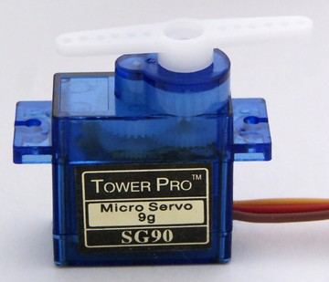

:date: 2018-12-10
:author: Carlos Félix Pardo Martín
:license: Creative Commons Attribution-ShareAlike 4.0 International

.. _control-index:

Control de sistemas
===================

Control y regulación automática de sistemas.

.. toctree::
   :maxdepth: 1
   :titlesonly:

   control-auto
   control-pid
   control-ziegler-nichols
   control-pid-digital
