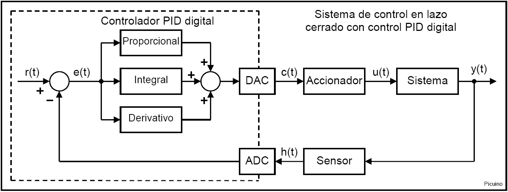
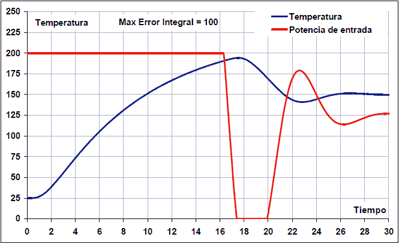
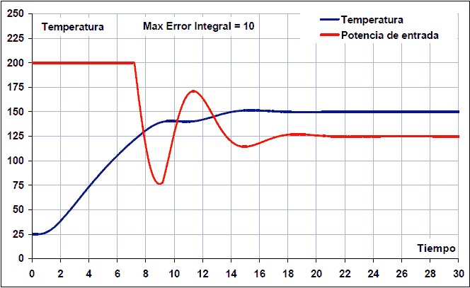

:Date: 10/12/2018
:Author: Carlos Félix Pardo Martín
:License: Creative Commons Attribution-ShareAlike 4.0 International
:tocdepth: 1

.. _control-pid-digital:

Controlador PID digital
=======================

Muchos controladores actuales utilizan microcontroladores digitales.
En esta página se presentará la programación de un regulador PID
implementado con un microcontrolador.
Los reguladores digitales sustituyen varios elementos en un sistema
de control tradicional por cálculos en un sistema programado.
En la figura siguiente puede verse un esquema de un regulador
controlado por un microcontrolador.

Las funciones del microcontrolador están encerradas en el cuadrado
con líneas de puntos.

Los bloques que sirven de conexión entre el microcontrolador y el
sistema son un `DAC (conversor digital a analógico)
<https://es.wikipedia.org/wiki/Conversor_de_se%C3%B1al_digital_a_anal%C3%B3gica>`__
y un `ADC (conversor de analógico a digital)
<https://es.wikipedia.org/wiki/Conversor_de_se%C3%B1al_anal%C3%B3gica_a_digital>`__.
Estos dos bloques permiten traducir las señales analógicas del
sistema controlado a números digitales utilizados por el
microcontrolador y viceversa.

En ocasiones los conversores ADC y DAC se pueden implementar con
un `regulador PWM <https://es.wikipedia.org/wiki/Modulaci%C3%B3n_por_ancho_de_pulsos>`__.

Período de muestreo
-------------------

Mientras que los sistemas analógicos son continuos, los sistemas
digitales son discontinuos. Esto significa que sus valores se
evalúan o cambian cada cierto período de tiempo llamado tiempo de
muestreo.
El período de muestreo define cuantas veces por segundo se van a
realizar las conversiones analógico-digitales y se van a calcular
los parámetros del PID. En adelante el período de muestreo se
representará por la letra **T**.

La respuesta en lazo cerrado de un sistema controlado por un PID
digital va a depender de este período de muestreo.
Si este tiempo es demasiado alto, la estabilidad del sistema será
menor y el sistema puede llegar a hacerse inestable y no ser
controlable.
Un método para estimar el período de muestreo consiste en
calcular el período de oscilación del sistema en lazo cerrado con
una ganancia que provoque oscilaciones. Se tomará un período de
muestreo menor que la décima parte del tiempo o período de
oscilación.

En el ejemplo que aparece a continuación se ha aumentado la
ganancia proporcional hasta que se mantengan las oscilaciones
en la respuesta al escalón.
El período de oscilación es entonces de 5,6 segundos y, por lo
tanto, el período de muestreo debe ser menor de 0,56 segundos.

         Período de muestreo de sistema oscilatorio.
   :align: center

Tiempo de oscilación y período de muestreo:

   Tc = 26,8 - 21,2 = 5,6 segundos  (Tiempo de oscilación)

   T < Tc / 10 = 0,56 segundos   (Período de muestreo)

Si el sistema es sobreamortiguado y no presenta oscilaciones,
el criterio para escoger el tiempo de muestreo partirá de la
respuesta al escalón. Como regla general se acepta que T debe
ser 10 veces menor que el tiempo de subida del sistema ante un
escalón en lazo abierto.

Este tiempo de subida se puede calcular como el tiempo que tarda
el sistema en subir desde un 10% hasta un 90% del valor final.

En la siguiente imagen se representa la respuesta al escalón de
un sistema térmico.

         Período de muestreo con una respuesta al escalón.
   :align: center

Este sistema tarda en subir desde el 10% hasta el 90% del valor
final 21,5 - 3,5 = 18 segundos.
Por lo tanto, para este sistema de ejemplo, el tiempo de muestreo
del controlador PID debe ser como máximo una décima parte de
los 18 segundos:

   T < Tiempo_de_respuesta / 10

   T < 18/10    ->   T < 1,8 segundos

En los dos casos se ha utilizado la misma planta para calcular
el tiempo de muestreo. Como puede verse los resultados son muy
diferentes. Con el segundo método el tiempo de muestreo es tres
veces mayor que con el primero. Por lo tanto, el tiempo de
muestreo depende también de la respuesta que se vaya a conseguir
y del tipo de sistema.

Siempre que sea posible, será preferible utilizar el primer método
puesto que calcula tiempos menores y, por lo tanto, más seguros.

Período de muestreo y término derivativo
----------------------------------------

Si bien antes se ha explicado que reducir el tiempo de muestreo
es deseable porque aumenta la estabilidad del sistema, reducir
excesivamente el tiempo de muestreo presenta también problemas.

Un problema de reducir mucho el tiempo de muestreo consiste
en que aumenta los cálculos necesarios en el microcontrolador
y por lo tanto le puede sobrecargar.
Otro problema de reducir el tiempo de muestreo consiste en que
dificulta calcular el término derivativo. En este caso, el ruido
de alta frecuencia afecta más al sistema. Además, la variación de
la entrada entre dos muestreos es tan pequeña que se ve afectada
por el error de cuantificación del conversor analógico-digital.

Por lo tanto, lo ideal es establecer un tiempo de muestreo que
consiga una respuesta aceptable en el sistema sin que sobrecargue
mucho los cálculos y que no afecte al término derivativo.

**Ejemplo: cómo afecta el error de cuantificación con tiempos
de muestreo muy pequeños**

Un sistema térmico cuyo sensor cambia con una velocidad de
0,1 voltio/segundo es muestreado por un conversor
analógico-digital de 10bits (1024 niveles)
con una referencia de tensión de 5 voltios.
La sensibilidad del conversor analógico-digital será:

   1024 puntos * (0,1 v/s / 5v) = 20 puntos/segundo.

Si el período de muestreo es de un segundo, la variación de
la medida será suficientemente grande como para evaluar el
término derivativo.
La lectura del sensor será en muestreos
consecutivos: 100, 120, 140, 160, etc.

Si se toma en cambio un período de muestreo de 10 milésimas de
segundo, solo una de cada 5 muestras va a presentar una variación
de un punto en la señal de entrada del sensor.
Ahora la lectura del sensor será en muestreos
consecutivos: 100, 100, 100, 100, 100, 101, 101, 101, etc.

Por otra parte, la ganancia derivativa será 100 veces mayor,
al estar dividida por un tiempo de muestreo 100 veces más
pequeño.

El resultado es que la acción derivativa actuará a impulsos
muy bruscos cada 5 ciclos. Este comportamiento no es deseable
y se puede corregir simplemente aumentando el tiempo
de muestreo.

Implementación del PID digital
------------------------------

Cada uno de los bloques que aparecen dentro del PID digital se
traducen a una ecuación. Las ecuaciones para calcular el
comparador y el controlador PID son las siguientes:

   .. code-block:: python

      # Tiempo de muestreo en segundos
      T = 0.1

      # Temperatura de referencia en grados centígrados
      Referencia = 150

      # Leer el valor del sensor en grados centígrados
      Sensor = leer_ADC()

      # Calcular el valor del controlador PID
      Error = Sensor - Referencia
      Proporcional = Error * Kp
      Integral = Integral + Error * Ki * T
      Derivativo = (Error - Error_anterior) * Kd / T
      Control = Proporcional + Integral + Derivativo
      Error_anterior = Error

      # Escribir el valor del controlador en el accionador
      escribir_DAC(Control)

Todas estas instrucciones y ecuaciones se deben repetir
con un período de T segundos (el tiempo de muestreo).
Si el tiempo de muestreo es de 0.1 segundos, las ecuaciones se
deben repetir 10 veces por segundo (cada 0.1 segundos).

El valor de la referencia se ha escogido en 150 grados centígrados,
pero se puede cambiar a voluntad. Es el valor que se quiere conseguir
en el sistema.

La instrucción leer_ADC() debe leer el valor devuelto por el sensor
y acondicionar ese valor para que esté medido en las mismas unidades
que se están utilizando en la referencia.
En el caso del ejemplo, grados centígrados.

Unidades utilizadas por las funciones de entrada y salida
---------------------------------------------------------

Las funciones de entrada y salida deben tener una conversión
adecuada de unidades. La función leer_ADC() debe devolver un
valor con las mismas unidades que utilice la referencia.
Es conveniente que la función escribir_DAC() acepte valores de
control entre 0 y 5 voltios para que se correspondan con el
valor real de salida del conversor DAC, que tendrá una tensión
de salida, por ejemplo, entre 0 y 5 voltios.
Los valores de control no están acotados y por lo tanto
pueden llegar a valer más que el valor máximo de salida de
5 voltios o menos que el valor mínimo de salida de 0 voltios.
En este caso la función escribir_DAC() debe recortar los valores
máximos a 5v y los valores mínimos a 0v.

Control anti-windup integral
----------------------------

El control integral es un sumatorio que puede llegar a acumular
valores muy altos. Esto ocurre generalmente cuando el error es
muy elevado y se mantiene durante mucho tiempo. En este caso
el sistema está saturado y el control integral no puede realizar
su función.
En estos casos, es recomendable deshabilitar el control integral
para que no se produzca un sobrepulso excesivo.
Existen varias formas de implementar este control anti-windup.
Aquí se implementará deshabilitando el control integral
mientras el error sea superior a una cota determinada.
Para implementar este control anti-windup, se añaden las
siguientes líneas al programa anterior.

   .. code-block:: python

      # Error máximo para que pueda funcionar el término integral
      max_integral_error = 30

      if (abs(Error) > max_integral_error):
         Integral = 0
      else:
         Integral = Integral + Error * Ki * T

En las imágenes siguientes se puede observar una simulación de
un control PID de temperatura de un horno con control anti-windup.
El error máximo para que actúe el control integral se ha
establecido en 100, 30 y 10 grados:

         Anti-Windup con error de 100 grados.
   :align: center

         Anti-Windup con error de 30 grados.
   :align: center

         Anti-Windup con error de 10 grados.
   :align: center

Como se puede observar, en el primer caso se ha establecido
el máximo error anti-windup en 100 grados y el sobrepulso
llega a ser de 45ºC con un tiempo de establecimiento
total de 26 segundos. Estos son valores muy altos.

En el segundo caso, el control anti-windup se ha establecido
con un error máximo de 30 y el sobrepulso apenas llega a ser
de 5 grados, con un tiempo de establecimiento de 14 segundos.
Este valor de anti-windup consigue los mejores resultados del sistema.

En el tercer caso el control anti-windup se ha establecido con un
error máximo de 10 grados, que es claramente insuficiente.
En este caso no hay sobrepulso porque la acción integral entra
demasiado tarde a corregir el error permanente.
El problema que puede presentar este valor tan bajo es que el
error se mantenga por encima del límite anti-windup y no llegue
a corregirse en ningún momento o que la reducción del error se
realice demasiado despacio.

Ruido en la realimentación
--------------------------

Hay varias fuentes de ruido que perturban la señal de
realimentación h(t).
A continuación se presentan las más importantes.

Ruido en el sensor y muestreo
-----------------------------

La primera fuente de ruido es el propio sensor que puede dar
una salida con ruido añadido de diversas frecuencias.
Este ruido es difícil de filtrar, de forma que siempre que
sea posible conviene reducir el ruido al mínimo.

El ruido del sensor entra en el sistema digital a través del
conversor analógico-digital.
Según el **teorema de Nyquist**, la máxima frecuencia que
puede medir un sistema de muestreo digital es igual a la
mitad de la frecuencia de muestreo.
Esto impone un límite máximo a las frecuencias que se van a
poder muestrear con fidelidad.

Entonces ¿Qué pasa con las frecuencias mayores a este límite?
Esas frecuencias se traducen en frecuencias más bajas.
Esto significa que el ruido de alta frecuencia se verá dentro
del microcontrolador como una señal de menor frecuencia.
Este efecto puede apreciarse bien en la siguiente imagen:

         Teorema de Nyquist.
   :align: center

La señal original aparece en rojo, con una frecuencia de 3 ciclos
por intervalo. La mínima frecuencia de muestreo debería ser de 6
muestras por intervalo.

Los puntos negros son las muestras que se han tomado de la señal
original, con una frecuencia de 5 muestras por intervalo, menor
de la frecuencia mínima necesaria.

Cuando se unen entre sí los puntos negros, aparece la señal
que el controlador cree haber muestreado.
Como resultado el sistema digital verá una frecuencia menor
que la que tiene la señal real.

Para evitar este efecto es conveniente limitar el ruido de
alta frecuencia en la señal analógica por medio de un diseño
cuidadoso, eligiendo un sensor adecuado y utilizando un filtro
analógico cuando sea necesario.

Los filtros digitales solo podrán actuar de forma efectiva
sobre las frecuencias que estén por debajo de la mitad de
la frecuencia de muestreo.

Ruido de cuantificación
-----------------------

Este ruido está producido por el conversor analógico-digital
y procede de redondear el valor analógico real al valor digital
más próximo dado que el valor digital tiene un numero finito
de valores posibles.
Este error se puede calcular a partir del número de bits del
conversor analógico-digital y su rango de medida.

   **Ruido de cuantificación = rango_tensión / 2^(bits_del_adc)**

En la siguiente imagen puede verse la representación del ruido
de cuantificación:

En el caso de un microcontrolador típico con 10 bits de
resolución y un rango de medida de 0 a 5 voltios, el ruido o
error de cuantificación es de 5V / 2^(10) = 5V / 1024 = 4,9 milivoltios.

Este valor puede también convertirse a unidades de medida de
salida de la planta a partir de la sensibilidad del sensor.
Veamos el ejemplo de un sensor de temperatura que entrega una
salida con sensibilidad de 10 mV/ºC

   **Ruido de cuantificación = rango_tensión / (2^(bits_adc) * sensibilidad)**

   **Ruido de cuantificación = 5V / (1024 * 0,010V/ºC) = 0,49 ºC**

El ruido de cuantificación afecta negativamente a la
respuesta del regulador, produciendo saltos en la señal de
control que empeoran el comportamiento de la planta.

Este ruido también afecta a la máxima precisión que puede
conseguir el controlador. En el ejemplo anterior, el controlador
no podrá conseguir controlar la temperatura con una precisión
mejor de 0,49 grados centígrados.

Referencias
-----------

[1] Ogata, Katsuhiko. Sistemas de control en tiempo discreto.
Segunda edición. Editorial Prentice Hall.
