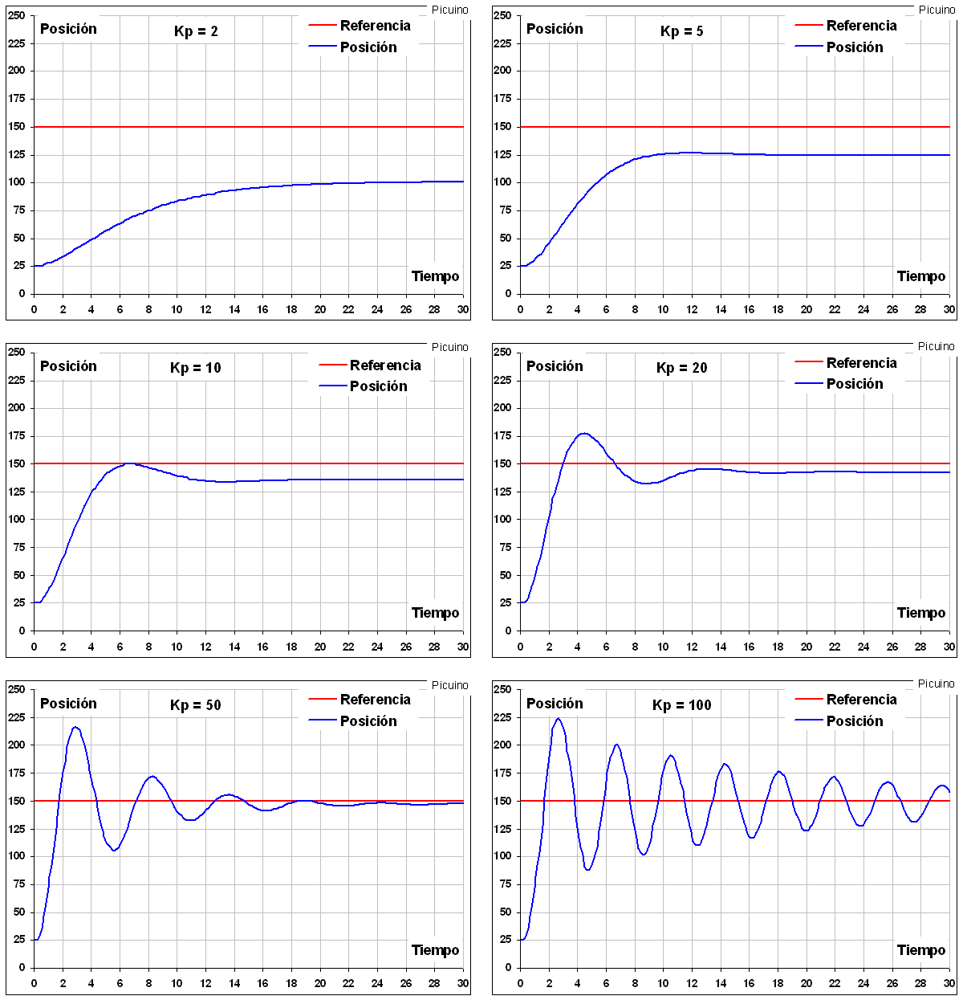
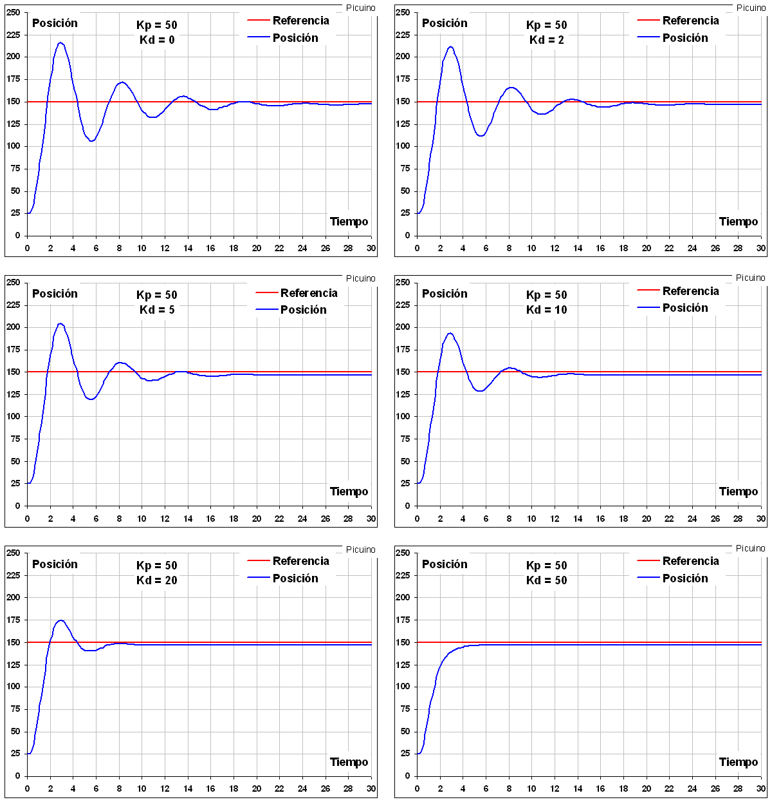
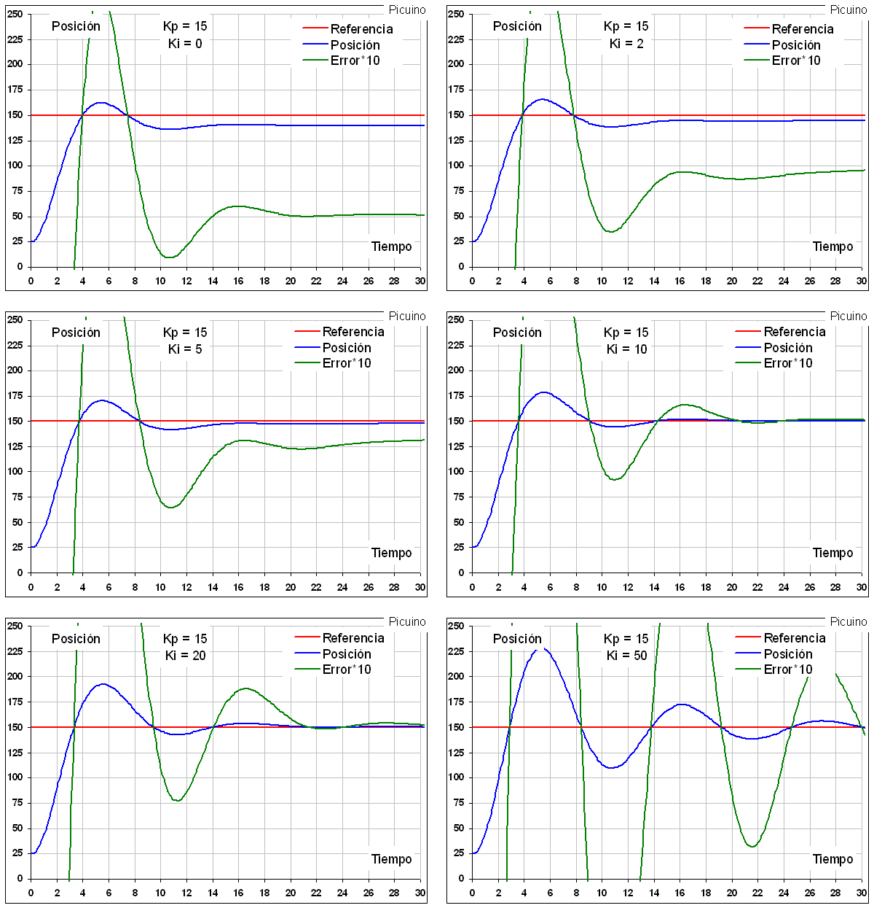

:Date: 10/12/2018
:Author: Carlos Félix Pardo Martín
:License: Creative Commons Attribution-ShareAlike 4.0 International
:tocdepth: 1

.. _control-pid:

Controlador PID
===============

Un controlador o regulador PID es un dispositivo que permite
controlar un sistema en lazo cerrado para que alcance el estado
de salida deseado. El controlador PID está compuesto de tres
elementos que proporcionan una acción Proporcional, Integral y
Derivativa. Estas tres acciones son las que dan nombre al
controlador PID.

.. image:: control/_images/img-0055.png
   :width: 640px
   :alt: Sistema de control en lazo cerrado con controlador PID
   :align: center

Señal de referencia y señal de error
------------------------------------

La señal **r(t)** se denomina **referencia** e indica el estado que
se desea conseguir en la salida del sistema **y(t)**.

La letra **t** dentro del paréntesis significa que las señales cambian
con el tiempo (t), es decir, que no permanecen con el mismo valor.

En un sistema de control de temperatura, la referencia r(t) será la
temperatura deseada y la salida y(t) será la temperatura real del
sistema controlado, que cambiarán con el tiempo.

Como puede verse en el esquema anterior, la entrada al controlador
PID es la señal de **error e(t)**. Esta señal indica al controlador la
diferencia que existe entre el estado que se quiere conseguir o
referencia r(t) y el estado real del sistema medido por el sensor,
señal **h(t)**.

Si la señal de error es grande, significa que el estado del sistema
se encuentra lejos del estado de referencia deseado. Si por el
contrario el error es pequeño, significa que el sistema ha alcanzado
el estado deseado.

Acción de control Proporcional
------------------------------

Como su nombre indica, esta acción de control es proporcional a la señal
de error e(t). Internamente la acción proporcional multiplica la señal
de error por una constante **Kp** que determina la cantidad de
acción proporcional que tendrá el controlador.

Esta acción de control intenta minimizar el error del sistema. Cuando
el error es grande, la acción de control es grande y tiende a minimizar
este error.

Aumentar la acción proporcional **Kp** tiene los siguientes efectos:

  1. Aumenta la velocidad de respuesta del sistema.
  2. Disminuye el error del sistema en régimen permanente.
  3. Aumenta la inestabilidad del sistema.

Los dos primeros efectos son positivos y deseables. El último efecto
es negativo y hay que intentar que sea reducido.
Al aumentar la acción proporcional existe un punto de equilibrio en el
que se consigue suficiente rapidez de respuesta del sistema y reducción
del error, sin que el sistema sea demasiado inestable.
Aumentar la acción proporcional más allá de este punto producirá una
inestabilidad indeseable.
Reducir la acción proporcional, reducirá la velocidad de respuesta
del sistema y aumentará su error permanente.

En los gráficos anteriores puede observarse el efecto de aumentar
progresivamente la acción proporcional en un control de posición.

 * Con una acción proporcional pequeña Kp=2, el sistema es lento,
   tardando 20 segundos en alcanzar la posición deseada y el error
   de posición es grande, de 50 milímetros. A medida que se aumenta
   la acción proporcional, el error disminuye y la velocidad de
   respuesta aumenta.
 * Con una ganancia proporcional Kp=20 el sistema es más rápido,
   tardando 12 segundos en establecerse la posición permanente.
   Asimismo el error se ha reducido hasta una décima parte, solo
   5 milímetros. También se puede observar un sobrepulso en la
   respuesta, y el comienzo de cierta inestabilidad.
 * Con ganancias mayores se consigue disminuir todavía más el
   error permanente, pero la velocidad de respuesta no aumenta
   porque el sistema se vuelve tan inestable que la posición
   tarda mucho en establecerse en su estado final.

En este ejemplo la acción proporcional se ha escalado de forma que
sus valores se encuentren entre 0 y 100.

Llegado a este punto, puede verse que la acción proporcional no
puede mejorar más la respuesta del sistema. La mejor opción con Kp=20
presenta un sobrepulso de unos 30 milímetros y un error permanente de
5 milímetros. Si se desea mejorar esta respuesta hay que incorporar
otro tipo de control.
Aquí es dónde el control derivativo puede ayudar a mejorar la
respuesta del sistema.

Acción de control Derivativa
----------------------------

Como su nombre indica, esta acción de control es proporcional a la
derivada de la señal de error **e(t)** multiplicada por la constante
**Kd**.
La derivada del error es otra forma de llamar a la "velocidad" del error.
A continuación se verá porqué es tan importante calcular esta velocidad.
En las gráficas anteriores, cuando la posición se encuentra por debajo
de 150mm, la acción de control proporcional siempre intenta aumentar
la posición.
El problema viene al tener en cuenta las inercias.
Cuando el sistema se mueve a una velocidad alta hacia el punto de
referencia, el sistema se pasará de largo debido a su inercia.
Esto produce un sobrepulso y oscilaciones en torno a la referencia.
Para evitar este problema, el controlador debe reconocer la velocidad
a la que el sistema se acerca a la referencia para poder frenarle con
antelación a medida que se acerque a la referencia deseada y evitar
que la sobrepase.

Aumentar la constante de control derivativa **Kd** tiene los siguientes
efectos:

   1. Aumenta la estabilidad del sistema controlado.
   2. Disminuye un poco la velocidad del sistema.
   3. El error en régimen permanente permanecerá igual.

Esta acción de control servirá, por lo tanto, para estabilizar una
respuesta que oscile demasiado.

En los gráficos anteriores puede verse como, al aumentar la acción
derivativa Kd, se consigue disminuir las oscilaciones hasta el punto
de que desaparecen para Kd=50. También puede apreciarse cómo la respuesta
se hace un poco más lenta al aumentar la constante derivativa.
Con Kd=0 el sistema tarda 1,8 segundos en subir hasta el valor de referencia.
Con Kd=20 el sistema tarda 2 segundos en subir hasta el valor de referencia.
En este ejemplo la acción derivativa se ha escalado de forma que sus
valores se encuentren entre 0 y 100.

Un problema que presenta el control derivativo consiste en que amplifica
las señales que varían rápidamente, por ejemplo, el ruido de alta frecuencia.
Debido a este efecto, el ruido de la señal de error aparece amplificado en
el accionamiento de la planta.
Para poder reducir este efecto es necesario reducir el ruido de la señal
de error mediante un `filtro paso bajo
<https://es.wikipedia.org/wiki/Filtro_paso_bajo>`__
antes de aplicarla al término derivativo.
Con este filtro la acción derivativa se encuentra limitada, por lo que es
deseable reducir el ruido de la señal de error por otros medios antes de
recurrir a un filtro paso bajo.

Llegado a este punto, el sistema es rápido y estable, pero mantiene todavía
un pequeño error en régimen permanente.
Esto significa que la posición real del sistema no es exactamente la
posición deseada.
Para poder reducir este error se recurre a la tercera acción del
controlador PID, el control Integral.

Acción de control Integral
--------------------------

Esta acción de control, como su nombre indica, calcula la integral de la
señal de **error e(t)** y la multiplica por la constante **Ki**.
La integral se puede ver como la suma o acumulación de la señal de error.
A medida que pasa el tiempo pequeños errores se van sumando para hacer
que la acción integral sea cada vez mayor.
Con esto se consigue reducir el error del sistema en régimen permanente.
La desventaja de utilizar la acción integral consiste en que esta añade
una cierta inercia al sistema y, por lo tanto, le hace más inestable.

Aumentar la acción integral **Ki** tiene los siguientes efectos:

   1. Disminuye el error del sistema en régimen permanente.
   2. Aumenta la inestabilidad del sistema.
   3. Aumenta un poco la velocidad del sistema.

Esta acción de control servirá para disminuir el error en
régimen permanente.

En las gráficas anteriores se ha añadido una señal de error ampliada,
de color verde, para apreciar mejor cómo se reduce el error a medida
que aumenta la acción integral. Otro efecto visible es el aumento
de la inestabilidad del sistema a medida que aumenta Ki.
Por esta razón el control integral se suele combinar con el control
derivativo para evitar las oscilaciones del sistema.

Sintonización manual de un controlador PID
------------------------------------------

Después de ver las diferentes acciones proporcional, integral y
derivativa de un control PID, se pueden aplicar unas reglas
sencillas para sintonizar este controlador de forma manual.

**1º - Acción Proporcional.**

Se aumenta poco a poco la acción proporcional para disminuir
el error (diferencia entre el estado deseado y el estado conseguido)
y para aumentar la velocidad de respuesta.

Si se alcanza la respuesta deseada en velocidad y error,
el PID ya está sintonizado.

Si el sistema se vuelve inestable antes de conseguir la respuesta
deseada, se debe aumentar la acción derivativa.

**2º - Acción Derivativa.**

Si el sistema es demasiado inestable, se aumentará poco a poco
la constante derivativa Kd para conseguir de nuevo estabilidad
en la respuesta.

**3º - Acción Integral.**

En el caso de que el error del sistema sea mayor que el deseado,
se aumentará la constante integral Ki hasta que el error se
minimice con la rapidez deseada.

Si el sistema se vuelve inestable antes de conseguir la
respuesta deseada, se debe aumentar la acción derivativa.

Con estas sencillas reglas es sencillo afinar poco a poco el
controlador PID hasta conseguir la respuesta deseada.

Ecuación del controlador
------------------------
La ecuación del control PID es la siguiente:

.. math::

      c(t) = Kp \cdot e(t) + Ki \cdot \int_{}^{}e(t) dt + Kd \cdot \frac{\partial e(t)}{\partial t}

Para:

  * c(t) = señal de control
  * e(t) = señal de error
  * Kp, Ki, Kd = parámetros del controlador PID

Saturación y límites del controlador PID
----------------------------------------

En los sistemas reales existen limitaciones que reducen la capacidad
del controlador para conseguir la respuesta deseada. Por mucho que se
aumente la acción proporcional, llegará un momento en el que el
accionador se saturará y no podrá dar más de sí. Por ejemplo, en un
sistema de control de temperatura, la resistencia calefactora podrá
suministrar potencia hasta los 2000 vatios. Si el controlador intenta
entregar más potencia para conseguir más velocidad de calentamiento,
no se podrá y el sistema no conseguirá mayor rapidez. Aunque se
aumente la acción de control proporcional el límite del accionador
de 2000 vatios limita la velocidad máxima de calentamiento.

Por lo tanto, hay que tener en cuenta que la velocidad de respuesta
de los sistemas reales tiene ciertos límites que el control no podrá
superar.

Simuladores de control PID
--------------------------

Este pequeño programa simula un carro guiado de forma automática
y controlado por un controlador PID. El objetivo del programa es
aprender a modificar los parámetros del controlador PID para
conseguir que el carro se posicione con rapidez y sin error.

:download:`Motion Control. Versión 0,31
<control/_downloads/motion-control-031.zip>`

Este otro programa simula el calentamiento de una caldera
utilizada para calentar a su vez agua de calefacción.
El sistema térmico utiliza dos controles PID para controlar
las dos distintas temperaturas del agua.

:download:`Thermal Control. Versión 0,11
<control/_downloads/thermal-control-011.zip>`

Referencias
-----------

`Wikipedia: Controlador PID
<https://es.wikipedia.org/wiki/Proporcional_integral_derivativo>`__

`Wikipedia: Sistema de control
<https://es.wikipedia.org/wiki/Sistema_de_control>`__

`Wikipedia: Servomotor
<https://es.wikipedia.org/wiki/Servomotor_de_modelismo>`__

[1] Ogata, Katsuhiko. Ingeniería de Control Moderna. Tercera edición.
Editorial Prentice Hall.

[2] Ogata, Katsuhiko. Sistemas de control en tiempo discreto.
Segunda edición. Editorial Prentice Hall.
