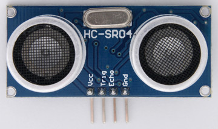

:date: 2018-12-10
:modified: 2026-06-13
:author: Carlos Félix Pardo Martín
:license: Creative Commons Attribution-ShareAlike 4.0 International
:license_url: https://creativecommons.org/licenses/by-sa/4.0/

.. _sensor-index:

**********
 Sensores
**********

Componentes para medición de temperatura, movimiento, luz, etc.

.. toctree::
   :numbered: 1
   :maxdepth: 1

   control-sensor-ultrasonic.rst
   control-sensor-potentiometer.rst
   control-sensor-temp.rst
   control-sensor-dht11.rst
   control-sensor-light.rst
