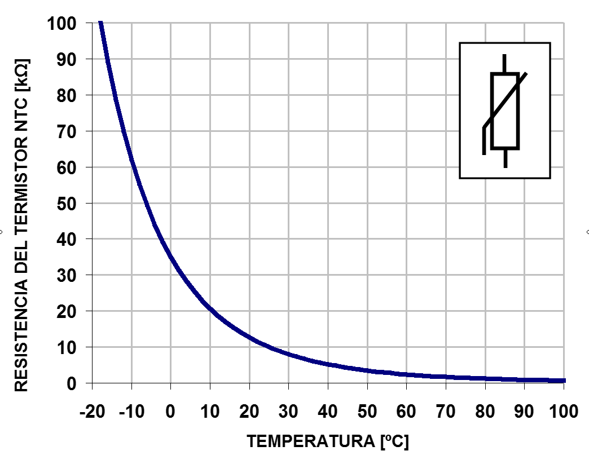
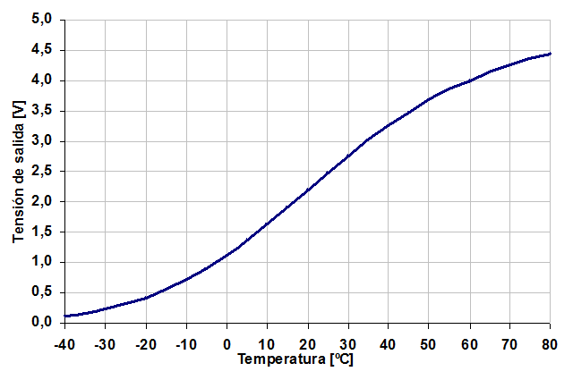
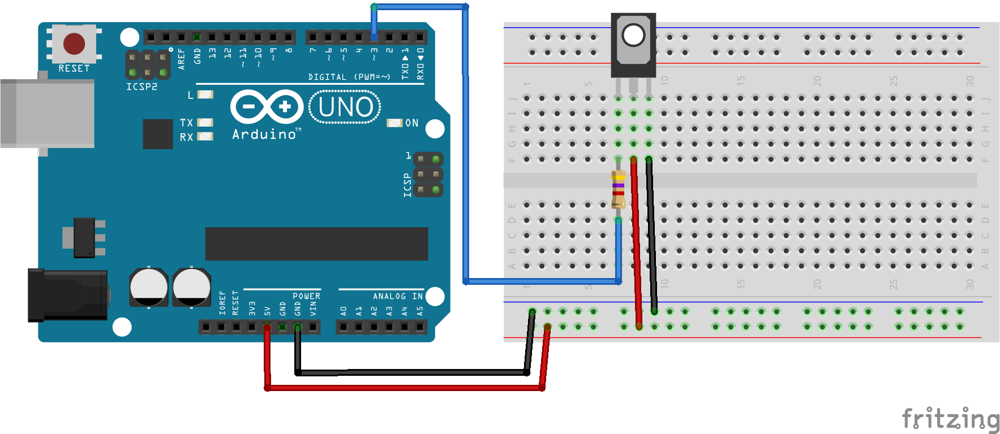
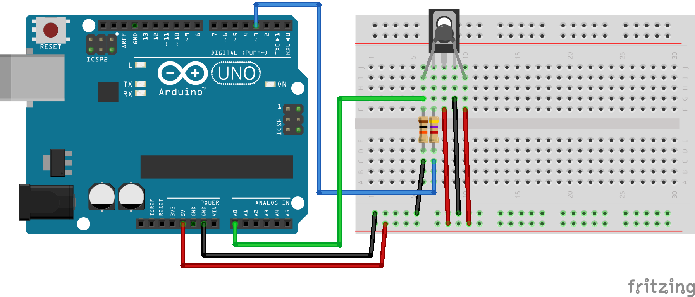

:Date: 10/12/2018
:Author: Carlos Félix Pardo Martín
:License: Creative Commons Attribution-ShareAlike 4.0 International

.. sensor-temp:

Sensor de temperatura
=====================

Un sensor de temperatura es un componente electrónico que devuelve una
señal eléctrica que depende de la temperatura del sensor.
A partir de la señal eléctrica se puede conocer la temperatura real
a la que se encuentra el sensor.

Existen muchos tipos diferentes de sensores de temperatura.
Cada tipo de sensor se adapta bien a una aplicación concreta.
En estas prácticas se van a estudiar solo sensores de bajo precio que
alcanzan un rango de temperaturas moderado, de -40ºC hasta 150ºC.
Con una exactitud moderada, desde 1ºC hasta 0,1ºC de error.

Sensor de temperatura NTC.

Sensor de temperatura basado en circuito integrado LM35.

.. ¿Qué hace? ¿Para qué sirve?
..  Aparatos cotidianos que lo usan

Los sensores de temperatura son muy útiles para construir aparatos de
medida de temperatura y máquinas que regulan de forma automática la
temperatura. A continuación se listan algunos ejemplos prácticos.

  * Termómetro digital para medir la temperatura del cuerpo.
  * Termostato digital de una casa.
  * Termostato de temperatura de un horno.
  * Sensor de incendios.
  * Termostato de acuario o de terrario.
  * Termómetro digital de temperatura ambiente.

Funcionamiento de un sensor NTC
-------------------------------

.. ¿Cómo funciona? (para el usuario)

Una resistencia NTC es un componente que reduce su resistencia cuando
aumenta la temperatura. Este sensor no es lineal. Esto quiere decir
que su exactitud no es muy buena en rangos amplios de temperatura,
comparada con otros sensores. A pesar de eso un sensor NTC bien
ajustado puede medir temperaturas con bastante exactitud, 0,1ºC en un
intervalo pequeño de temperaturas.

La siguiente gráfica representa la resistencia de un sensor NTC en su
rango de medición de temperaturas.

.. ¿Cómo funciona? (descripción técnica) Partes y nomenclatura

Como se puede ver, la resistencia disminuye a medida que aumenta la
temperatura. La forma de la curva es no lineal, lo que da problemas
a la hora de calcular con exactitud la temperatura.
La siguiente fórmula puede utilizarse para calcular la resistencia en
función de la temperatura.

.. math::

   R = A \cdot exp(B/T)

R = Resistencia del sensor NTC

T = Temperatura en grados kelvin

B = Temperatura característica del material. Entre 2000ºK y 5000ºK

A = Constante del termistor. Depende del material.

Los coeficientes :math:`A` y :math:`B` dependen de cada componente y
se pueden encontrar en las hojas de características de los fabricantes
o bien se pueden calcular para un sensor NTC concreto a partir de un
ensayo, midiendo la resistencia a varias temperaturas.

Especificaciones de un sensor NTC
---------------------------------
Se ha escogido para este apartado un sensor NTC con un valor nominal
de 10k Ohmios a la temperatura de 25ºC

  * Resistencia a 25ºC = 10k Ohmios
  * Bandas de color = Marrón Negro Naranja
  * Tiempo de respuesta = 1,2 segundos
  * Constante A = 0,01618 Ohmios
  * Constante B = 3977 ºK

A continuación se muestra una imagen con la curva de tensión que
suministra este sensor NTC conectado a 5 voltios, con una resistencia
de polarización de 10k Ohmios conectada a masa.

Tabla de datos con los valores de la curva.

  ===========  =======
  Temperatura  Tensión
  ===========  =======
      -40       0,117
      -35       0,165
      -30       0,230
      -25       0,314
      -20       0,422
      -15       0,555
      -10       0,717
      -5        0,908
      0         1,128
      5         1,373
      10        1,638
      15        1,918
      20        2,203
      25        2,486
      30        2,760
      35        3,020
      40        3,260
      45        3,480
      50        3,676
      55        3,851
      60        4,004
      65        4,138
      70        4,253
      75        4,353
      80        4,439
  ===========  =======

Esta tabla se puede utilizar para buscar valores intermedios de
tensión o de temperatura mediante la orden map().

Para calcular otros valores fuera de rango o calcular valores de un
sensor NTC diferente, se puede utilizar la
hoja excel adjunta :download:`NTC <control/_downloads/ntc.xls>`.

Esquema de conexión de un transistor calentador
-----------------------------------------------
En la siguiente imagen puede verse el cableado necesario para
realizar un calentador basado en un transistor
:download:`BD135 <control/_downloads/BD135-onsemi.pdf>`.

Este circuito es capaz de consumir hasta 200 miliamperios a 5 voltios,
proporcionando 1 vatio de potencia. Esta potencia es suficiente para
aumentar la temperatura del transistor 100 grados centígrados al aire
libre. Si se coloca algún tipo de aislamiento, la temperatura puede
subir todavía más, destruyendo el componente.

Por esta razón es necesario tener especial cuidado en no encender a
máxima potencia al transistor y **tomar las precauciones necesarias
para que no se produzcan quemaduras**.

El siguiente programa permite probar el calentamiento del transistor.

.. code-block:: Arduino
   :linenos:

   // Enciende el transistor conectado al pin digital 3

   void setup() {
      pinMode(3, OUTPUT);    // Define el pin 3 como salida
   }

   void loop() {
      analogWrite(3, 128);   // Señal en pin 3 encendida al 50%
   }

Esquema de conexión de un sensor NTC
------------------------------------
Para que el sensor NTC pueda dar una tensión útil que se pueda medir,
es necesario añadir una resistencia de polarización.
Esta resistencia se coloca entre el sensor y masa como muestra el
siguiente esquema.

**Autocalentamiento:**
El autocalentamiento consiste en el aumento de temperatura que
produce en el sensor NTC la corriente que se le suministra para poder
medir la temperatura.
Si el sensor recibe mucha corriente, esta aumentará de forma
artificial la temperatura interior produciendo una lectura de
temperatura mayor que la temperatura real.

Si por el contrario la resistencia recibe poca corriente, la señal de
tensión será difícil de medir y el ruido eléctrico producirá también
errores de medición.

Los valores de resistencia entre 5k ohmios y 50k Ohmios mantienen un
buen equilibrio entre estos dos efectos contrarios cuando funcionan
en el rango de 0 a 5 voltios. Por esa razón se ha escogido un sensor
NTC de 10k Ohmios.

**Resistencia de polarización**
El valor de la resistencia de polarización debe ser aproximadamente
igual al valor de resistencia del sensor NTC a temperatura ambiente.
de esta forma se podrá medir con mayor precisión el rango de
temperaturas cercanas a la temperatura ambiente.
En este montaje se ha escogido un sensor NTC que tiene una
resistencia de 10k Ohmios a 20ºC y por lo tanto la resistencia de
polarización tiene ese mismo valor.

**Entrada analógica**
La señal del sensor NTC se ha conectado a una entrada analógica que
puede medir con precisión tensiones en el rango de 0 a 5 voltios.
Una entrada digital no puede medir más que dos valores distintos de
tensión de entrada y por lo tanto no es capaz de leer correctamente
el valor de tensión de un sensor NTC.

El siguiente programa permite medir la tensión generada por el
sensor NTC

.. code-block:: Arduino
   :linenos:

   // Mide el valor de tensión del sensor NTC conectado en
   // el pin analógico A0

   void setup() {
      Serial.begin(115200);  // Inicializar el puerto serie
   }

   void loop() {
      // Lee la señal analógica del pin analógico
      int ntc = analogRead(A0);

      // Convierte el valor del conversor analógico-digital
      // en un valor de tensión de 0 a 5 voltios
      float volt = ntc * (5.0 / 1024.0);

      // Envía el valor de tensión por el puerto serie
      Serial.print("Volt =\t");
      Serial.println(volt);

      // Espera un segundo antes de continuar
      delay(1000);
   }

Ejercicios
----------

1. Montar el esquema de conexión del sensor de temperatura con el
   transistor de calentamiento. Completar la tabla siguiente con los
   valores de tensión medidos en el sensor para diferentes potencias
   del transistor de calentamiento.

     ==========  ===========
     Transistor  Tensión NTC
     ==========  ===========
          0
         50
        100
        150
        200
        250
     ==========  ===========

   Cada vez que cambie la potencia del calentador, será necesario
   esperar a que la tensión medida en el sensor NTC se estabilice.
   La duración depende de los componentes y puede ser de dos o tres
   minutos para conseguir la máxima exactitud.

   .. code-block:: Arduino
      :linenos:

      // Control de temperatura en lazo abierto.
      // Calentador: Transistor BD135
      // Sensor de temperatura: NTC de 10k Ohmios

      const int potencia = 0;

      void setup() {
         pinMode(3, OUTPUT);    // Define el pin 3 como salida
         Serial.begin(115200);  // Inicializar el puerto serie
      }

      void loop() {
         // Establece la potencia del transistor
         analogWrite(3, potencia);

         // Lee la señal analógica del pin analógico
         int ntc = analogRead(A0);

         // Convierte el valor del conversor analógico-digital
         // en un valor de tensión de 0 a 5 voltios
         float volt = ntc * (5.0 / 1024.0);

         // Envía el valor de tensión por el puerto serie
         Serial.print("Volt =\t");
         Serial.println(volt);

         // Espera un segundo antes de continuar
         delay(1000);
      }

2. El siguiente programa controla en lazo cerrado la temperatura del
   sensor. El esquema de funcionamiento se denomina todo/nada.
   Al comenzar, el programa enciende el calentador a máxima potencia.
   Cuando la temperatura supera el valor deseado, el calentador se
   apaga por completo.

   .. code-block:: Arduino
      :linenos:

      // Control de temperatura en lazo cerrado.
      // Esquema de control Todo / Nada
      // Calentador: Transistor BD135
      // Sensor de temperatura: NTC de 10k Ohmios

      void setup() {
         pinMode(3, OUTPUT);    // Define el pin 3 como salida
         Serial.begin(115200);  // Inicializar el puerto serie
      }

      void loop() {
         // Lee la señal analógica del pin analógico
         int ntc = analogRead(A0);

         // Convierte el valor del conversor analógico-digital
         // en un valor de tensión de 0 a 5 voltios
         float volt = ntc * (5.0 / 1024.0);

         // Apaga el calentador si la temperatura supera
         // el nivel establecido.
         if (volt > 3.5) {
            Serial.print("OFF  ");
            analogWrite(3, 0);
         }
         else {
            Serial.print("ON   ");
            analogWrite(3, 255);
         }

         // Envía el valor de tensión por el puerto serie
         Serial.print("Volt =\t");
         Serial.println(volt);

         // Espera un segundo antes de continuar
         delay(1000);
      }
