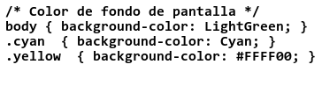

:Date: 24/10/2020
:Author: Carlos Félix Pardo Martín
:License: Creative Commons Attribution-ShareAlike 4.0 International

.. css-background:

Color de fondo
==============
En este ejercicio se estudia cómo dar color al fondo de pantalla.

Referencias.

* `Colores CSS <https://www.w3schools.com/cssref/css_colors.asp>`__
* `HTML Color Picker <https://www.w3schools.com/colors/colors_picker.asp>`__
* `HTML Color Mixer <https://www.w3schools.com/colors/colors_mixer.asp>`__

Ejercicio
---------

Fichero **css-background.html**

.. literalinclude:: css/css-background.html
   :language: html
   :linenos:
   :name: css-background

Fichero **css-background.css**

Resultado
---------

         en un navegador

