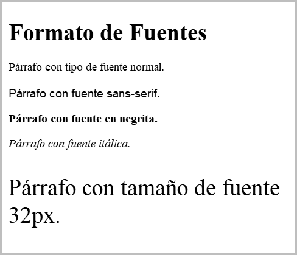

:Date: 13/12/2018
:Author: Carlos Félix Pardo Martín
:License: Creative Commons Attribution-ShareAlike 4.0 International

.. css-fonts:

Formato de fuentes
==================

Para más información sobre los formatos de fuentes se pueden
consultar las páginas de w3schools.

* `Formato de fuentes
  <https://www.w3schools.com/css/css_font.asp>`__
* `Formato de texto
  <https://www.w3schools.com/css/css_text.asp>`__
* `Colores
  <https://www.w3schools.com/css/css_colors.asp>`__

Ejercicio
---------

Fichero **css-fonts.html**

.. literalinclude:: css/css-fonts.html
   :language: html
   :linenos:
   :name: css-fonts

Fichero **css-fonts.css**

Resultado
---------

         en un navegador

