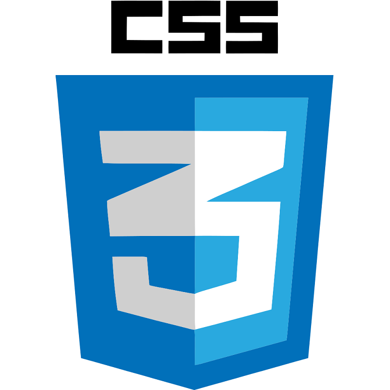

:Date: 12/12/2018
:Author: Carlos Félix Pardo Martín
:License: Creative Commons Attribution-ShareAlike 4.0 International

.. _css-index:

*****************
 Tutorial de CSS
*****************

Tutorial de código CSS para crear páginas web.

.. toctree::
   :numbered: 1
   :maxdepth: 1
   :titlesonly:

   css-style.rst
   css-file.rst
   css-clases.rst

   css-span.rst
   css-div.rst

   css-cascading.rst

   css-fonts.rst
   css-sans-serif.rst
   css-serif.rst
   css-monospace.rst
   css-text-align.rst

   css-list-style.rst

   css-background.rst
   css-width-height.rst
   css-padding-border.rst

   css-recursos.rst

..
   css-paragraph.rst
   css-text.rst
   css-background.rst
   css-padding.rst
   css-border.rst
   css-margin.rst