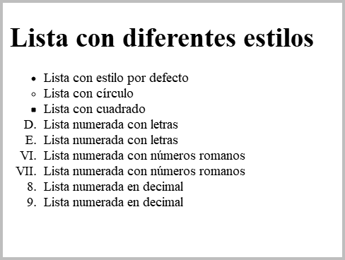

:Date: 23/10/2020
:Author: Carlos Félix Pardo Martín
:License: Creative Commons Attribution-ShareAlike 4.0 International

.. css-list-style:

Estilos de lista
================
En este ejercicio se estudian los diferentes estilos que puede
tener una lista.

Ejercicio
---------

Fichero **css-list-style.html**

.. literalinclude:: css/css-list-style.html
   :language: html
   :linenos:
   :name: css-list-style

Fichero **css-list-style.css**

Resultado
---------

         en un navegador

