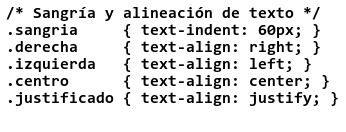
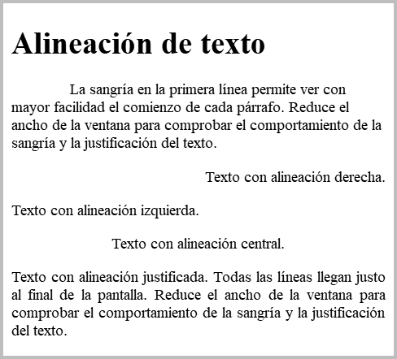

:Date: 22/10/2020
:Author: Carlos Félix Pardo Martín
:License: Creative Commons Attribution-ShareAlike 4.0 International

.. css-text-align:

Alineación del texto
====================
En este ejercicio se estudian las diferentes alineaciones
que se pueden dar al texto así como la sangría de primera
línea.

Ejercicio
---------

Fichero **css-text-align.html**

.. literalinclude:: css/css-text-align.html
   :language: html
   :linenos:
   :name: css-text-align

Fichero **css-text-align.css**

Resultado
---------

         en un navegador

