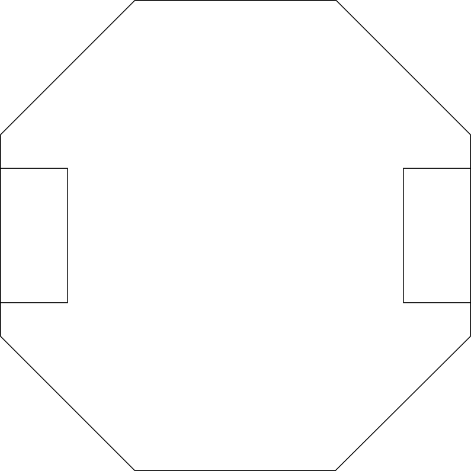

:Date: 21/04/2026
:Author: Carlos Félix Pardo Martín
:License: Creative Commons Attribution-ShareAlike 4.0 International
:tocdepth: 1

.. _cucabot-base:

Plataforma universal
====================
En este apartado se muestra cómo construir la plataforma universal para
poder montar posteriormente los distintos robots sobre ella.

   
   Plataforma universal para montar los robots Cucabot.

#. Primero descargaremos el plano PDF de la plataforma universal:
   
   :download:`Plano de construcción de la plataforma universal.
   Formato PDF. <cucabot/cucabot-base.pdf>`
   
   :download:`Plano de construcción de la plataforma universal.
   Formato editable SVG. <cucabot/cucabot-base.svg>`

#. Después imprimiremos el plano con una escala del 100% del tamaño
   original. Las líneas de los extremos izquierdo y derecho coinciden con
   la hoja DIN A4, por lo que no se verán impresas en la hoja de papel.

#. A continuación utilizaremos la impresión como plantilla para cortar
   una tabla de madera con la forma octogonal de la plataforma universal, 
   recortando también los rectángulos que alojarán las ruedas del robot.

#. Terminada de cortar la plataforma de madera, podemos añadir los dos
   motores con reductora y ruedas a la plataforma universal.

#. Una vez añadidos los motores se debe añadir una rueda loca para que
   sirva de apoyo en la parte frontal de la plataforma.

Créditos
--------
Instrucciones de la página original de `Cucabot en archive.org 
<https://web.archive.org/web/20100331204307/http://roble.pntic.mec.es/~jsaa0039/cucabot/pu-intro.html>`__