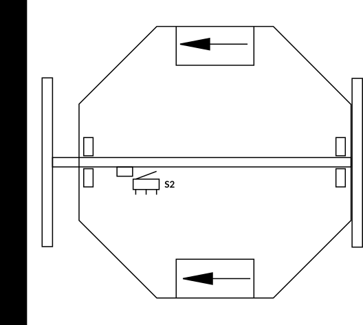
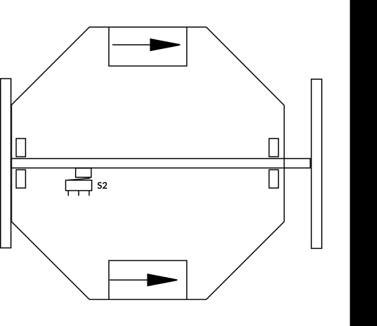

:Date: 20/04/2026
:Author: Carlos Félix Pardo Martín
:License: Creative Commons Attribution-ShareAlike 4.0 International
:tocdepth: 1

.. _cucabot-cero:

Cucabot cero
============
Este es el robot con el circuito eléctrico y funcionamiento más sencillo
de todos.

Al conectar el interruptor de marcha el robot avanza hacia adelante hasta
que choca con un obstáculo, momento en el que el robot comienza a
retroceder (avanza hacia atrás) hasta que vuelve a chocar con otro
obstáculo, momento en el que vuelve a invertir el sentido de la marcha.

Esquema eléctrico
-----------------

.. figure:: cucabot/_images/cucabot-cero-schema.png
   :alt: Esquema eléctrico del robot Cucabot cero.
   :width: 640px
   :align: center

   Esquema eléctrico del robot Cucabot cero.
   
.. figure:: cucabot/_images/cucabot-cero-cableado.png
   :alt: Cableado eléctrico del robot Cucabot cero.
   :width: 640px
   :align: center

   Cableado eléctrico del robot Cucabot cero.
   
|  :download:`Circuito eléctrico y cableado del Cucabot cero. Formato PDF.
   <cucabot/cucabot-cero-electric.pdf>`

Montaje y funcionamiento
------------------------

   Funcionamiento del Cucabot cero avanzando hacia una pared a su izquierda.

   Funcionamiento del Cucabot cero retrocediendo hacia una pared a su derecha.

Créditos
--------
Instrucciones de la página original de `Cucabot en archive.org <https://web.archive.org/web/20100401060124/http://roble.pntic.mec.es/~jsaa0039/cucabot/cero-intro.html>`__